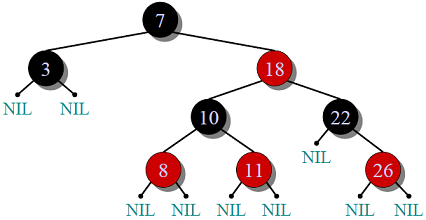

### 小声 BB

本篇尽量不 po 代码，仅仅过一遍 AVL 树和红黑树

其中红黑树更是在 HashMap 中大展身手，肯定要研究一下为什么他们要用到 RBT

---

### AVL

了解 AVL 之前，我们先 BB 一句二叉搜索树（Binary Search Tree，BST），BST 有什么性质？

曰：**二叉结构，元素可比，左小右大，仅此而已**

然后再 BB 一句为什么有了 BST 之后，又要研究 AVL 树：在极端的情况下，一组大小有序的数据插入 BST，那么就会生成一条线而不是一棵树，这样对于树的操作就完全退化成链表操作，举例说查找操作从二分法的效率变成了顺序查找

大部分时候我们使用一棵树，更重要的是要用到他的查找操作，而不是插入或者删除操作

于是为了防止一棵树会变成一条线，于是就有了平衡二叉树，也就是 AVL 树

下面引自[GeekforKGeek 的《AVL Tree | Set 1 (Insertion)》一文](https://www.geeksforgeeks.org/avl-tree-set-1-insertion/)

> **Why AVL Trees?** Most of the BST operations (e.g., search, max, min, insert, delete.. etc) take O(h) time where h is the height of the BST. The cost of these operations may become O(n) for a skewed Binary tree. If we make sure that height of the tree remains O(Logn) after every insertion and deletion, then we can guarantee an upper bound of O(Logn) for all these operations. The height of an AVL tree is always O(Logn) where n is the number of nodes in the tree (See [this ](http://www.youtube.com/watch?v=TbvhGcf6UJU)video lecture for proof).

大部分的 BST 操作都会在**O(h)**的效率内完成，但是一旦树有倾斜，就会变成**O(n)**的效率，AVL 通过旋转来保持平衡防止树倾斜，使得所有操作都在**O(logn)**的效率内完成；因为 AVL 的高度始终都是**O(logn)**；

#### 和 BST 有何异同？

- **结点：**AVL 树的每一个结点中有一个字段用于存储平衡因子（average factor），这个平衡因子用于记录该结点的左子树高度和右子树高度之差，用以表示这棵树本身是否**平衡**，于是这个平衡因子的取值在一棵合法的 AVL 数中的每个节点上只可能取值为：-1，0，1；
- **平衡状态：**保证树上的每个结点的平衡因子都只在**[-1，1]**之间，一旦达到+2 或者-2，就需要通过选旋转操作来保持平衡；
- **旋转操作：**为了保持平衡，在达插入的时候如果发现其祖父结点达到不平衡了，那么就需要旋转该树，以从新达到平衡；

  - **右旋（Right Rotation，RR）：这个旋转是在一个新的键插入左子女的左子树后发生的，插入前这棵树的 AF 是+1**

    ```
             z                                      y
            / \                                   /   \
           y   T4      Right Rotate (z)          x      z
          / \          - - - - - - - - ->      /  \    /  \
         x   T3                               T1  T2  T3  T4
        / \
      T1   T2
    ```

  - **左旋（Left Rotation，LL）：这个旋转是在一个新的键插入右子女的右子树后发生的，插入前这棵树的 AF 是-1**

    ```
      z                                y
     /  \                            /   \
    T1   y     Left Rotate(z)       z      x
        /  \   - - - - - - - ->    / \    / \
       T2   x                     T1  T2 T3  T4
           / \
         T3  T4
    ```

  - **左右旋（Left Right Rotation，LR）：这个旋转是在一个新的键插入树的左子女的右子树后发生的，插入前这棵树的 AF 是+1**

    ```
         z                               z                           x
        / \                            /   \                        /  \
       y   T4  Left Rotate (y)        x    T4  Right Rotate(z)    y      z
      / \      - - - - - - - - ->    /  \      - - - - - - - ->  / \    / \
    T1   x                          y    T3                    T1  T2 T3  T4
        / \                        / \
      T2   T3                    T1   T2
    ```

  - **右左旋（Right Left Rotation，RL）：这个旋转是在一个新的键插入树的右子女的左子树后发生的，插入前这棵树的 AF 是-1**

    ```
       z                            z                            x
      / \                          / \                          /  \
    T1   y   Right Rotate (y)    T1   x      Left Rotate(z)   z      y
        / \  - - - - - - - - ->     /  \   - - - - - - - ->  / \    / \
       x   T4                      T2   y                  T1  T2  T3  T4
      / \                              /  \
    T2   T3                           T3   T4
    ```

#### 结构与过程

##### 结点结构

结构比较简单，左右两子和平衡高度

```java
class Node {
    int key, height;
    Node left, right;
    Node(int d) {
        key = d;
        height = 1;
    }
}
class AVLTree {
    Node root;
    // A utility function to get the height of the tree
    int height(Node N) {
        if (N == null)
            return 0;
        return N.height;
    }
    // A utility function to get maximum of two integers
    int max(int a, int b) {
        return (a > b) ? a : b;
    }
    // Get Balance factor of node N
    int getBalance(Node N) {
        if (N == null)
            return 0;
        return height(N.left) - height(N.right);
    }
    // ...
}
```

##### 右旋

```java
Node rightRotate(Node y) {
    Node x = y.left;
    Node T2 = x.right;
    // Perform rotation
    x.right = y;
    y.left = T2;
    // Update heights
    y.height = max(height(y.left), height(y.right)) + 1;
    x.height = max(height(x.left), height(x.right)) + 1;
    // Return new root
    return x;
}
```

```
// 图示
   y						x
  /						     \
 x			 =====>		      y
  \ 						 /
   T2						T2
```

##### 左旋

```java
Node leftRotate(Node x) {
    Node y = x.right;
    Node T2 = y.left;
    // Perform rotation
    y.left = x;
    x.right = T2;
    //  Update heights
    x.height = max(height(x.left), height(x.right)) + 1;
    y.height = max(height(y.left), height(y.right)) + 1;
    // Return new root
    return y;
}
```

```
// 图示
   x				       y
    \			          /
     y		=====>		 x
    /				      \
   T2				      T2
```

其他双旋操作都是基于这两个基本操作来搞的；

##### 插入

```java
Node insert(Node node, int key) {
    /* 1.  Perform the normal BST insertion */
    if (node == null)
        return (new Node(key));
    if (key < node.key)
        node.left = insert(node.left, key);
    else if (key > node.key)
        node.right = insert(node.right, key);
    else // Duplicate keys not allowed
        return node;

    /* 2. Update height of this ancestor node */
    node.height = 1 + max(height(node.left),
                          height(node.right));

    /* 3. Get the balance factor of this ancestor
          node to check whether this node became
          unbalanced */
    int balance = getBalance(node);

    // If this node becomes unbalanced, then there
    // are 4 cases
    // Left Left Case
    if (balance > 1 && key < node.left.key)
        return rightRotate(node);

    // Right Right Case
    if (balance < -1 && key > node.right.key)
        return leftRotate(node);

    // Left Right Case
    if (balance > 1 && key > node.left.key) {
        node.left = leftRotate(node.left);
        return rightRotate(node);
    }

    // Right Left Case
    if (balance < -1 && key < node.right.key) {
        node.right = rightRotate(node.right);
        return leftRotate(node);
    }

    /* return the (unchanged) node pointer */
    return node;
}
```

我们来分析一下实现，我们插入一个新键，也许会破坏树的平衡，所以在插入操作完毕之后，我们就需要调整树平衡，由于实现中的插入是通过递归去实现的，**所以递归路径上就记录了每一个经过的父节点**，于是等我们从插入点最近的不平衡点开始回溯的时候，同时执行平衡性判断，然后依次通过旋转去调整**回去路上**每个点的平衡，以达到回到根节点的时候，整棵树就是平衡的；一下是几个关键点：

1. 递归寻找插入点，通过键值判断左右；

2. 调整插入点的父亲的高度；
3. 判断该点的平衡性；
4. 根据四种失衡情况进行旋转；

##### 删除操作

这个更为复杂点，就先不分析了；

#### 效率

插入、查找、删除均为**O(logn)**

#### 参考

> https://www.geeksforgeeks.org/avl-tree-set-1-insertion/
>
> https://www.geeksforgeeks.org/avl-tree-set-2-deletion/

---

### 红黑树

红黑树是一棵自平衡（self-balancing）的 BST，它的每个结点都遵循以下四个规则：

**1)** 每点非红即黑

**2)** 根结点必定黑

**3)** 红结点若有子节点，这俩子节点必定是黑色（有直接关系的两结点不能同时都是红色）

**4)** 每条从根节点到一个 NULL 结点的路径上总有相同数量的黑色结点



前 3 条没什么难理解的，关键是第四条，到底是什么意思呢？参考[百度百科](https://baike.baidu.com/item/%E7%BA%A2%E9%BB%91%E6%A0%91)可知，这句话还可以这样说：**“从任一节点到其每个叶子的所有路径都包含相同数目的黑色节点”**

也就是说，如上图中任意结点到其子树上的所有的**NIL 结点**，路上都只有**相同数量**的黑色结点

然后就是*Why*的问题了，下面引自[百度百科](https://baike.baidu.com/item/%E7%BA%A2%E9%BB%91%E6%A0%91)：

> 1. 这些约束强制了红黑树的关键性质: 从根到叶子的最长的可能路径不多于最短的可能路径的两倍长。结果是这个树大致上是平衡的。
> 2. 要知道为什么这些特性确保了这个结果，注意到性质 4 导致了路径不能有两个毗连的红色节点就足够了。最短的可能路径都是黑色节点，最长的可能路径有交替的红色和黑色节点。因为根据性质 5 所有最长的路径都有相同数目的黑色节点，**这就表明了没有路径能多于任何其他路径的两倍长**。

以上这个特性，保证了 RBT 的任何操作，最坏情况也不过是**O(logn)**，这看上去和 AVL-T 是一样的，但是我们继续往下看

说完两树的特性之后，我们说一下它们有何不同，为什么有了 AVL-T 之后，还要来个 RBT？一下引自[GeekforGeek-《Red-Black Tree | Set 1 (Introduction)》](https://www.geeksforgeeks.org/red-black-tree-set-1-introduction-2/)：

> The AVL trees are more balanced compared to Red-Black Trees, but they may cause more rotations during insertion and deletion. So if your application involves many frequent insertions and deletions, then Red Black trees should be preferred. And if the insertions and deletions are less frequent and search is a more frequent operation, then AVL tree should be preferred over Red-Black Tree.

即是 AVL 树是**绝对的平衡**，而要保持这个绝对平衡就需要花费更多的旋转操作去达到这个绝对平衡，**而 RBT 允许有那么一点不平衡**，牺牲了那么一点不平衡，能够在保证操作成本仍在**O(logn)**下，减少许多旋转操作，所以 RBT 的整体效率，要比 AVL-T 高；

如果场景中经常有插入和删除等操作，相应的就会有很多旋转操作，在这个情况下，RBT 的表现无疑是更胜一筹；

如果场景中查询操作更多，那还是选 AVL-T 吧；

但是也因为如此，RBT 的平衡是用概念去描述的，而非像 AVL-T 一样可以用高度差去量化平衡，所以 RBT 的实现稍微复杂和难懂一些；

##### 插入简要分析

在做插入分析之前，我们再说两件事：

1. **插入的结点一开始就把他当成一个红色结点来插入；（为什么？因为当成黑色结点插入必然会违背 rule4）**
2. **NULL 结点虽然不做考虑，但是可以视为是黑色结点；**

AVL-T 的平衡是通过旋转去调节的，而 RBT 则需要通过**“着色”**和旋转来重新达到平衡，在失衡的时候：

1. 首先尝试着色，看是否能还原平衡；
2. 如果不能平衡，就分两种情况讨论，主要是针对新键的**舅舅**结点：
   1. 如果舅舅结点是红色，那么就只需要重新着色；
   2. 如果是黑色，则先做旋转，再看是否需要重新着色；

关于具体的逻辑，可以去看[GeekforGeek《C Program for Red Black Tree Insertion》](https://www.geeksforgeeks.org/c-program-red-black-tree-insertion/)

里面还有详细的 C 语言实现
