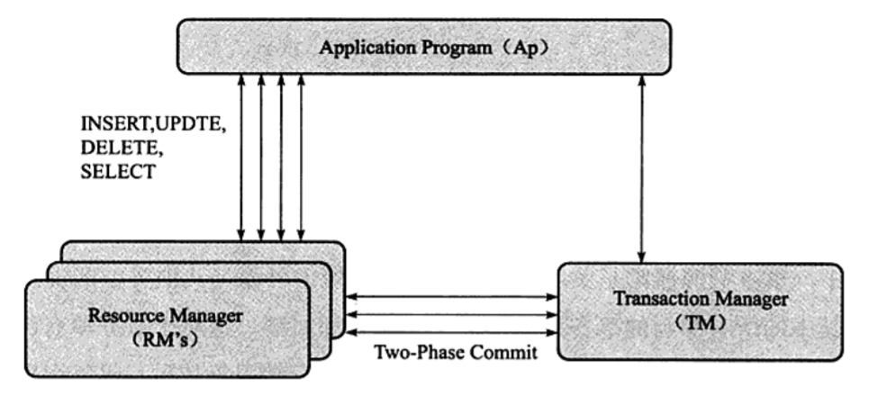

本篇介绍内容：

- 数据库系统中事务的相关概念；
- SQL 隔离级别要解决的问题；
- InnoDB 中的隔离级别；
- InnoDB 支持什么样的事务以及如何支持事务；

### 事务相关概述

#### ACID

在数据库中，事务可以是一条简单的 SQL 语句，也可以是一组复杂的 SQL 语句；一个事务是访问并更新数据库的一个**执行单元**；

数据库要保证的是，事务中的操作要么全部成功，要么全部无效；

事务的保证需要遵循**ACID 特性**，但是数据库可以不必严格满足**ACID**，对于 InnoDB 来说，它是完全满足了 ACID 的

**原子性（Atomicity）**

是指整个事务是一个不可切分的工作单位，整个事务中所有的数据库操作要都成功，该事务才算成功；事务中任何一个语句失败则整个事务都失败；

**一致性（Consistency）**

指事务从一个状态转变到下一个状态的过程中，事务的开始和结束后，数据库的完整性约束没有被破坏；例如某个字段是唯一的，在事务进行当中如果破坏了该字段的唯一性，系统会撤销该事务，然会到初始状态；

**隔离性（Isolation）**

隔离性在 MySQL 的 InnoDB 中还代表着：并发控制、可串行化、锁等；

事务的隔离性要求每个对鞋事务的对象对其他事务的操作对象能够互相分离，即该事务提交前对其他事务都不可见，一般是用锁来实现；

**持久性（Durability）**

事务一旦提交，其结果是永久性的，即使发生宕机事故，数据库也能恢复该数据；

#### 事务的分类

理论上来说，事务可以被分为以下几种类型：

- 扁平事务；
- 带保存点的事务；
- 链事务；
- 嵌套事务；
- 分布式事务；

**扁平事务**

它是使用得最多的事务类型，它的所有操作都在同一个层次，其间的操作都是原子的，要么都执行，要么都回滚，因此扁平事务是程序称为原子操作的基本组成

**带保存点的事务**

允许在事务执行的过程中回滚到**同一事务中较早的某个状态**，虽然扁平事务的使用率高，但是有些事务在执行过程中万一出错就要回滚整个事务好像有点不划算，于是利用**保存点（save point）**机制来让系统支持事务的部分回滚

对于扁平事务，其保存点是事务的最开始

**链事务**

在一个事务进行时如果系统崩溃，那么其所有的保存点都会消失，当进行恢复的时候，事务又要重新开始执行，而不会从最近一个保存点开始执行

链事务的思想是：在提交一个事务的时候，开始下一个事务，这个过程是原子的，意味着下一个事务能看到上一个事务的结果，就好像它们处于同一个事务一样；

不同的是：

- 事务的回滚仅能回到当前事务节点的保存点，而不能回到之前事务节点的保存点；

- 任意节点 commit 之后，会释放相应事务节点所设计的锁，而带有保存点的事务的任何回滚操作都不会放锁；

**嵌套事务**

一个事务中可以开启其他事务，所属关系为父子关系，在结构上是一棵树；其特点是：

1. 子事务可以是任何类型的事务；
2. 子事务的提交并不立即生效，而是都在顶层事务提交后再提交；
3. 树中任意事务回滚都会引起其他子事务的一同回滚

**分布式事务（XA 事务）**

分布式事务是处理不同主机、不同数据库甚至是同一数据库实例的不同引擎之间的**扁平事务**，我们把不同的执行上下文称为一个节点；

对于分布式事务，其对 ACID 的要求是最严格的，任何节点的事务失败，则整个事务都会失败；

实现分布式事务的各个节点的隔离级别都需要是**SERIALIABLE（串行化）**级别

分布式事务的基本模型为：一个或多个资源管理器、一个事务管理器、一个应用程序；

- 资源管理器：通常由数据库代表；
- 事务管理器：协调参与全局事务中的各个事务，需要和所有节点通信；
- 应用程序：事务发起方；

分布式事务采用**两段式提交（two-phase commit）**：

- 第一阶段：所有参与事务的节点都进入准备状态（PREPARE），并通知事务管理器；
- 第二阶段：事务管理器告诉资源管理器执行 COMMIT 还是 ROLLBACK，待所有节点都发出同意消息之后，再最终 COMMIT 或者 ROLLBACK；

### 事务的实现

事务的隔离性由锁来实现，而原子性、一致性、持久性由事务来保持

- redo log，用来保证原子性、持久性，基本上是顺序读写；
- undo log，用来保证事务的一致性和 MVCC，需要进行随机读写；

#### Redo 的概念

为了实现事务的持久性，设计了**重做日志**，其由两部分组成：

1. 内存中的重做日志缓冲（redo log buffer）；
2. 文件中的重做日志文件（redo log file）；

InnoDB 为了能保证事务的理论特性，通过**_Force Log At Commit_**机制实现事务的持久性，在事务提交的时候，必须先把该事务的所有**“日志”**写入到**重做日志文件**中，然后再真正执行 COMIMIT

这里的**“日志”**由两部分组成，一是 redo log，二是 undo log；

为了确保重做日志的及时性和有效性，当要把日志从缓冲写到文件系统后，引擎都要调用一次主机系统的 fsync 操作，由于这个操作依赖磁盘性能，所以事务也依赖磁盘性能，所以数据库整体就依赖磁盘性能；

#### Undo

##### 支持回滚

重做日志记录了事务的行为，可以很好地重做页；但是事务还需要回滚操作，这时候就会需要 undo，在数据要修改的时候，引擎不仅会产生 redo，还会产生一定量的 undo，这样如果某条语句失败了，或者用户可以主动地调用回滚，将数据滚回之前的样子

于是，**“回滚”是 undo 第一个要做的事**

redo 存放在重做日志文件中，而 undo 是存在数据库内部的一个特殊段（segment）中，这个 undo 段位于共享表空间里

需要注意的是：undo 并非用于将数据库**物理地**恢复到事务之前的样子，实际上 undo 是逻辑日志，它将数据**逻辑地**恢复到原来的样子；我们可以理解为：

> 你怎么改的哪些东西，就怎么改哪些东西回去，而不是将整个页都改回原来的样子

因为只有这样，你才能不会影响到其他线程的事务

##### 支持 MVCC

**undo 还有一个作用是 MVCC**

MVCC 的实现是通过 undo 来完成的，当读取一条被锁定的记录的时候，不会阻塞在此而是通过 undo 来读取之前的行版本信息，实现**非锁定读**

最后，undo 的执行也会产生 redo log，因为它页需要持久性保护

那么 undo 究竟在干嘛？当事务提交的时候，**引擎会为 undo 机制做以下两件事**：

1. 将 undo log 放入列表，以供 purge 操作；
2. 判断 undo log 所在页释放可以重用，以供下个事务使用；

事务提交后不会马上删除 undo log 和相关 undo log 页，因为可能还有其他事务需要这个 undo 的版本，所以 undo 的删除页交由 purge 线程来判断

> 什么是 MVCC？
>
> MVCC 其实并不是一个标准，但是大多数数据库或者引擎都实现了它，可以简单将其理解为**行级锁**的一个变种，但它在很多情况下都避免了对行加锁因此开销小，阻塞率低
>
> 其基本思路是，所有操作后都会保留一个快照，事务的执行以快照版本为准，也就是说，无论一个需要时间的事务执行期间该记录被修改了多少次，该事务始终只看到该记录在该事务开始之前的样子，除非该事务自己修改了这个记录；所以根据事务开始的时机的不同，它看到的表数据可能不一样，但是一旦事务开启之后，它只能看到唯一一个版本的数据
>
> 每个引擎对这个机制的实现不同，InnoDB 的行为如下：
>
> - select
>
>   1. 只查找版本早于当前事务版本的数据，保证事务读取的**行**：要么是事务开始前已经存在的，要么是事务自身修改或者拆入过的；
>   2. 行的删除版本要么未定义，要么大于当前事务版本号，保证事务读取到的行在事务开始之前未被删除；
>
> - insert/delete/update
>
>   都是对**该行**的版本号进行改动

##### purge 线程

那么怎么决定什么样的 undo log 要删除呢？我们先来了解以下 undo log 的分类：

- insert undo log

  是指 insert 操作产生的 undo log，因为该操作只对当前线程可见，所以一旦事务提交，则该 undo log 可以直接删除，不需要转给 purge；

- update undo log

  是指 delete 和 update 语句产生的 undo log，这些操作因为可能会被其他事务的 MVCC 所需要，所以会保留一段时间，直到没有事务线程引用其 MVCC 版本就会删除；

我们把重点放在第 第二种 log 上，由于一些 update 操作需要保留一些 undo log 来支持 MVCC，所以实际上这些操作设计到的数据记录页并没有**马上就更新或者是删除，而是会有延时，这些操作最终会由 purge 线程来完成！等到没有事务引用其版本记录，那么就会删除这个版本，并且执行 update 操作**

### 事务的隔离级别

和 ACID 类似地，SQL 标准定义的四个隔离级别为：

**读未提交（READ UNCOMMITTED）**

能够读取到其他事务的正在修改中的**未提交的结果**，称之为脏读；而且性能上说这个隔离级别也没有比后面的级别好多少，反而问题多多

**读已提交（READ COMMITTED）**

大多数数据库的默认隔离级别（MySQL 不是），简单来说就是只能够读取到已经提交过的结果，但是在同一次事务中读取某个数据两次可能会得到两个不同的结果（假如其他事务同时对该数据提交了两次修改）；所以该级别也叫不可重复读（nonrepeatable read）

**可重复读（REPEATABLE READ)**

可重复读解决了脏读、多次读取不一致的问题，但在理论上，标准的可重复读没有能够解决幻读的问题，即某个事务在读取**范围内数据**的时候，另一个事务在这个范围又插了一条数据，原来的事务再次读取这个范围就会读取到**幻行**，导致上下文不一致；而 MySQL 的 InnoDB 通过多版本**并发控制（MVCC）**解决了这个问题

**串行化（SERIALIZABLE）**

最高级别，强制事务串行执行，避免前面的各种问题，简单说就是在读取的每行上都加了共享锁，所以这个隔离级别的性能会比较低；

---

下面我们来说一些**细节**

#### 效率问题

隔离级别越低，事务请求的锁就越少或者保持锁的时间就越短，但是随着技术的不断改进，可以有很多机制来辅助隔离级别的行为，于是各个隔离级别之间的性能差异越来越小，甚至没有区别

#### 实现问题

对于**InnoDB**，由于其提供了 MVCC 而解决了**不可重复读、幻读等问题，同时还提高了并发性能**；所以在其 REPEATABLE READ（可重复读）级别下也能完整地支持事务 ACID，于是其默认的级别也就是这个；

对于其他引擎，甚至是其他数据库，都不一定会支持所有隔离级别，也不会严格按照标准实现

#### MVCC 的行为

对于 MVCC，不同隔离级别的快照读取的方式不同：

- READ COMMITTED：总是读取最新的一份快照；
- REPEATEABLE READ：总是读取事务开始时的快照版本；
