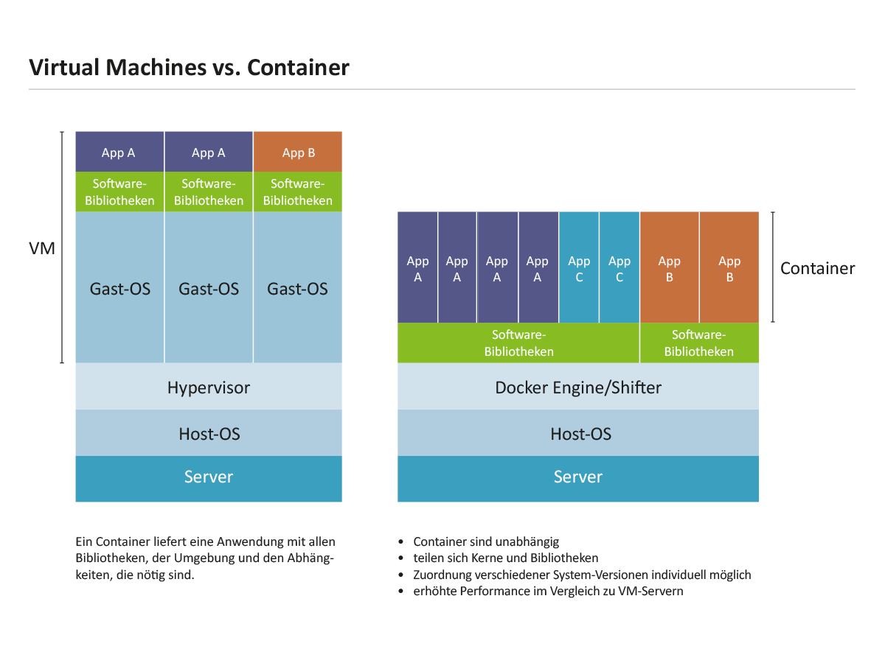

### Docker concepts

Docker is a platform for developers and sysadmins to **develop, deploy, and run** applications with containers. The use of Linux containers to deploy applications is called _containerization_. Containers are not new, but their use for easily deploying applications is.

Containerization is increasingly popular because containers are:

- Flexible: Even the most complex applications can be containerized.
- Lightweight: Containers leverage and share the host kernel.
- Interchangeable: You can deploy updates and upgrades on-the-fly.
- Portable: You can build locally, deploy to the cloud, and run anywhere.
- Scalable: You can increase and automatically distribute container replicas.
- Stackable: You can stack services vertically and on-the-fly.

> 优点巨多，这也是为什么开发中 vm 被 container 技术迅速淘汰的原因


#### Images and containers

A container is launched by running an image. An **image** is an executable package that includes everything needed to run an application--the code, a runtime, libraries, environment variables, and configuration files.

A **container** is a runtime instance of an image--what the image becomes in memory when executed (that is, an image with state, or a user process). You can see a list of your running containers with the command, `docker ps`, just as you would in Linux.

> 这里表明了 image 是一个只读的镜像，包含了运行 app 所需要的代码/运行库/运行环变量/配置文件
>
> 而 container 是一个运行时的 image 实例

#### Containers and virtual machines

A **container** runs _natively_ on Linux and shares the kernel of the host machine with other containers. It runs a discrete process, taking no more memory than any other executable, making it lightweight.

By contrast, a **virtual machine** (VM) runs a full-blown “guest” operating system with _virtual_ access to host resources through a hypervisor. In general, VMs provide an environment with more resources than most applications need.



### Setup

#### Installation

For more information, please go to the official site :

https://docs.docker.com/install/linux/docker-ce/centos/#upgrade-docker-ce-1

1. update yum packages

   ```bash
   $ sudo yum update
   ```

2. perform the docker installation script([reference here][link2])

   ```bash
   $ curl -sSL https://get.docker.com/ | sh
   ```

   if it's error because the fallowing problem:

   ```ba
   Error: Package: docker-ce-17.06.0.ce-1.el7.centos.x86_64 (docker-ce-stable)
              Requires: container-selinux >= 2.9
    You could try using --skip-broken to work around the problem
    You could try running: rpm -Va --nofiles --nodigest
   ```

   seems like you should update or get your container-selinux before your installation move forward, here is the solution reference on [requires container-selinux][link1]:

   > Installing the Selinux from the Centos repository worked for me:
   >
   > 1. Go to http://mirror.centos.org/centos/7/extras/x86_64/Packages/
   > 2. Find the latest version for container-selinux i.e. container-selinux-2.21-1.el7.noarch.rpm
   > 3. Run the following command on your terminal: $ sudo yum install -y http://mirror.centos.org/centos/7/extras/x86_64/Packages/**Add_current_container-selinux_package_here**
   > 4. The command should looks like the following $ sudo yum install -y http://mirror.centos.org/centos/7/extras/x86_64/Packages/container-selinux-2.21-1.el7.noarch.rpm
   >    Note: the container version is constantly being updated, that is why you should look for the latest version in the Centos' repository

   for now it may look like:

   ```bash
   $ sudo yum install -y http://mirror.centos.org/centos/7/extras/x86_64/Packages/container-selinux-2.55-1.el7.noarch.rpm
   ```

   then you could try the installation script again and it should be done

3. start docker service

   ```bash
   $ sudo service docker start
   [sudo] password for xxx:
   Redirecting to /bin/systemctl start docker.service
   ```

#### Verify your installation

```bash
$ sudo docker run hello-world
Unable to find image 'hello-world:latest' locally
latest: Pulling from library/hello-world
d1725b59e92d: Pull complete
Digest: sha256:0add3ace90ecb4adbf7777e9aacf18357296e799f81cabc9fde470971e499788
Status: Downloaded newer image for hello-world:latest

Hello from Docker!
This message shows that your installation appears to be working correctly.

To generate this message, Docker took the following steps:
1. The Docker client contacted the Docker daemon.
2. The Docker daemon pulled the "hello-world" image from the Docker Hub.
   (amd64)
3. The Docker daemon created a new container from that image which runs the
   executable that produces the output you are currently reading.
4. The Docker daemon streamed that output to the Docker client, which sent it
   to your terminal.

To try something more ambitious, you can run an Ubuntu container with:
$ docker run -it ubuntu bash

Share images, automate workflows, and more with a free Docker ID:
https://hub.docker.com/

For more examples and ideas, visit:
https://docs.docker.com/get-started/
```

### Optional Linux post-installation steps

#### Manage Docker as a non-root user

You might trouble with permissions problems like:

```bash
$ docker ps
Got permission denied while trying to connect to the Docker daemon socket at unix:///var/run/docker.sock: Get http://%2Fvar%2Frun%2Fdocker.sock/v1.39/containers/json: dial unix /var/run/docker.sock: connect: permission denied
```

It's because the Docker daemon binds to a Unix socket instead of a TCP port. By default that Unix socket is owned by the user `root` and other users can only access it using `sudo`. The Docker daemon always runs as the `root` user.

If you don’t want to preface the `docker` command with `sudo`, create a Unix group called `docker` and add users to it. When the Docker daemon starts, it creates a Unix socket accessible by members of the `docker` group.

1. create the docker group:

   ```bash
   $ sudo groupadd docker
   ```

2. add your user to the `docker` group

   ```bash
   $ sudo usermod -aG docker $USER
   ```

   or

   ```bash
   $ sudo gpasswd -a $USER docker
   ```

3. update the group

   ```bash
   $ newgrp docker
   ```

Then you can run docker commands without sudo.

#### Configure Docker to start on boot

Most current Linux distributions (RHEL, CentOS, Fedora, Ubuntu 16.04 and higher) use [`systemd`](https://docs.docker.com/install/linux/linux-postinstall/#systemd) to manage which services start when the system boots. Ubuntu 14.10 and below use [`upstart`](https://docs.docker.com/install/linux/linux-postinstall/#upstart).

##### `systemd`

```
$ sudo systemctl enable docker
```

To disable this behavior, use `disable` instead.

```
$ sudo systemctl disable docker
```

If you need to add an HTTP Proxy, set a different directory or partition for the Docker runtime files, or make other customizations, see[customize your systemd Docker daemon options](https://docs.docker.com/engine/admin/systemd/).

#### More options

Please refer to [post-install][link3]

Congrats and enjoy your journey of docker~

---

[link1]: https://stackoverflow.com/questions/45272827/docker-ce-on-rhel-requires-container-selinux-2-9 "requires container-selinux"
[link2]: http://www.docker.org.cn/book/install/install-docker-on-rhel-29.html "docker installation reference"
[link3]: https://docs.docker.com/install/linux/linux-postinstall "docker post installation options"
