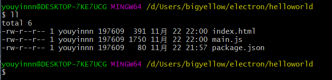
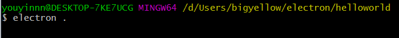
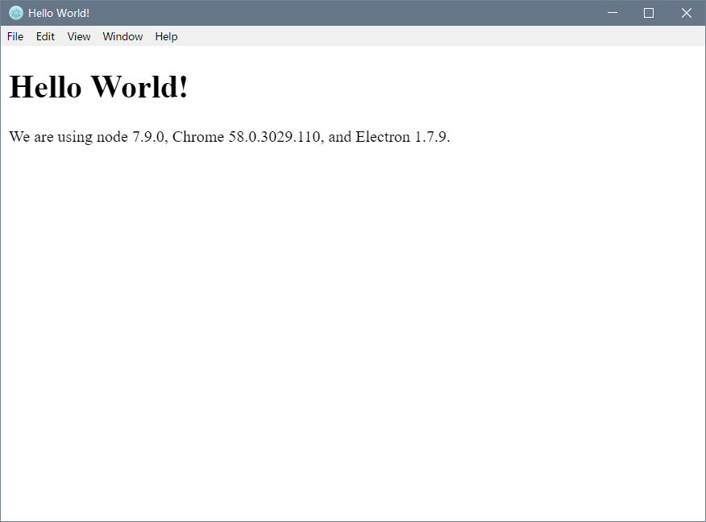



惊！仅用前端技术就可以打造跨平台桌面应用！



### 快速入门

---

简单介绍一下什么是 Electron：

> 如果你只会前端技术，如果你想打造一个桌面应用，如果你不想学 C#、Swing 之类的技术，那么 Electron 绝对是你的不二之选。
>
> 它的本质就是提供一个轻巧的 chrome 内核（其实也有 131M），把你的项目包在里面运行，等于是你项目的专属浏览器！
>
> 为什么想要使用这门技术，首先非常有趣，其次我只是个半吊子的前端选手，写项目完全不存在浏览器兼容性考虑这回事（我觉得兼容考虑就是前端开发届的一大毒瘤之一），我写的项目全部基于 Chrome 的 V8，IE 什么的傻逼浏览器我是不会去管的。因此你如果想要使用我的项目，要么使用 Chrome，要么使用我项目打包成的桌面应用咯- -

然后这篇基本就算官网[快速入门](https://electronjs.org/docs/tutorial/quick-start)的照搬

我开始上的是中文网，它的快速入门文档我觉得还是有点对菜鸟不友好，整个文档，居然没教怎么安装！

它只说是 npm 安装，但是没说具体安装哪一个！！这太不友好了！

关键 Electron 中文网并没有原官网的`博客`模块！！百度一下之后找到[此文](https://electronjs.org/blog/npm-install-electron)，里面提到怎么安装 electron。

在这里提醒一下：

**千万不要**使用 Electron 中文网：https://electron.org.cn/

**千万要**使用原官网：https://electronjs.org/

原官网也支持中文！中文网的内容有缺失！

所以我们可以正式开始了！

### 安装

---

贴一个 Electron 的 github 项目地址：https://github.com/electron/electron ，里面有安装说明。

我觉得玩什么东西，安装才是第一步！

> 环境准备：node.js 以及 npm 是必须的，git 就不用说了。

然后以下命令进行全局安装（就全局，不要怂）：

```shell
npm install electron --save-dev -g
```

如果安装的时候卡住了的话，可能是因为 electron 的源被墙了的原因，解决：

修改~/.npmrc 文件，加入如下代码：

```cpp
registry=https://registry.npm.taobao.org
electron_mirror="https://npm.taobao.org/mirrors/electron/"
```

### 基本概念

---

#### 主进程

> 在 `Electron` 里，运行 `package.json` 里 `main` 脚本的进程被称为主进程。在主进程运行的脚本可以以创建 web 页面的形式展示 GUI。

#### 渲染进程

> 由于 `Electron` 使用 `Chromium` 来展示页面，所以 `Chromium` 的多进程结构也被充分利用。每个 `Electron` 的页面都在运行着自己的进程，这样的进程我们称之为渲染进程。
>
> 在一般浏览器中，网页通常会在沙盒环境下运行，并且不允许访问原生资源。然而，`Electron` 用户拥有在网页中调用 `Node.js` 的 `APIs` 的能力，可以与底层操作系统直接交互。

#### 主进程与渲染进程的区别

> 主进程使用 `BrowserWindow` 实例创建页面。每个 `BrowserWindow` 实例都在自己的渲染进程里运行页面。当一个 `BrowserWindow` 实例被销毁后，相应的渲染进程也会被终止。
>
> 主进程管理所有页面和与之对应的渲染进程。每个渲染进程都是相互独立的，并且只关心他们自己的页面。
>
> 由于在页面里管理原生 `GUI` 资源是非常危险而且容易造成资源泄露，所以在页面调用 `GUI` 相关的 `APIs` 是不被允许的。如果你想在网页里使用 `GUI` 操作，其对应的渲染进程必须与主进程进行通讯，请求主进程进行相关的 `GUI` 操作。
>
> 在 `Electron`，我们提供几种方法用于主进程和渲染进程之间的通讯。像 `ipcRenderer` 和 `ipcMain` 模块用于发送消息， `remote` 模块用于 `RPC` 方式通讯。这些内容都可以在一个 FAQ 中查看 [how to share data between web pages](https://electron.org.cn/doc/faq.html#how-to-share-data-between-web-pages)。

### HelloWorld

---

大体上，一个`Electron`应用的目录结构如下：

```
your-app/
├── package.json
├── main.js
└── index.html
```

`package.json`的格式和 Node 完全一致，而且被 main 字段声明的脚本文件是你的应用的启动脚本，它运行在主进程上。你应用里的`package.json`看起来应该：

```json
{
  "name": "your-app",
  "version": "0.1.0",
  "main": "main.js"
}
```

**注意：如果 main 字段没有在 package.json 声明，Electron 会优先加载 index.js。**

`main.js` 应该用于创建窗口和处理系统事件，一个典型的例子如下：

```JavaScript
const {app, BrowserWindow} = require('electron')
const path = require('path')
const url = require('url')

// 保持一个对于 window 对象的全局引用，如果你不这样做，
// 当 JavaScript 对象被垃圾回收， window 会被自动地关闭
let win

function createWindow () {
  // 创建浏览器窗口。
  win = new BrowserWindow({width: 800, height: 600})

  // 加载应用的 index.html。
  win.loadURL(url.format({
    pathname: path.join(__dirname, 'index.html'),
    protocol: 'file:',
    slashes: true
  }))

  // 打开开发者工具。
  win.webContents.openDevTools()

  // 当 window 被关闭，这个事件会被触发。
  win.on('closed', () => {
    // 取消引用 window 对象，如果你的应用支持多窗口的话，
    // 通常会把多个 window 对象存放在一个数组里面，
    // 与此同时，你应该删除相应的元素。
    win = null
  })
}

// Electron 会在初始化后并准备
// 创建浏览器窗口时，调用这个函数。
// 部分 API 在 ready 事件触发后才能使用。
app.on('ready', createWindow)

// 当全部窗口关闭时退出。
app.on('window-all-closed', () => {
  // 在 macOS 上，除非用户用 Cmd + Q 确定地退出，
  // 否则绝大部分应用及其菜单栏会保持激活。
  if (process.platform !== 'darwin') {
    app.quit()
  }
})

app.on('activate', () => {
  // 在这文件，你可以续写应用剩下主进程代码。
  // 也可以拆分成几个文件，然后用 require 导入。
  if (win === null) {
    createWindow()
  }
})

// 在这文件，你可以续写应用剩下主进程代码。
// 也可以拆分成几个文件，然后用 require 导入。
```

最后，你想展示的 `index.html`：

```html
<!DOCTYPE html>
<html>
  <head>
    <meta charset="UTF-8" />
    <title>Hello World!</title>
  </head>
  <body>
    <h1>Hello World!</h1>
    We are using node
    <script>
      document.write(process.versions.node);
    </script>
    , Chrome
    <script>
      document.write(process.versions.chrome);
    </script>
    , and Electron
    <script>
      document.write(process.versions.electron);
    </script>
    .
  </body>
</html>
```

### Run HelloWorld

---

一旦你创建了最初的 `main.js`， `index.html` 和` package.json` 这几个文件，你可能会想尝试在本地运行并测试，看看是不是和期望的那样正常运行。

安装文档说明，运行 electron 应用的方式有两种：

- npm 安装 electron 模块 使用模块运行
- 直接使用二进制文件运行

如果你没有 nodejs 环境，你可以考虑使用二进制文件运行应用。

使用模块去运行 electron 应用的命令是这样的：

_electron 是一个 npm 模块，包含所使用的 Electron 预编译版本。 如果你已经用 npm 全局安装了它，你只需要按照如下方式直接运行你的应用：_

```shell
electron .
```

下面是我自己的演示：

- 目录结构：
  

- 运行：
  

- 界面：
  

---

然后官网里还给了一个 quickstar 项目，那个项目没必要跑了，内容基本和上面的 HelloWorld 是一样的。

这样 Electron 的 HelloWorld 的体验已经完成了！前端变桌面应用的感觉巨奇妙！超级期待后面的学习！
