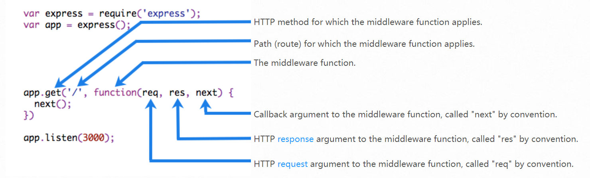



翻译自官方文档



## Writing Middleware

中间件能够在请求响应周期中访问 [request object](http://www.expressjs.com.cn/en/4x/api.html#req) (`req`)，和 [response object](http://www.expressjs.com.cn/en/4x/api.html#res) (`res`)，以及 `next`方法。`next`方法用于在路由过程中执行当前中间件紧接着的下一个中间件。

中间件能够完成以下事情：

- Execute any code.
- Make changes to the request and the response objects.
- End the request-response cycle.
- Call the next middleware in the stack.

如果当前中间件不结束该次请求响应周期，它必须调用 next 方法，将控制传递到下一个中间件，否则请求会被挂起。

下图展示了中间件功能的基本元素：



### Example: Middleware function myLogger

这里是一个简单的“myLogger”中间件，作用仅仅只是在有请求进来的时候打印。

```javascript
var myLogger = function (req, res, next) {
  console.log("LOGGED");
  next();
};
```

方法的最后一行调用了`next()`函数，这个函数不是 Node.js 或者 Express API 里的函数，而是从第三个方法参数传进来的下一个中间件的名称，将这个参数当作方法调用就是在调用下一个中间件；。

为了加载中间件，调用`app.use()`。比如下面的代码将`myLogger`中间件加载到根路径上。

```javascript
var express = require("express");
var app = express();

var myLogger = function (req, res, next) {
  console.log("LOGGED");
  next();
};

app.use(myLogger);

app.get("/", function (req, res) {
  res.send("Hello World!");
});

app.listen(3000);
```

中间件加载的顺序很重要：先加载的中间件其方法先被执行。

如果`myLogger`是在“路由到根路径”之后加载的话，那么任何请求都不会访问到它，因为根路径路由周期已经结束了。

### Example: Middleware function requestTime

我们创建一个记录请求时间的中间件：

```javascript
var requestTime = function (req, res, next) {
  req.requestTime = Date.now();
  next();
};
```

回调方法也可以使用路由方法上的参数，去添加属性到`req`上：

```javascript
var express = require("express");
var app = express();

var requestTime = function (req, res, next) {
  req.requestTime = Date.now();
  next();
};

app.use(requestTime);

app.get("/", function (req, res) {
  var responseText = "Hello World!<br>";
  responseText += "<small>Requested at: " + req.requestTime + "</small>";
  res.send(responseText);
});

app.listen(3000);
```

### Configurable middleware

如果你需要你的中间件可以配置的话，那么你可以这样做：

File: `my-middleware.js`

```javascript
module.exports = function (options) {
  return function (req, res, next) {
    // Implement the middleware function based on the options object
    next();
  };
};
```

然后在装载的时候指定参数：

```javascript
var mw = require("./my-middleware.js");

app.use(mw({ option1: "1", option2: "2" }));
```

中间件[cookie-session](https://github.com/expressjs/cookie-session) 和 [compression](https://github.com/expressjs/compression) 都是以这样的形势去配置的。
