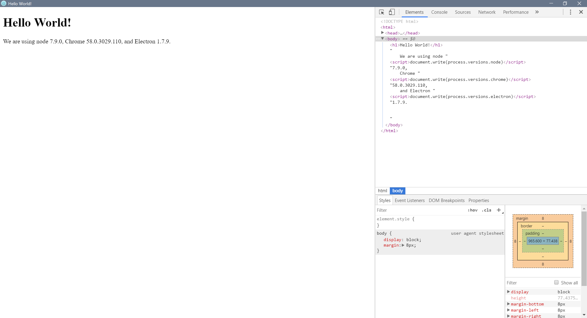



EXE 什么的，看着就忍不住要双击它！



### Introduction

---

首先介绍一下 Electron 打包应用的方式：

- 打包成 asar 分发；这种方式弊端很多而且不好操作，[详情见](https://electronjs.org/docs/tutorial/application-packaging)。
- 重构官网提供的二进制 release，这种方式也比较麻烦。
- 通过打包工具：
  - [electron-forge](https://github.com/electron-userland/electron-forge)
  - [electron-builder](https://github.com/electron-userland/electron-builder)
  - [electron-packager](https://github.com/electron-userland/electron-packager)
- 重编译源码二进制文件...

用打包工具进行打包比较傻瓜式，两年前的时候，我用过 packager，但是现在不知道为啥不好使了，老卡住，然后我转试 builder。

## electron-packager

根据项目 readme 的说明，首先得安装 electron-packager 的模块：

```shell
npm insatll electron-packager -g
```

对还是全局安装 不要怂。

要打包你的项目，你只需要运行下面格式的命令：

```shell
electron-packager <sourcedir> <appname> --platform=<platform> --arch=<arch> [optional flags...]
```

里面的参数含义我们可以通过[txt](https://github.com/electron-userland/electron-packager/blob/master/usage.txt)进行简单的参考，或者在[md](https://github.com/electron-userland/electron-packager/blob/master/docs/api.md)进行深入研究。

推荐是看 md 的比较清晰一点

在上篇中，我们构造的 helloworld 的目录结构为：

```
your-app/
├── package.json
├── main.js
└── index.html
```

在我们的演示中，我们运行的是这样的命令：

```shell
electron-packager . helloworldappname --out outputdir --electronVersion 1.7.9
```

我们在项目目录根目录下运行了这个命令，所以第一个`.`代表的`<sourcedir>`是本目录，然后我们指定了`<appname>`为`helloworldappname`，然后我们指定了`--out`表示打包输出的目录，最后指定了我们使用的 electron 的版本号。

我没有指定`--platform`和`--arch`是因为这俩在默认的情况下是选取本机参数，比如我是 win32x64。

但是每次打包都要写这巨长的命令，确实有点麻烦，我们可以使用 npm 的`run-script`功能去快速的执行写好的命令：

npm`run-script`是默认运行当前目录下`package.json`文件中 script 定义好的命令，具体的应用自己去学 npm 相关知识，我在项目的`package.json`文件中写好：

```json
{
  "name": "helloworld",
  "version": "0.1.0",
  "main": "main.js",
  "scripts": {
    "start": "electron .",
    "pk": "electron-packager . helloworldappname --out=outputdir --electronVersion=1.7.9"
  }
}
```

然后在根目录下运行命令：

```shell
npm run-script pk
```

结果如下：

```shell
youyinnn@DESKTOP-7KE7UCG MINGW64 /d/Users/bigyellow/electron/helloworld
$ ll
total 6
-rw-r--r-- 1 youyinnn 197609  391 11月 22 22:00 index.html
-rw-r--r-- 1 youyinnn 197609 1750 11月 22 22:00 main.js
-rw-r--r-- 1 youyinnn 197609  211 11月 23 16:04 package.json

youyinnn@DESKTOP-7KE7UCG MINGW64 /d/Users/bigyellow/electron/helloworld
$ npm run-script pk

> helloworld@0.1.0 pk D:\Users\bigyellow\electron\helloworld
> electron-packager . helloworldappname --out=outputdir --electronVersion=1.7.9

Packaging app for platform win32 x64 using electron v1.7.9
Wrote new app to outputdir\helloworldappname-win32-x64

youyinnn@DESKTOP-7KE7UCG MINGW64 /d/Users/bigyellow/electron/helloworld
$ ll
total 6
-rw-r--r-- 1 youyinnn 197609  391 11月 22 22:00 index.html
-rw-r--r-- 1 youyinnn 197609 1750 11月 22 22:00 main.js
drwxr-xr-x 1 youyinnn 197609    0 11月 23 16:05 outputdir/
-rw-r--r-- 1 youyinnn 197609  211 11月 23 16:04 package.json

youyinnn@DESKTOP-7KE7UCG MINGW64 /d/Users/bigyellow/electron/helloworld
$
```

然后项目目录下会生成：


运行 exe：


---

至此我们的 HelloWorld 的打包就完成了，可以发现虽然我们只是一个简单的 html，但是整个包的大小却有 131M，这是因为它还包含了 chrome 微引擎和其他的环境文件。

_参考：https://electronjs.org/docs/tutorial/application-distribution_

_参考：https://github.com/electron-userland/electron-packager/blob/master/docs/api.md_

_参考：http://blog.csdn.net/a1170201028/article/details/59108126_

## electron-builder

1. Specify the standard fields in the application `package.json` — [name](https://www.electron.build/configuration/configuration#Metadata-name), `description`, `version` and [author](https://docs.npmjs.com/files/package.json#people-fields-author-contributors).

2. Specify the [build](https://www.electron.build/configuration/configuration#configuration) configuration in the `package.json` as follows:

   ```
   "build": {
     "appId": "your.id",
     "mac": {
       "category": "your.app.category.type"
     }
   }
   ```

   See [all options](https://www.electron.build/configuration/configuration#configuration). Option [files](https://www.electron.build/configuration/contents#files) to indicate which files should be packed in the final application, including the entry file, maybe required.

3. Add [icons](https://www.electron.build/icons).

4. Add the [scripts](https://docs.npmjs.com/cli/run-script) key to the development `package.json`:

   ```
   "scripts": {
     "pack": "electron-builder --dir",
     "dist": "electron-builder"
   }
   ```

   Then you can run`yarn dist`(to package in a distributable format (e.g. dmg, windows installer, deb package)) or`yarn pack`(only generates the package directory without really packaging it. This is useful for testing purposes).

   To ensure your native dependencies are always matched electron version, simply add script `"postinstall": "electron-builder install-app-deps"` to your `package.json`.

5. If you have native addons of your own that are part of the application (not as a dependency), set [nodeGypRebuild](https://www.electron.build/configuration/configuration#Configuration-nodeGypRebuild) to `true`.

Please note that everything is packaged into an asar archive [by default](https://www.electron.build/configuration/configuration#Configuration-asar).

For an app that will be shipped to production, you should sign your application. See [Where to buy code signing certificates](https://www.electron.build/code-signing#where-to-buy-code-signing-certificate).

这个 build 的时候也需要下载一些东西，源可能被 BAN 了。
