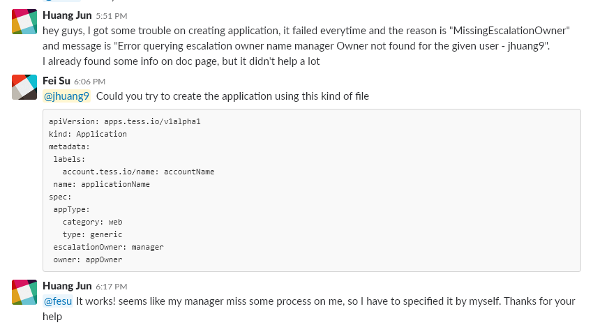

### Tess

#### 0. What is Tess?

Tess.IO is eBay’s cluster manager, with a vision of ensuring a world-class **build, ship and run** experience for eBay’s applications at scale, while ensuring high efficiency, security, and agility to the developers. Tess.IO leverages Kubernetes under its hood. Kubernetes (commonly referred to as “k8s”) is an open source container cluster manager that aims to provide a “platform for automating deployment, scaling, and operations of application containers across clusters of hosts.”

Tess makes DevOps a breeze.

> So, you don't have to setup k8s or docker on your server anymore.
>
> Tess is not an new tech, it's a plus-version of k8s cli with eBay's own way.

#### 0.1. Further Reading

To best introduce topics, the following instructions suggest a way of consuming this documentation such that topics build upon previous topics.

First, you’ll want to understand what Tess.IO is. For this, read the [Introduction](https://tess.io/userdocs/getting-start/intro). Next, you’ll want to set up your machine with the necessary tools and configuration to talk to Tess.IO. For this, read [Setup](https://tess.io/userdocs/getting-start/setup). Finally, you’ll want to run the [Hello World](https://tess.io/userdocs/getting-start/hello-world) example.

From here, you can branch out depending on your needs. Consider starting with [Model Workloads](https://tess.io/userdocs/getting-start/models) followed by [Build and Deploy](https://tess.io/userdocs/getting-start/build-and-deploy).

For a better understanding of Kubernetes we recommend reading the following documentation:

- Core Kubernetes [documentation](https://kubernetes.io/docs/home)
- [Declarative](https://kubernetes.io/docs/concepts/overview/object-management-kubectl/declarative-config/) configuration files
- Kubernetes [examples](https://github.com/kubernetes/examples).
- Kubernetes [best practices](https://www.youtube.com/playlist?list=PLIivdWyY5sqL3xfXz5xJvwzFW_tlQB_GB).

> I strongly recommends Tess user would have basic knowledge of k8s, otherwise you will get some trouble and you don't event know how to fix it.
>
> Anyway, keep learning.

#### 1. Setup Tess on your server

Follow the instructions of [setup][tess-setup-page].

#### 2. Finish your helloworld

Follow the instructions of [helloworld][tess-helloworld-page].

##### 2.1 Why does my application's creations are always failed?

Try

```bash
$ tskb get application tesshjapp -o yaml
```

and

```bash
apiVersion: ebay/v1alpha1
kind: Application
metadata:
  creationTimestamp: 2018-11-13T08:46:53Z
  labels:
    account.tess.io/name: jhuang9
  name: tesshjapp
  resourceVersion: "1527349281"
  selfLink: /apis/ebay/v1alpha1/applications/tesshjapp
  uid: ab51990f-e720-11e8-8642-74dbd180c0ec
spec:
  appType:
    category: web
    type: generic
  owner: jhuang9
status:
  conditions:
  - lastProbeTime: 2018-11-13T08:47:24Z
    lastTransitionTime: 2018-11-13T08:47:24Z
    message: Error querying escalation owner name manager Owner not found for the
      given user - jhuang9
    reason: MissingEscalationOwner
    status: "True"
    type: Failed
  phase: Failed
  startTime: 2018-11-13T08:47:24Z
```

It seems like your account is "MissingEscalationOwner"



As Tess member said, we can create Application using -f option to create app with file:

```bash
$ tskb create -f app.yaml
```

and the app.yaml file may look like:

```yaml
apiVersion: apps.tess.io/v1alpha1
kind: Application
metadata:
  labels:
    account.tess.io/name: accountName
  name: applicationName
spec:
  appType:
    category: web
    type: generic
  escalationOwner: manager
  owner: appOwner
```

#### 3. Learn the main concepts of Tess Model

[Tess Model][tess-model-page]

#### 4. Now, get to work!

You've got enough knowledge to move to k8s/prometheus/grafana.

This is not the end, it just a beginning.

Here's some tips:

1. work with namespace at the most of time

2. use tess to get help, It does give a lot of help

   ```bash
   $ tess
   Tess CLI Version: {"Experimental":"true","Major":"1","Minor":"8+","Tess Release":"release-0.33.2"}
   Fetching released Tess CLI versions...
   ** New version release-0.33.5 available. Please use `tess version list` to get the released versions.
   Client Version: version.Info{Major:"1", Minor:"8+", GitVersion:"v0.0.0-master+$Format:%h$", GitCommit:"$Format:%H$", GitTreeState:"", BuildDate:"1970-01-01T00:00:00Z", GoVersion:"go1.9.6", Compiler:"gc", Platform:"linux/amd64"}

   Tess CLI is currently an alpha offering. Functionalities are subject to be changed based on customer feedback and
   product direction.

     * We are on slack: https://tessio.slack.com

   Commands to initialize tess
     login       Login to Tess
     init        Initialize Tess workspace

   Commands to manipulate kube objects
     kubectl     kubectl controls the Kubernetes cluster manager

   Commands to manipulate groups/applications/accounts
     get         Display one or many resources
     annotate    Update the annotations on a resource
     create      Create a resource by filename or stdin
     delete      Delete resources by filenames, stdin, resources and names, or by resources and label selector
     describe    Show details of a specific resource or group of resources
     edit        Edit a resource on the server
     label       Update the labels on a resource
     replace     Replace a resource by filename or stdin

   Other Commands:
     clusters    List Tess clusters
     help        Help about any command
     install     Install specified Tess CLI version
     status      Print the cluster and user account information
     version     Print the client and server version information

   Use "tess <command> --help" for more information about a given command.
   Use "tess options" for a list of global command-line options (applies to all commands).
   ```

---

[tess-setup-page]: https://tess.io/userdocs/getting-start/setup/
[tess-helloworld-page]: https://tess.io/userdocs/getting-start/hello-world/
[tess-model-page]: https://tess.io/userdocs/models/
