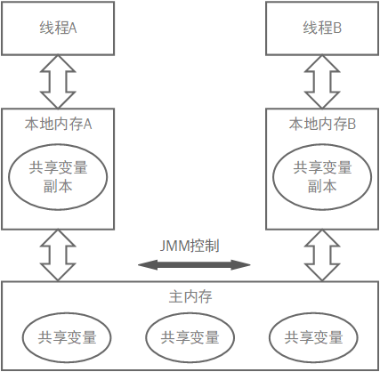
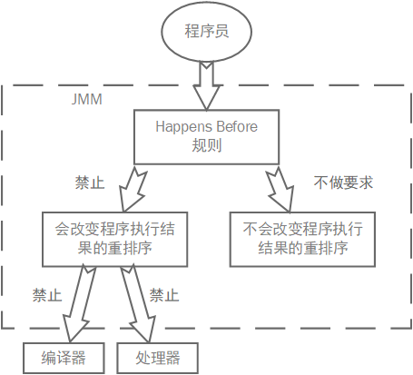
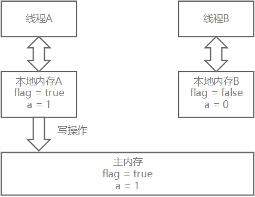
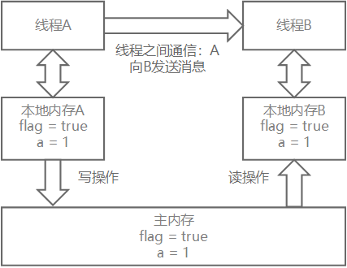

### 前言

前面说了好多好多刀枪剑，还说了一些最前置的内功心法，这回说说更深层的内功心法——**JMM，Java Memory Model，Java 内存模型！**

Java 线程之间的通信对程序员是完全透明的（你是很难感知得到的），所以内存可见性问题经常称为并发的通病之一，这坎说的内存模型，是让你更好地去感知，去推断线程内存通信的有力武器。

这坎基本就是*《核心》*的第三章内容，我就这书总结一下，然后调一下排版，主要说的内容：

- **JMM 基础：介绍基本概念**
- **JMM 中的顺序一致性：重排序和顺序一致性内存**
- **三个同步原语 synchronized、volatile 的内存语义**
- **重排序规则**
- **JMM 设计原理**

---

### JMM 基础

#### 并发编程的两个关键问题

线程之间如何进行通信？线程之间如何进行同步？在命令式编程中，线程通信机制有两种：共享内存和消息通信

| 通信机制 \ 问题 | 通信问题 | 同步问题 |
| :-------------: | :------: | :------: |
|    共享内存     |   隐式   |   显式   |
|    消息通信     |   显式   |   隐式   |

在共享内存模型中：

- 线程通过读写公共内存来进行通信，这是**隐式通信**
- 程序必须有指定的区域让线程互斥执行，这是**显式同步**

在消息通信模型中：

- 线程没有公共状态，必须发送消息来通信，这是**显示通信**
- 由于消息的发送必须是在消息接收之前，所以是**隐式同步**

而 Java 的并发采用的是**共享内存模型**，所以同步是显示的，可能比线程通信好好懂一些

#### JMM 内存模型抽象结构



线程之间的通信由 JMM 控制，JMM 控制之内从与每个线程的本地内存之间的交互，来为 Java 程序员提供内存可见性保证

这里每个线程之间的本地内存在虚拟机中就是每个线程自己的栈空间

也就是说：**JMM 决定一个线程对共享变量的写入在什么时候对另一个线程可见！**

所以，如果线程之间要通信的话，需要经过以下两步：

1. 线程 A 将自己的副本值刷到主内存中
2. 线程 B 从主内存中读取共享变量来更新自己的该共享变量的副本

#### 从源代码到指令序列的重排序

在执行程序的时候，为了提高性能，编译器和处理器通常会对指令做重排序，重排序分为 3 种：

1. **编译器优化重排序**。编译器在不改变语义的情况下，可以重新安排语句的内容
2. **指令级并行的重排序**。用来将多条指令堆叠执行，如果不存在数据依赖性，处理器可以改变语句对应机器指令的执行顺序
3. **内存系统重排序**。由于和处理器直接通信的是缓冲区，所以加载和存储操作看上去可能是在乱序执行

第一个是属于编译器重排序，后两个是属于处理器重排序，因为提升性能而存在的这些重排序，在多线程中就有可能出现内存可见性问题

对于编译器重排序，JMM 会禁止一些类型的编译器重排序

对于处理器重排序，JMM 会在编译器程持指令序列的时候，在序列之间插入特定的**内存屏障（Memory Barriers）**，这些屏障用于禁止特定类型的处理器重排序

下面是内存屏障的类型表：

|      屏障类型       |           指令示例           | 说明                                                                                                                                                                              |
| :-----------------: | :--------------------------: | --------------------------------------------------------------------------------------------------------------------------------------------------------------------------------- |
|  LoadLoad Barriers  |   Load1；LoadLoad；Load2；   | 确保 Load1 数据的装载先于 Load2 及以后所有的装载指令的装载                                                                                                                        |
| StoreStore Barriers | Store1；StoreStore；Store2； | 确保 Store1 数据对其他处理器可见（刷到主内存中去）先于 Store2 及其后的所有存储指令的存储                                                                                          |
| LoadStore Barriers  |   Load1；LoadStore；Store2   | 确保 Load1 数据装载先于 Store2 及所有后续的存储指令刷新到内存                                                                                                                     |
| StoreLoad Barriers  |   Store1；StoreLoad；Load2   | 确保 Store1 数据对其他处理器变得可见（刷到主内存）先于 Load2 及所有后续装载指令的装载。该屏障会使该屏障之前的所有内存访问指令（装载和存储）完成之后，才执行屏障后的内存访问指令。 |

最后一个屏障是全能型的屏障，它拥有前三个屏障所有的功能，但是执行这个屏障的开销会很大，因为要把缓冲区中所有的数据内容都刷到主存中去

##### 数据依赖性

什么是数据依赖性？如果两个操作访问同一个变量，而且至少其中一个操作是**写操作**，就称这两个操作之间存在数据依赖性，数据依赖性分为：写后读、写后写、读后写；

如果两个操作存在数据依赖性，那么一旦重排序这两个操作，并且改变了执行顺序，两个操作的执行结果就会被改变，JMM 禁止这种重排序！

- 所以编译器和处理器在进行重排序的时候，会遵循数据依赖原则，不会对这些情况进行重排序
- 并且要注意的是，数据依赖性仅针对**单个处理器中执行的指令序列和单个线程中执行的操作**，对于多处理器和多线程情况的数据依赖性不被编译器和处理器考虑！

##### as-if-serial 语义

这个语义的意思是：**不管怎么重排序，<u>单线程</u>程序的执行结果不能被改变！**

> as-if-serial 语义把单线程操作保护了起来，即使底层进行了异常复杂的重排序，单线程程序员还是认为程序是按照顺序执行的，因为重排序并没有改变执行结果

实际上：

> 在单线程程序中，对存在控制依赖的操作进行重排序，不会改变执行结果（这也是 as-if-serial 语义做出的保证，实际上并不会进行重排序）；
>
> 但是在多线程程序中，对存在控制依赖的操作进行重排序，可能会改变执行的结果，因为 JMM 没有保证

#### happens-before 关系和 JMM 的设计意图

Happens Before 是 JMM 最核心的概念，理解 Happens Before 就理解了 JMM 的管理机制。

##### JMM 的设计

JMM 作为 Java 的内存管理的一方霸主，它的设计自然不能特别随意，JMM 的设计需要考虑：

- 从程序员的角度来说：需要一个易于理解易于编程的强有力的内存模型来写代码
- 从编译器和处理器的角度来说：内存模型的束缚越少越好，这样性能也快

这在计算机领域中是随处可见的矛盾，既要方便安全，又要性能，于是 JMM 设计的核心目标就是找到一个平衡点，既要有强有力的规则来保证内存可见性，又要保证处理器可以大展手脚

于是就有了**Happens Before 规则**



可以看到，JMM 将重排序情况分为：会改变结果的排序、不会改变结果的排序

对于这两种情况，JMM 也有不同的策略：

- 如果重排序会改变结果，那么 JMM 要求处理器和编译器坚决禁止这种排序
- 如果不影响 JMM 则没有要求

换句话说：**只要不坑程序员，处理器和编译器想怎么玩就怎么玩~**

举两个例子，如果编译器经过细致的分析过后，判定一个锁只会被一个线程单独访问，那么这个锁可以被消除；

如果编译器经过细致的分析过后，认定一个 volatila 变量只会被单线程访问，那么编译器可以把这个变量当作普通变量去对待；

##### happens-before 关系是什么？

> JSR-133 使用 happens-before 的概念来指定两个操作之间的执行顺序。由于这两个操作可以在同一个线程，也可以在不同线程之间，因此，JMM 可以通过 happens-before 关系向程序员提供跨线程的内存可见性保证。

*《JSR-133：Java Memory Model and Thread Specification》*对 happens-before 关系的定义如下：

1. 如果一个操作 happens-before 另一个操作，那么第一个操作的执行结果对第二个操作可见，且第一个操作的执行顺序排在第二个操作之前
2. 两个操作之间存在 happens-before 关系，并不意味着 Java 平台的具体实现必须要按照 happens-before 关系指定的顺序来执行，如果重排序的执行结果，和保持 happens-before 关系的执行结果一致，那么 JMM 允许这种重排序

- 上面的 1.是**JMM 对程序员的承诺**，但需要注意的是，这只是 JMM 向程序员做出的保证。
- 上面的 2.是**JMM 对编译器和处理器重排序的约束原则**，前面已经说过，JMM 允许重排序的原则是只要不改变程序运行结果，你想怎么优化都行，而对于程序员和编译器处理器这两者之间来说，只要后者重排序之后，即使操作顺序改变了，但是结果没变，对前者看来，程序还是按照他们的预期去执行。

> **我们需要特别注意的一点：**
>
> 所谓的 happens-before 规则，只是对程序员的**承诺**，它只反映了程序运行结果，实际运行情况和规则所表达的不同，举个最简单的例子：
>
> 比如两条语句 1 和 2，由顺序规则有`1 happens-before 2`，JMM 在编译的时候允许将这段代码重排序为 2 先于 1，之所以允许重排序是因为 JMM 觉得这会提高处理器性能（至于为什么你就别管了 JMM 说了算），但是这种排序并不改变程序执行结果，所以对于程序员来说，2 先于 1 和 1 先于 2 没有区别，但这依旧得是在我们程序员的设计之下，所以即使执行的是 2 先于 1，程序员以`1 happens-before 2`这样的规则去判断程序就好了。

基于上面的原因，happens-before 关系本质上和 as-if-serial 语义是一回事

- as-if-serial 语言保证单线程内程序执行的结果不变，happens-before 关系保证**<u>正确同步</u>**的多线程程序的执行结果不被改变
- as-if-before 让程序员以为他们写的单线程程序是按照顺序执行的，happens-before 关系让程序员以为他们写的正确同步的多线程程序是按照 happens-before 指定的顺序去执行的

##### happens-before 规则

*《JSR-133：Java Memory Model and Thread Specification》*定义了如下 happens-before 规则：

1. **程序顺序规则：**一个线程中的每个操作，happens-beofore 于该线程中的任意后续操作
2. **监视器锁规则：**对一个锁的解锁，happens-before 于随后对这个锁的加锁
3. **volatile 变量规则：**对一个 volatile 域的写操作，happens-before 于任意后续对这个 volatile 域的读
4. **传递性规则：**如果 A happens-before B，且 B happens-before C，那么 A happens-bofore C
5. **start()规则：**如果线程 A 执行操作`ThreadB.start()`（启动线程 B），那么 A 线程的`ThreadB.start()`操作 happens-before 于线程 B 中的任意操作
6. **join()规则：**如果线程 A 执行操作`ThreadB.join()`并成功返回，那么线程 B 中的任意操作 happens-before 于线程 A 从`ThreadB.join()`操作成功返回

##### happens-before 应用例子

###### 程序顺序规则

```java
double pi = 3.14;	// A
double r = 1.0;		// B
double area = pi * r * r; // C
```

根据顺序规则有：

> 1.  A happens-before B
> 2.  B happens-before C
> 3.  A happens-before C // 传递性推导

这里 1 和 2 允许重排序，但是不改变 3 的结果，因为 pi 和 r 谁先被初始化都无所谓，只要不改变 area 的结果就好

#### volatile 的内存语义

##### 特性

我们可以用两段程序来说明 volatile 变量和一般变量访问锁方法之间的读写等效，首先看 volatile 变量：

```java
class A{
    volatile int i = 0;
    public void set(int i){
        this.i = i;	// 单个变量的写
    }
    public void increment(){
        i++;	// 复合操作的读/写
    }
    public int get(){
        return i;	// 单个变量的读
    }
}
```

上面的程序段等效于下面的对一般变量的方法锁方法：

```java
class B{
	int i = 0;
    public synchronized void set(int i){	// 上锁写
        this.i = i;
    }
    public void increment(){	// 普通方法调用
        int temp = get();	// 调用同步读方法
        temp += 1;	// 普通的写操作
        set(temp);	// 调用同步写方法
    }
    public synchronized int get(){
        return i;
    }
}
```

> 锁的 happens-before 规则保证释放锁和获取锁的两个线程之间的内存可见性，所以这意味着：
>
> **对一个 volatile 变量的读，总是能看到所有线程对这个 volatile 变量的最后一次写入！**

于是我们可以总结一下 volatile 变量的特性：

- 可见性保证：对一个 volatile 变量的读，总是能看到所有线程对这个 volatile 变量的最后一次写入
- 原子性保证：对 volatile 变量的读写操作具有原子性，但是 volatile++这种复合操作一定不具有原子性

##### 从 happens-before 关系看 volatile 的写-读

从 JSR-133（JDK1.5）开始，volatile 变量的写-读可以实现线程之间的通信

- volatile 写和锁的释放有相同的内存语义
- volatile 读和锁的获取有相同的内存语义

我们看看例子：

```java
public class VolatileExample {
	public static void main(String[] args) throws InterruptedException {
		V v = new V();
		Runnable wirter = () -> {v.wirter();};
		Runnable reader = () -> {v.reader();};
		Thread wt = new Thread(wirter);
		Thread rt = new Thread(reader);
		wt.start();
		rt.start();
	}
}

class V{
	int a = 0;
	volatile boolean flag = false;
	public void wirter() {
        a = 999;						// 1
        flag = true;					// 2
    }
	public void reader() {
		if (flag) {
            int i = a;					// 3
            System.out.println(i);		// 4
        }
	}
}
```

> 假设线程 A 执行 writer()方法之后，线程 B 执行 reader()方法，根据 happens-before 规则有：
>
> 1. 根据程序顺序规则，1 happens-before 2；3 happens-before 4
> 2. 根据 volatile 规则，2 happens-before 3
> 3. 根据传递性规则，1 happens-before 4

其中，2 是一个放锁相同原语，3 是一个加锁相同原语，在这里我们需要注意一个有意思的事情，当你运行程序之后你会发现，i 的值是 999，也就是说，两个线程之间的本地变量 a 值被**<u>同步了</u>**！书里的原话是：

> 线程 A 写一个 volatile 变量之后，线程 B 读同一个变量。线程 A 在写 volatile 变量之前所有可见的共享变量（这里指 a），在线程 B 读取同一个 volatile 变量之后将立即变得对线程 B 可见。

具体为什么，我们看下一节如何解释 volatile 的写-读的内存语义！

我也尝试过去验证这些结论的反面，但是很遗憾的是，很有可能由于**“CPU 一旦空闲就刷共享内存（JVM 尽可能的给你保证共享变量同步）”**的原因，即使你不读取同一个 volatile 变量，甚至你不读取任何 volatile 变量，a 的值也是 999，在这样的情况下，不能说书上的结论有误，只能说这应该是两个不同的机制去做同一件事。

##### volatile 写-读的内存语义

###### 写 volatile 变量内存语义

> 当写一个 volatile 变的时候，JMM 会把该线程对应的本地内存中的共享比变量刷新到主内存。



线程 A 在写 flag 变量之后，本地内存 A 中被线程更新过的两个共享变量被更新到主内存中。此时本地内存 A 和主内存中的变量的值是一致的。

###### 读 volatile 内存语义

> 当读一个 volatile 变量的时候，JMM 会把该线程对应的本地内存置为无效，然后从主内存中读取共享变量



如图，在读 flag 之后，本地内存 B 中的值已经无效了，这时线程 B 必须从主内存中读取共享变量，这样就完成了内存可见性保证。

现在对 volatile 写和 volatile 读的内存语义做个总结：

1. 线程 A 写一个 volatile 变量，实质上是把自己的本地内存刷到主内存，并向接下来要读这个变量的线程发出信息：“你的本地内存无效啦！你从主内存读数据吧！”
2. 线程 B 读一个 volatile 变量，实质上是接收了之前线程 A 发出的消息，知道了自己的本地内存变量已经无效了，所以就从主内存读取共享变量
3. **线程 A 写一个 volatile 变量，随后线程 B 读取 volatile 变量，实际上是线程 A 通过主内存向线程 B 发消息！**

#### 锁的内存语义

##### 从 happens-before 关系看锁的释放和获取

下面代码引自 P47

```java
class MonitorExample{
    int a = 0;
    public synchronized void writer(){	// 1	拿锁
        a++;							// 2	操作临界资源
    }									// 3	放锁
    public synchronized void reader(){	// 4	拿锁
        ini i = a;						// 5	操作临界资源
    }									// 6	放锁
}
```

> 假设线程 A 执行 writer()方法，随后线程 B 执行 readre()方法，根据 happens-before 规则有：
>
> - 根据程序顺序规则：1 happens-before 2，2 happens-before 3；4 happens-before 5；5 happens-before 6
> - 根据监视器规则：3 happens-before 4
> - 根据传递性：2 happens-before 5

> 线程 A 释放了锁之后，随后线程 B 获取同一个锁，根据传递的来的`2 happens-before 5`，A 在释放锁之前的所有可变共享变量，在线程 B 获取同一个锁之后立即对线程 B 可见。

##### 锁的释放和获取的内存语义

- **获取锁**：JMM 会把本地内存置为无效，让线程执行临界区代码的时候必须去主内存中读取共享变量值（和**volatile 读**一样）
- **释放锁**：JMM 建本地内存中的值刷到主内存中（和**volatile 写**一样）

##### 锁的内存语义的实现

1. 利用 volatile 变量的写-读具有的内存语义
2. 利用 CAS 所附带的 volatile 读和 volatile 写的内存语义（同时具有两种语义）
