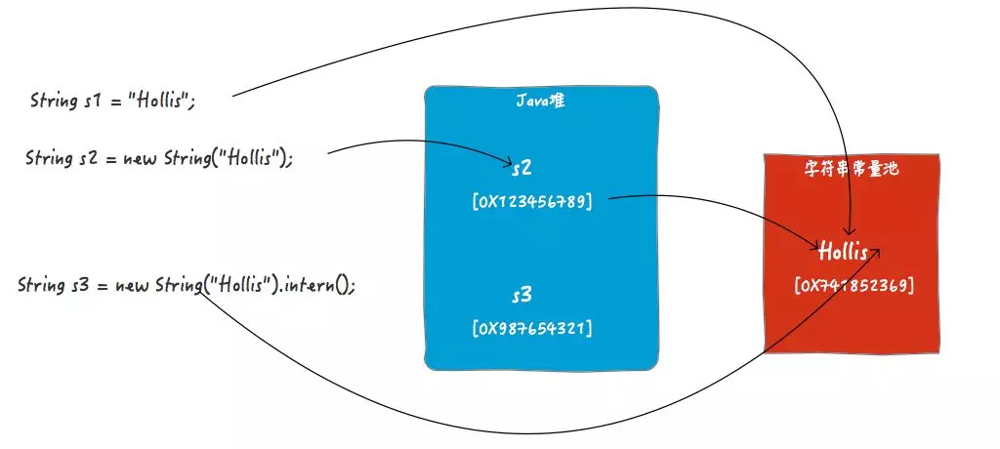
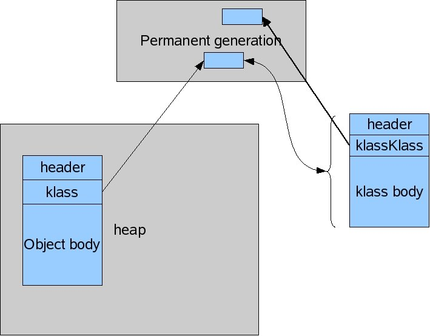
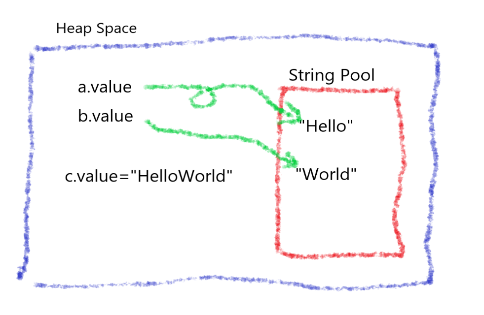

### Introduction

Java 中的`String`其实有很多东西可以深入的，比如最快拼接效率，比如常量池，比如老生常谈的`==`问题

研究它们的时候我们始终要记住，`String`是不可变的**（immutable）**

还有比如它的本质是一个`char[]`数组这些事实就简单带过了

我们需要深入的是`String`的内存问题，既然它是一成不变的，有一个对象是一个对象，那么 JVM 是如何减少内存的开销的？以及它引申出的一系列内存问题

而我想写这篇文章的引子，则是[Hollis 前辈](https://github.com/hollischuang)的一篇：[为什么阿里巴巴不建议在 for 循环中使用"+"进行字符串拼接](https://mp.weixin.qq.com/s/Zs8en3T8TxCMbxGWHkDwBw?comefrom=http://blogread.cn/news/)

### Constant Pool & Runtime Constant Pool

关于常量池，它用于存放 Java 编译期生成的各种字面量和符号引用，于是每个 Class 文件都会有一个 Constant Pool，具体的你可以通过`javap -v ClassName`一个类去看到；

而在 JVM 装载 class 文件的时候，会读取 Constant Pool 里的内容到 Runtime Constant Pool，而 Runtime Constant Pool 会在程序运行的时候动态产生新的常量；

### Literal

我们知道 String 有两种创建的方式：

```java
String a = "hello";		// literal
String b = new String("hello");		// new an object
```

我们当然也知道，a 和 b 是两个不同的对象，因为 a 是直接引用 String Pool 的**字面量**，而 b 引用的是一个 String 对象，虽然这个 String 对象中的字面量实际上也是引用到 String Pool



图引自[我终于搞清楚了和 String 有关的那点事儿。](https://mp.weixin.qq.com/s?__biz=MzI3NzE0NjcwMg==&mid=2650121551&idx=1&sn=b14691e0daeca8d1283fc8a860732405&chksm=f36bb86ec41c3178bb5f17ae733ffa73a7249e39fcc473f63db928c909466397b352b493c0a3&scene=21#wechat_redirect)

> 在不同版本的 JDK 中，Java 堆和字符串池（字符串表）之间的关系也是不同的，这里为了方便表述，就画成两个独立的物理区域了。具体情况请参考 Java 虚拟机规范。

### String Pool

那么问题来了，我之前确实知道有 String Pool 这玩意，那么它到底在哪里？堆还是栈？StackOverFlow 上面有一段很有意思的问答：[where does javas string constant pool live? the heap or the stack?](https://stackoverflow.com/questions/4918399/where-does-javas-string-constant-pool-live-the-heap-or-the-stack)

> The answer is technically neither. **According to the Java Virtual Machine Specification**, the area for storing string literals is in the [runtime constant pool](https://docs.oracle.com/javase/specs/jvms/se8/html/jvms-5.html#jvms-5.1).
>
> **The runtime constant pool** memory area is allocated on a per-class or per-interface basis, so it's not tied to any object instances at all.
>
> **The runtime constant pool** is a subset of the _method area_ which **"stores per-class structures such as the runtime constant pool, field and method data, and the code for methods and constructors, including the special methods used in class and instance initialization and interface type initialization"**.
>
> The VM spec says that although the _method area_ is **logically part of the heap**, it doesn't dictate that memory allocated in the method area be subject to garbage collection or other behaviors that would be associated with normal data structure allocated to the heap.

String Pool 是 RT Constant Pool 的一部分，而 RT Constant Pool 是**方法区**的一部分，虽然方法区也是 Heap 的一部分，但它的行为和 Heap 主区域不同；

也有人说：

> As explained by [previous answer](https://stackoverflow.com/a/4918466/829571), the exact location of the string pool is not specified and can vary from one JVM implementation to another.
>
> It is interesting to note that until Java 7, the pool was in the permgen space of the heap on hotspot JVM but [it has been moved to the main part of the heap since Java 7](http://www.oracle.com/technetwork/java/javase/jdk7-relnotes-418459.html#jdk7changes):
>
> > **Area**: HotSpot
> > **Synopsis**: In JDK 7, interned strings are no longer allocated in the permanent generation of the Java heap, but **are instead allocated in the main part of the Java heap** (known as the young and old generations), along with the other objects created by the application. This change will result in more data residing in the main Java heap, and less data in the permanent generation, and thus may require heap sizes to be adjusted. Most applications will see only relatively small differences in heap usage due to this change, but larger applications that load many classes or make heavy use of the String.intern() method will see more significant differences. RFE: 6962931
>
> And in Java 8 Hotspot, Permanent Generation has been completely removed.

严格来说，String Pool 的位置根据不同的 JVM 以及不同的 JDK 版本而变化，而在 HotSpot 中，7 之前的 StringPool 确实是在永久代，但是 7 之后就将它从永久代移除掉了，被集中的 String 实际上在堆的主要部分分配；

我认为这样做的目的是让 GCor 也能处理冗余的字符串常量，并且避免因为字符串常量爆满而引发的 PermGen Space 的 OOM

在[Bealdung: Guide to Java String Pool](https://www.baeldung.com/java-string-pool#garbage-collection)中有提到过这个事

> From Java 7 onwards, the Java String Pool is **stored in the _Heap_ space, which is garbage collected** by the JVM*.* The advantage of this approach is the **reduced risk of _OutOfMemory_ error** because unreferenced _Strings_ will be removed from the pool, thereby releasing memory.

并且从中我们得知，即使 String Pool 是在堆内存中，它自身也是有大小限制的，CG 会根据这个大小限制去工作：

> In Java 7, we have more detailed options to examine and expand/reduce the pool size. Let's see the two options for viewing the pool size:
>
> ```
> -XX:+PrintFlagsFinal
> -XX:+PrintStringTableStatistics
> ```
>
> If we want to increase the pool size in terms of buckets, we can use the _StringTableSize_ JVM option:
>
> ```
> -XX:StringTableSize=``4901
> ```
>
> Prior to Java 7u40, the default pool size was 1009 buckets but this value was subject to a few changes in more recent Java versions. To be precise, the default pool size from Java 7u40 until Java 11 was 60013 and now it increased to 65536.
>
> **Note that increasing the pool size will consume more memory but has the advantage of reducing the time required to insert the _Strings_ into the table.**

再提一句，在 HotSpot 的 Java 8 中，永久代被完全移除掉了，下面我们详细说这个事

### PermGen ?

之前了解到，方法区是永久代的所在地，那么 Java 8 HotSpot 中移除掉了永久代然后影响到了什么？之前永久代存在的意义又是什么？

> PermGen is an abbreviation for Permanent Generation and it’s a special heap space which is separate from the main Java heap where JVM keeps track of metadata of the classes which have been loaded.

并且找到如下参考：

- [PermGen And Metaspace](https://dzone.com/articles/permgen-and-metaspace)
- [Presenting The Permanent Genaration](https://blogs.oracle.com/jonthecollector/presenting-the-permanent-generation)

#### In Java 7

永久代是之前 JVM 用来保留用于类加载的元数据的地方，除此之外还存储所有的静态内容：静态方法、原始变量、静态对象的引用等等；它还存储了字节码、所有名称对应的数据、以及 JIT 的信息；最后就是字符串池也在这里；

PermGen Space 是有默认的最大空间限制的，所以在 Java 7 之前，字符串池（字符串表）还在 PermGen Space 的时候，万一字符串爆了，就会引发 OOM；于是 7 就将 String Pool 移到 main part of heap；

当我们需要调整这一片的大小的时候，JVM 会将它和 Heap 主 part 的调整大小操作一起进行，通常会引发一次**Full GC**，这样的操作非常昂贵，特别是如果程序装载类信息过多的时候，JVM 会考虑增大 PermGen Space，从而引发**Full GC**，于是我们启动程序的时候也会变得很慢，所以我们加上启动参数，调整 PermGen 的默认初始化大小和最大可用空间：

`-XX:PermSize=N` - sets the initial (and minimum size) of the Permanent Generation space.

`-XX:MaxPermSize=N` - sets the maximum size of the Permanent Generation space.

#### What's More ?

Java 中每个对象都是一个类的示例，JVM 管理这些对象并将它们存放在 Heap 中；

Java 中每一个类也是有一个 Class 对象去对应的，于是经过前面的铺垫我们可以归总一下，Java 类对象，也就是所有的 Class 对象，是存放在 PermGen 的；

于是他们的关系如图：



那么我们说既然都是对象，而且它们在 GCor 的眼里反正都是一样的，那为什么不将他们放在一起呢？为什么要将类对象放在 PermGen 呢？

有一个技术上的原因是，Class 对象仅仅只是用来给 JVM 看的，而 Heap 中的其他程序业务相关的示例对象，是 Java 开发者真正要去关心的，如果说这两个放在一起，那么开发者可能需要花费大量的精力去理解这些 Class 对象甚至是处理它们可能会报出来的错误；

在更久以前，它俩确实是放在一起的，但是因为系统类和开发者写的自定义类的装载行为不一样，所以卸载行为变得很少发生，出于性能优化的考虑才推出了 PermGen，效果也很显著；

还有更多的细节，还是去参考上面放出的第二个原文连接

#### In Java 8

PermGen Space 被一个新的区域替代——Metaspace，它和前者的不同之处就在于：它并不限制默认的最大可用空间，虽然你也可以自行设置：

`-XX:MetaspaceSize=N` - sets the initial (and minimum size) of the Metaspace.

`-XX:MaxMetaspaceSize=N` - sets the maximum size of the Metaspace.

有关 Metaspace 的特点，可以参考一个大神写的[文章](https://www.cnblogs.com/duanxz/p/3520829.html)，以后我有时间也研究一下；或者还有一个参考[Metaspae in Java 8](http://java-latte.blogspot.com/2014/03/metaspace-in-java-8.html)

#### So

所以永久代的一部分被移到普通堆，剩下的用 Metaspace Native Memory 替代了，于是这部分内存开销由直接内存承担，不属于 JVM 的一部分

### Syntactic Sugar

参考自：[String concatenation in Java: syntactic sugar versus efficiency](https://www.experts-exchange.com/articles/17406/String-concatenation-in-Java-syntactic-sugar-versus-efficiency.html)

Java provides two main ways to perform string concatenation and one of them could cause you some trouble. The first one most of us encounter is the **+** operator, where doing something like **String value = "Hello " + "world";** results in a string with the value **"Hello world"**. Most of the time, developers don't immediately learn that the **+** operator is just [syntactic sugar](https://en.wikipedia.org/wiki/Syntactic_sugar) that the compiler turns into **StringBuilder** operations, that being the other main way one can concatenate strings in Java.

Just about every time the compiler encounters a **+ operator** that has **String objects** or literals as its arguments, it translates that code into a three-step sequence of operations:

1. Create a new **StringBuilder** instance, passing the first argument to its constructor.
2. Call **StringBuilder.append()** and pass the second argument.
3. Call **StringBuilder.toString()**.

```java
String s1 = "12";
String s2 = "1";
String s3 = s2 + "1";	// sb way
System.out.println(s1 == s3); // false
```

### String.intern()

**编译期**生成的各种**字面量**和**符号引用**是运行时常量池中比较重要的一部分来源，但是并不是全部。那么还有一种情况，可以在运行期像运行时常量池中增加常量。那就是`String`的`intern`方法。

当一个`String`实例调用`intern()`方法时，JVM 会查找常量池中是否有相同 Unicode 的字符串常量，如果有，则返回其的引用，如果没有，则在常量池中增加一个 Unicode 等于 str 的字符串并返回它的引用；

**intern()有两个作用，第一个是将字符串字面量放入常量池（如果池没有的话），第二个是返回这个常量的引用。**

比如：

```java
String s1 = "Hollis";
String s2 = new String("Hollis");
String s3 = new String("Hollis").intern();

System.out.println(s1 == s2);	// false
System.out.println(s1 == s3);	// true
```


由于 s1 和 s3 都是字符串池（字符串表）中的字面量的引用，所以 s1==s3。但是，s2 的引用是堆中的对象，所以 s2!=s1。

#### Real Purpose Of String.intern()

其实，在`String s3 = new String("Hollis").intern();`中，`intern`是多余的。

因为就算不用`intern`，`"Hollis"`已经作为一个字面量在编译时就被加载到 Class 文件的常量池，进而加入到运行时常量池中，

那么到底什么场景下才会用到 intern 呢?

在解释这个之前，我们先来看下以下代码：

```java
String s1 = "Hollis";
String s2 = "Chuang";
String s3 = s1 + s2;
String s4 = "Hollis" + "Chuang";
```

在经过反编译后，得到代码如下：

```java
String s1 = "Hollis";
String s2 = "Chuang";
String s3 = (new StringBuilder()).append(s1).append(s2).toString();
String s4 = "HollisChuang";
```

可以发现，同样是字符串拼接，s3 和 s4 在经过编译器编译后的实现方式并不一样。s3 被转化成`StringBuilder`及`append`，而 s4 被直接拼接成新的字符串。

如果你感兴趣，你还能发现，`String s4 = s1 + s2;` 经过编译之后，常量池中是有两个字符串常量的分别是 `Hollis`、`Chuang`（其实`Hollis`和`Chuang`是`String s1 = "Hollis";`和`String s2 = "Chuang";`定义出来的），拼接结果`HollisChuang`并不在常量池中。

如果代码只有`String s4 = "Hollis" + "Chuang";`，那么常量池中将只有`HollisChuang`而没有 Hollis 和 Chuang。

究其原因，是因为常量池要保存的是**已确定**的字面量值。也就是说，对于字符串的拼接，纯字面量和字面量的拼接，会把拼接结果作为常量保存到字符串。

如果在字符串拼接中，有一个参数是非字面量，而是一个变量的话，整个拼接操作会被编译成`StringBuilder.append`，这种情况编译器是无法知道其确定值的。只有在运行期才能确定。

那么，有了这个特性了，`intern`就有用武之地了。**那就是很多时候，我们在程序中用到的字符串是只有在运行期才能确定的，在编译期是无法确定的，那么也就没办法在编译期被加入到常量池中。**

这时候，对于那种可能经常使用的字符串，使用`intern`进行定义，每次 JVM 运行到这段代码的时候，就会直接把常量池中该字面值的引用返回，这样就可以减少大量字符串对象的创建了。

如一美团点评团队的[《深入解析 String#intern》](https://tech.meituan.com/2014/03/06/in-depth-understanding-string-intern.html)文中举的一个例子：

```java
static final int MAX = 1000 * 10000;
static final String[] arr = new String[MAX];

public static void main(String[] args) throws Exception {
    Integer[] DB_DATA = new Integer[10];
    Random random = new Random(10 * 10000);
    for (int i = 0; i < DB_DATA.length; i++) {
        DB_DATA[i] = random.nextInt();
    }
    for (int i = 0; i < MAX; i++) {
        //arr[i] = new String(String.valueOf(DB_DATA[i % DB_DATA.length]));
         arr[i] = new String(String.valueOf(DB_DATA[i % DB_DATA.length])).intern();
    }
}
```

在以上代码中，我们明确的知道，会有很多**重复的相同的字符串**产生，但是这些字符串的值都是只有在运行期才能确定的。所以，只能我们通过`intern`显示的将其加入常量池，这样可以减少很多字符串的重复创建。

文章种给出的测试结果：

> 不使用 intern 的代码生成了 1000w 个字符串，占用了大约 640m 空间。 使用了 intern 的代码生成了 1345 个字符串，占用总空间 133k 左右。其实通过观察程序中只是用到了 10 个字符串，所以准确计算后应该是正好相差 100w 倍。虽然例子有些极端，但确实能准确反应出 intern 使用后产生的巨大空间节省。
>
> 使用了 intern 方法后时间上有了一些增长。这是因为程序中每次都是用了 `new String` 后，然后又进行 intern 操作的耗时时间，这一点如果在内存空间充足的情况下确实是无法避免的，但我们平时使用时，内存空间肯定不是无限大的，不使用 intern 占用空间导致 jvm 垃圾回收的时间是要远远大于这点时间的。 毕竟这里使用了 1000w 次 intern 才多出来 1 秒钟多的时间。

但是不要盲目地使用这个方法，过多地使用这个方法在字符串变化量巨大的情况下会给字符串池（字符串表）带来压力。

### new String()

结合美团文章给出的错误案例，我们顺道说一下`new String()`的一个细节

当我们的字符串对象是运行时创造的时候，比如：

```java
String a = "Hello";
String b = "World";
String c = a + b;		// StringBuilder().append(a).append(b).toString()
```

最后的`toString()`其实就有`new String()`的操作但是我们来说说数据的内存分布情况：



我们可以知道，运行时产生的所有字符串的值都是存在堆的主内存区的，除非你调用`intern()`方法将它放进字符串池中，而美团给出的错误例子就是讲大量的不同值的字符串值放进字符串池，导致字符串池压力过大，从而性能降低。

### Switch For String

还是先上代码：

```java
public class switchDemoString {
    public static void main(String[] args) {
        String str = "world";
        switch (str) {
        case "hello":
            System.out.println("hello");
            break;
        case "world":
            System.out.println("world");
            break;
        default:
            break;
        }
    }
}
```

对代码进行反编译：

```java
public class switchDemoString
{
    public switchDemoString()
    {
    }
    public static void main(String args[])
    {
        String str = "world";
        String s;
        switch((s = str).hashCode())
        {
        default:
            break;
        case 99162322:
            if(s.equals("hello"))
                System.out.println("hello");
            break;
        case 113318802:
            if(s.equals("world"))
                System.out.println("world");
            break;
        }
    }
}
```

看到这个代码，你知道原来字符串的 switch 是通过`equals()`和`hashCode()`方法来实现的。**记住，switch 中只能使用整型**，比如`byte`，`short`，`char`(ackii 码是整型)以及`int`。

仔细看下可以发现，进行`switch`的实际是哈希值，然后通过使用 equals 方法比较进行安全检查，这个检查是必要的，因为哈希可能会发生碰撞。

所以，**其实 swich 只支持一种数据类型，那就是整型，其他数据类型都是转换成整型之后在使用 switch 的。**

### Substring In Java6 & Java7

简单一句话，6 里的方法得出的子串还和源串有联系，所以会引发内存泄漏问题；而 7 的方法会真正分配一个空间存储字串；

### Concating String

终于来到我们的引子了，大部分参考自[为什么阿里巴巴不建议在 for 循环中使用"+"进行字符串拼接](https://mp.weixin.qq.com/s/Zs8en3T8TxCMbxGWHkDwBw?comefrom=http://blogread.cn/news/)

一般来说，我们可以直接使用`+`去拼接，对于字面量而言，首先就可以直接+起来

但是要注意的是，对于 String 对象之间而言，`+`是 Java 中的语法糖，前面我们有一节提到过，编译后其实是`StringBuilder.append()`

```java
String a = "xixi";
String b = "haha";

String s1 = "xixi" + "haha";
String s2 = a.concat(b);
String s3 = a + b; // (new StringBuilder()).append(a).append(b).toString();
```

所以说为什么字符串对象不推荐在 for 循环中用+去连接呢？因为这样做每层循环都会创造一个新的`StringBuilder`对象，倒不如直接定义一个`StringBuilder`在外边，统一用它去连接所有的字符串

而 concat 的源码一读就懂：

```java
public String concat(String str) {
    int otherLen = str.length();
    if (otherLen == 0) {
        return this;
    }
    int len = value.length;
    char buf[] = Arrays.copyOf(value, len + otherLen);
    str.getChars(buf, len);
    return new String(buf, true);
}
```

然后就是显示地使用`StringBuilder`（非线程安全）、和`StringBuffer`（线程安全）去拼接了

更多的是，`String.join()`（Java 8）或者`StringUtils.join()`方法，这两个方法主要是让多个串之间以某个分隔符连接在一起

然后在 Java 8 中，又新增了`StringJoiner`，在前辈的[文章](https://juejin.im/entry/5c75e576e51d453ed7681719/)中说到过：它的实现几乎就是`StringBuilder`，所以性能差不多，也是非线程安全的，之所以增加这个类，是因为配合 Java 8 Stream 的特性：

```java
// 假如说有
List<String> list = ImmutableList.of("Hollis","hollischuang","Java干货");

// 想拼接在一起我们可以：
StringBuilder builder = new StringBuilder();
if (!list.isEmpty()) {
    builder.append(list.get(0));
    for (int i = 1, n = list.size(); i < n; i++) {
        builder.append(",").append(list.get(i));
    }
}
builder.toString();

// 又或者
list.stream().reduce(new StringBuilder(), (sb, s) -> sb.append(s).append(','), StringBuilder::append).toString();

// 甚至是
list.stream().reduce((a,b)->a + "," + b).toString();

// 但我们现在可以
list.stream().collect(Collectors.joining(":"));
```

而`Collectors.joining()`的实现就是通过`StringJoiner`去做的

> 当然，或许在 Collector 中直接使用 StringBuilder 似乎也可以实现类似的功能，只不过稍微麻烦一些
>
> 所以，Java 8 中提供了 StringJoiner 来丰富 Stream 的用法
>
> 而且 StringJoiner 也可以方便的增加前缀和后缀，比如我们希望得到的字符串是"[Hollis,hollischuang,Java 干货]"而不是"Hollis,hollischuang,Java 干货"的话，StringJoiner 的优势就更加明显了
