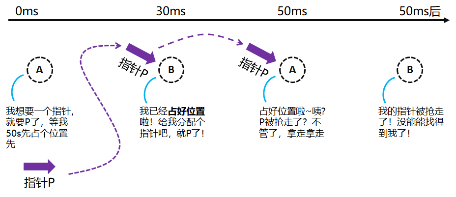
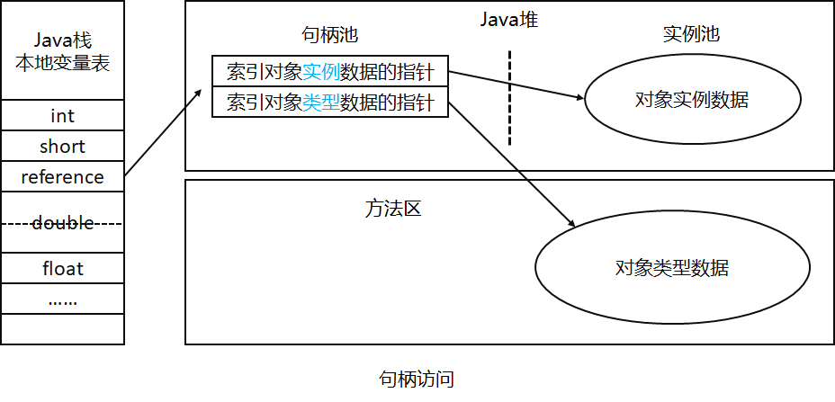
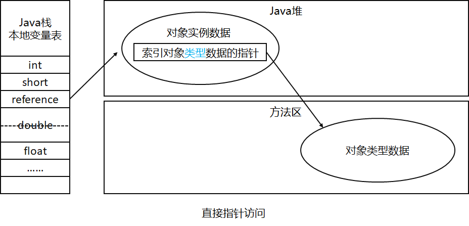

### HotSpot 虚拟机对象内存

深入讨论 HotSpot 虚拟机在 Java 堆中的对象分配、内存布局和对象访问的过程

#### 对象创建流程

##### 过程

1. **加载类**

   当虚拟机遇到一个**new 指令**的时候，就会检查指令参数是否能在常量池中定位到一个类的符号引用，并坚持这个符号代表的类是否已经被加载、解析和初始化过，如果没有，则需要必须进行类加载过程

   在类加载的过程完成后，**对象所需的内存大小已经完全可以确定**

2. **选择内存分配算法**

- **指针碰撞（Bump the Pointer）**

  假设**Java 堆的内存是绝对规整**，即所有**用过的内存放一边**，**空闲的内存放另一边**，中间有一个指针作为**分界点**，此时对象内存分配仅是把指针向**空闲方向**挪动**一个对象内存的距离**

- **空闲列表（Free List）**

  假设**Java 堆内存并不是规整的**，即已使用的内存和未使用的内存**互相交错**，虚拟机就必须维护一个**列表**，这个列表记录着哪些内存块是**可用的**，在分配的时候就在列表中找到一块**足够大的空间**划分给对象实例，并更新列表记录

  因此我们选择内存分配算法的根据就是：**Java 堆内存的划分是否规整**

1. **选择内存分配并发问题的解决方案**

   

   如图的并发指针分配问题，我们解决这个问题有两种方式：

   1. 对**内存分配的动作**进行**同步**处理
   2. 把**内存分配的动作**按照线程划分**在不同的空间中进行**，即每个线程在 Java 堆中预先分配一小块内存，这样的内存成为**本地线程分配缓冲（Thread Local Allocation Buffer，TLAB）**，哪个线程需要分配内存，就在哪个线程的**TLAB**上分配，只有当**TLAB**用完并分配新的**TLAB**的时候，再进行同步锁定

2. **设置对象基本信息**

   1. **对象头（Object Header）**信息的设置

   2. **执行`init`方法**

      在此之前，对于 JVM 来说，对象已经产生了，但是对象的字段还都是 0，对于 Java 程序来说，执行完**new 指令**之后还得执行**`init`方法**，初始化对象数据

#### 对象内存布局

##### 划分

- 对象头（Header）
- 实例数据（Instance Data）
- 对齐填充（Padding）

##### 1. 对象头（Header）

HotSpot 的对象头分为两部分信息：

- 第一部分：**Mark Word**

  用于存储对象自身的**运行时数据**如哈希码、GC 分代年龄、锁状态标志、线程持有的锁、偏向线程 ID、偏向时间戳

- 第二部分：**类型指针**

  虚拟机通过这个指针来**确定对象是哪个类的实例**，**但是**并不是所有的虚拟机实现都必须在对象数据上保留类型指针，也就是查找对象所属类的元数据信息并不一定要经过类本身

- 第三部分：**数组长度数据**

  如果对象是一个**数组**，则对象头还需要用一块内存来记录数组长度数据

##### 2. 实例数据（Instance Data）

这一部分是对象真正存储的**有效信息**，也是在程序代码中锁定义的各种类型的字段内容，包括继承下来的信息

##### 3. 对齐填充（Padding）

这部分不是必然的实现，也没有特殊含义，但是由于 HotSpot VM 的自动内存管理系统要求**对象起始地址必须是 8 字节的整倍数**，一个对象内存分配完之后，并不一定占 8 字节的整倍数空间，所以填充一些空间以补齐 8 字节整倍数，保证下一个对象内存分配的起始位置是 8 字节整倍数

#### 对象访问定位

**Java 程序通过虚拟机栈上的 reference 数据来操作堆上的具体对象（重点）**

JVM 规范**只说了 reference 是一个指向对象的引用，但是没有说怎么引用**，所以对象访问方式还是取决于虚拟机的实现，主流的实现有**句柄访问**和**直接指针访问**两种

##### 句柄访问

如果使用这种方式，Java 堆中会划分一块内存来作为**句柄池**，**reference**中存储的就是对象的**句柄地址**，句柄中包含了**对象实例数据地址信息**和**类型实例数据地址信息**



##### 直接指针访问

reference 中存储的直接就是对象地址



> 直观一点解释就是
>
> 假如我有一个 Person 类：
>
> ```java
> public class Person{
>     private static String kind = "human";
>     private String name;
>     private Integer age;
>     // ...
> }
> ```
>
> 然后有：
>
> ```java
> 	Person jack = new Person("Jack", 21);
> ```
>
> 这个时候，语句会有两部分，左边`Person`类型的指针`jack`，指向右边`Person`对象实例，且如果是第一次 new，则会进行一系列的`Person`类的加载，这时候：
>
> 1. 在 Java 栈中的本地变量表（当前线程中）会存在一个 reference 类型指针`jack`，该指针指向一个对象的**句柄地址/对象地址（4.）**
> 2. 在方法区内会存在`Person`类的静态变量`kind`的数据
> 3. 在 Java 堆内会存在`Person`类的静态变量`kind`的索引指针，该指针指向（2.）
> 4. 在 Java 堆内会存在一个`Person`类型对象数据，数据中有`name=jack，age=12`，如果是直接指针访问，则它会包含（3.）
> 5. 如果是句柄访问，那么在 Java 堆内会存在一个**句柄地址**，地址包含两个指针，一个指针是（3.），另一个指针指向对象实例数据（4.）

##### 两种方式的对比

- **句柄稳定**：句柄访问的好处是 reference 中存储的是稳定的句柄地址，**对象被移动的时候（特别是垃圾回收的时候）**，只需要改句柄指针就好了，reference 不需要修改
- **直接更快**：节省了多一次指针定位的开销，对象的访问在 Java 中很频繁，所以指针定位开销也是较为可观的执行成本
- **HotSpot 用的是直接指针访问**
