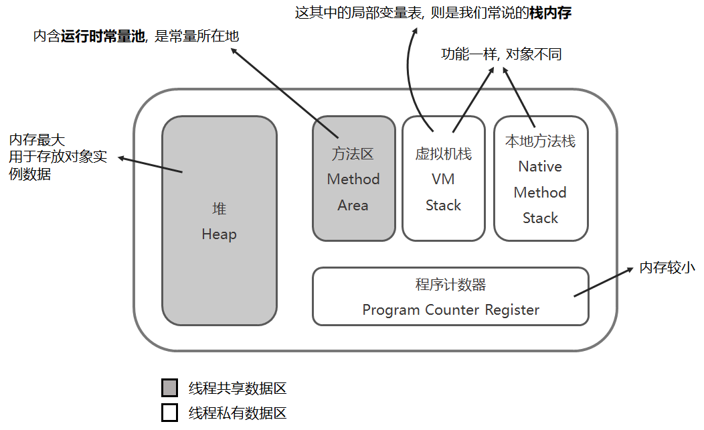

### 前言

本书第二版为止，其实还是针对于 Java SE 7 Specification（后简称 Spec），然而到了 Java8，情况又有很大的不同，比如最出名的 Permanent Generation，就在 8 中被 HotSpot 虚拟机移除掉了，所以这一系列的文章，我后续还需要慢慢地研究和重写

然后是一篇关于 Java SE 7 Spec 的[好文](http://blog.jamesdbloom.com/JVMInternals.html#threads)

### JVM 运行时数据区

基本上整个第二章说的都是**运行时数据取区**,，Java 虚拟机在执行 Java 程序的时候,，会把它所管理的内存划分为若干个不同的数据区域

这些数据区域有**各自的用途**以及**各自的生命周期**(创建和销毁策略)

我们得特别注意，这里我们再将**JVM 的运行时数据区**划分为：**线程共享数据区**，**线程私有数据区**

#### 1. 程序计数器（PCR）

##### 作用

它可以看作是**当前线程程序执行的字节码的行号指示器**

字节码解释器工作的时候，就是通过改变这个计数器里的值来选取下一条需要执行的字节码指令，程序的分支、循环、跳转、异常处理、线程恢复等基础功能都需要依赖计数器

##### 特点

- **内存较小**
- **线程私有**：每条线程都有自己的独立的程序计数器，各线程之间的计数器互不影响，独立存储
- **仅面对 Java 方法计数**：如果线程执行的是 Java 方法，则计数器有记录，记录的是所执行字节码的指令地址，如果执行的是 Native 方法，则计数器记录为空
- **不会内存溢出**：则个区域是 JVM 中唯一不会出`OutOfMemoryError`的地方

#### 2. Java 虚拟机栈（JVM Stack）

##### 作用

虚拟机栈描述的是**Java 方法执行（注意是方法执行）的内存模型**

当**每个方法执行的同时**，**会创建一个栈帧（Stack Frame）**用于存放<u>**局部变量表（这个表就是我们 Java 程序员常说的栈内存所在）**</u>、<u>**操作数栈**</u>、**<u>动态链接</u>**、**<u>方法出口</u>**等信息

每个方法从**调用**到**执行完成的过程**，就对应着一个栈帧在虚拟机栈中入栈到出栈

##### 局部变量表

###### 存放内容

这里存放了编译期可知的各种：

- **基本数据类型**（boolean、byte、char、short、int、float、long、double）
- **对象引用（reference 类型， 这个是重点，它不同于对象本身，它可能是一个指向对象起始地址的引用指针，也可能是指向一个代表对象的句柄或其他和此对象相关的位置）**
- **returnAddress 类型（指向了一条字节码指令地址）**

###### 特点

- 其中 64 位长度的**long 类型**和**double 类型**数据会占用两个**局部变量空间（Slot）**，其他占 1 个
- 局部变量表所需内存空间**在编译器就完成分配，运行期间不会改变**，当方法入栈时，运行期间栈帧所需的内存大小是**完全固定的**

##### 特点

- **线程私有**
- **两个异常**：`StackOverflowError`栈深过长和`OutOfMemoryError`扩充内存时内存不够而溢出

#### 3. 本地方法栈（NM Stack）

这个区域和**JVM-Stack**如出一辙，唯一不同的地方就是，**JVM-Stack**执行的是 Java 方法，而**NM-Stack**执行的是 Native 方法，这里同样也会抛出`StackOverflowError`栈深过长和`OutOfMemoryError`扩充内存时内存不够而溢出两个异常

#### 4. Java 堆（Java Heap/GC Heap）

##### 作用

唯一的目的就是**存放对象实例**，“几乎”所有的**对象实例以及数组**都在这里分配内存

##### 特点

- **内存最大**

- **线程共享：** 因为存放的是所有对象的实例

- **别名 GC-Heap：** 是垃圾收集器（Garbage Collector）管理的主要区域

- **堆内再划分：** 基于**CG 分代收集算法**，还可细分为新生代、老年代

  **再划分的意义：** 为了更好地管理回收内存，或者说更快地分配内存

- **可以不连续：** 内存空间可以不连续，只要逻辑连续即可

- **一个异常：**`OutOfMemoryError`

#### 5. 方法区（Method Area）

##### 作用

用于存储已被虚拟机加载的**类信息**、**常量**、**静态变量**、**即时编译器编译后的代码**等数据

##### 特点

- **逻辑上是堆的一部分**

  > 虽然 JVM Spec 把方法区描述为堆的一个**逻辑部分**，但它有一个别名：Non-Heap，目的应该是表面它相比于堆的其它部分的特殊性；

- **线程共享**

- **CG 执行少：**

  - 回收内容：针对**常量池的回收**和对**类型的卸载**
  - 回收难度大，尤其是类型卸载
  - 回收必要性：很有必要

- **一个异常：**`OutOfMemoryError`

##### 运行时常量池（Runtime Constant Pool）

它是方法区的一部分，主要存储的东西有：

1. 在 Class 文件中除了有类的版本、字段、方法、接口等描述信息，还有一项信息是常量池（Constant Pool Table），用于存放**“编译期”生成的各种字面量和符号引用**，这部分常量是运行之前就确定好了的，并且在类被加载后将这些信息**转入**运行时常量池存放；
2. 系统运行的过程中才确定的常量；
3. 还有编译期翻译出来的直接引用；
4. String 类型、Integer、Double、Long、Float 等类型的字面量常量；

所以这里也会发生 OOM

#### \* 6. 直接内存（Direct Memory）

##### 介绍

在 NIO 类的使用中，基于通道（Channel）和缓冲区（Buffer）的 IO 方式，它们使用的是**Native 函数库直接分配的堆外内存（注意是堆外）**，这部分内存并不属于堆或者 JVM 的运行时数据区内存

通过堆中的一个**DirectByteBuffer 对象**来操作这块**内存的引用**

而在 Java 8 之后，这里又有一块区域被划分为 Metaspace，承担原 Perm Gen 区的部分功能，存储类的元数据

##### 作用

在某些场景中显著地提高性能，因为避免了**Java 堆**和**Native 堆**中来回复制数据
