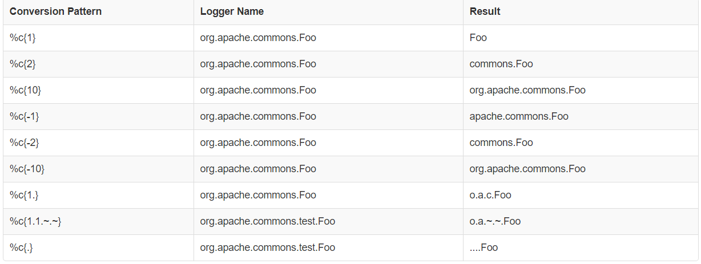
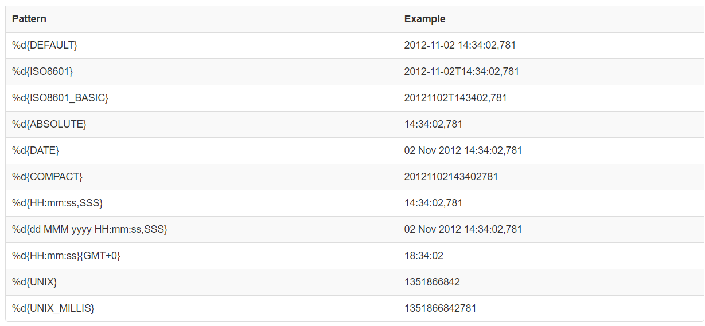



Layout：定制你的输出模式



<!-- more -->

[Layouts](https://logging.apache.org/log4j/2.x/manual/layouts.html)里提到了许多种 Layout 方式，我最常用的是 PatternLayout。

### Pattern Layout 模式输出

是一种通过 pattern 字符串来配置的灵活的输出方式。

属性：

- charset：string：所使用的字符集
- pattern：string：定制你的输出模式
- header：string：这是一个可选项，它会包含在每个 log 文件的开头
- footer：string：这是一个可选项....

#### Patterns

##### Logger Name 模式

`c{precision}`
`logger{precision}`

用例：

#### Class 模式

`C{precision}`
`class{precision}`

##### Date 模式

`d{pattern} & date{pattern}`

用例：

#### Line 模式

`%L`：输出报出 issue 的 logger 的行数
`%l`：输出更详细的行数信息

#### Message 信息模式

`%msg`：输出 logger 的信息

#### Method 模式

`%M`：输出 logger 所在的方法

#### n 模式

`%n`：输出系统支持的行分隔符，比如`\n`或者`\r\n`

#### N 模式

`%N`：输出调用 Log 事件时的:`System.nanoTime()`

#### pid 模式

`%pid`：输出程序的 pid

#### level 模式

`p|level{level=label, level=label, ...}`：指定每个级别的别名
`p|level{lowerCase=true|false}`：指定级别是否小写

#### Thread 模式

`%t`: 输出调用 Log 事件时所处的线程名
`%tid`: 输出调用 Log 事件时所处的线程 id

#### Context 模式

`%X{key[,key2...]}`: 输出存在 ThreadContext 里的键所对应的值
