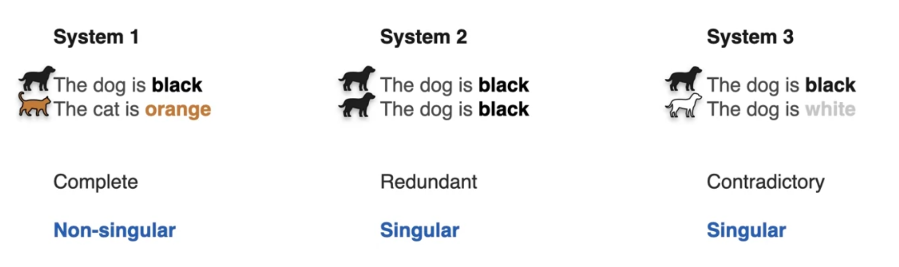
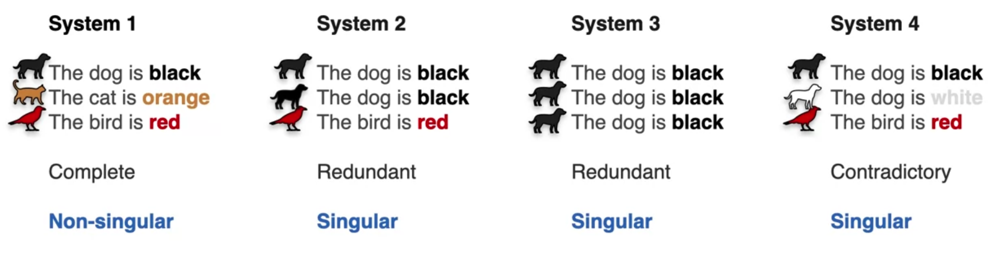
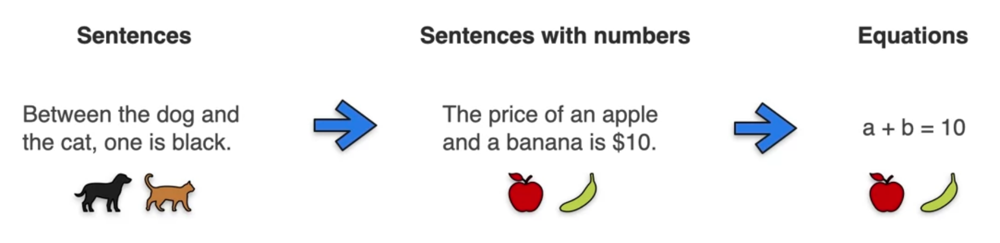
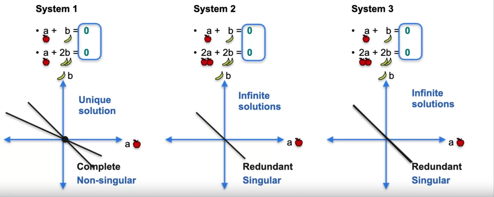
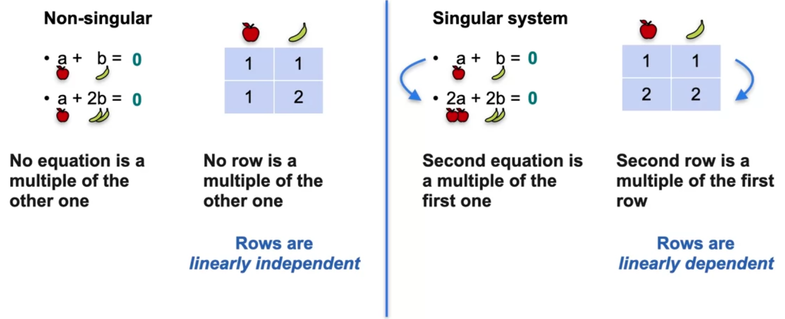
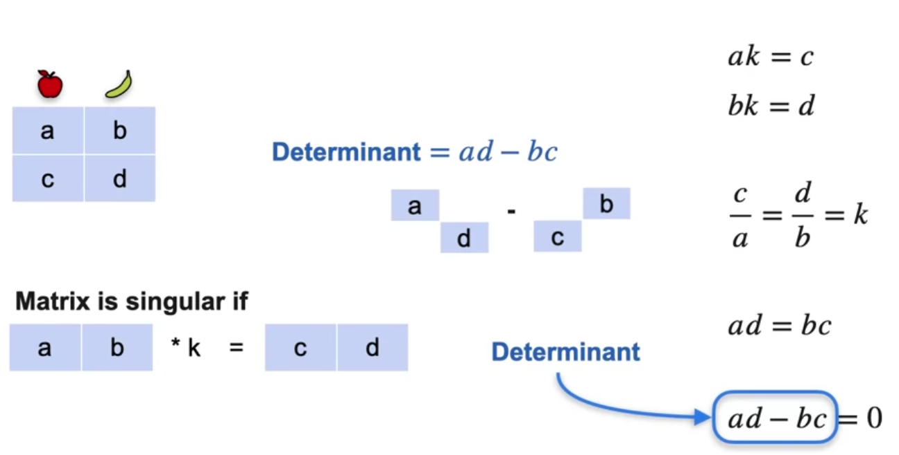

### Week 1

#### System of Sentences

Sentences are linear algebra equations for organizing the world's information.

##### Terms

1. Complete/Redundant/Contradictory System;

   Non-singular System -> Complete System;

   Singular System -> Redundant/Contradictory System;

   

   

2. Sentences to Equations

   

3. System of equations as lines

   

   The geometric notion of Singularity: We change the constants of the equations to zero, and then the lines move to the origin.

   

4. Systems of equations as matrices

   

5. (Linear) Dependence and Independence

   

6. Determinant Formula: to determine if a matrix is singular or not.

   

   $$ad$$ is the product of the main diagonal, and $$bc$$ is the product of the antidiagonal.

### Week 2
