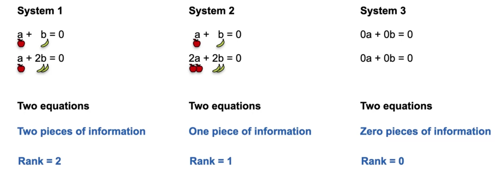

### Week 1

#### Basic Terms

1. **System of Sentences**: Sentences are linear algebra equations for organizing the world's information.

2. **Complete/Redundant/Contradictory System**;

   **Non-singular System -> Complete System;**

   **Singular System -> Redundant/Contradictory System;**

   

   

3. **Sentences to Equations**

   

4. System of equations as lines

   

   The geometric notion of Singularity: We change the constants of the equations to zero, and then the lines move to the origin.

   

5. Systems of equations as matrices

   

6. **(Linear) Dependence and Independence**

   

7. **Determinant** Formula: to determine if a matrix is singular or not.

   

   $$ad$$ is the product of the main diagonal and $$bc$$ is the product of the antidiagonal.

   If the matrix is singular, then the determinant is equal to ***zero***.

#### 3 Variable System

More systems of equations.

Another example:

If we turn the constant into zero:

#### Linear Dependent and Independent in more complicated System

#### Linear Dependent 

Case 1:

The third equation depends on the first and the second equation.

Case 2:

#### Linear Indenpent

#### Relationship of Dependency/Singularity/Solution/Determinant

Relationship 1:
$$
\begin{split}   
      \text{Dependent} &= \text{Singular}\\
      \text{Singular} &= \text{Determinant is Zero} \\
			\text{Singular} &= \text{Reduntant / Contradictory System} \\
\text{Reduntant / Contradictory System} &= \text{Infinite / No Solution} \\
\end{split}
$$

Relationship 2:
$$
\begin{split}
\text{Independent} &= \text{Non-singular} \\
\text{Non-singular} &= \text{Determinant is not Zero} \\
      \text{Non-singular} &= \text{Complete System}\\
\text{Complete System} &= \text{Unique Solution} \ \checkmark
\end{split}
$$

#### Determinant for 3x3

One way to tell if a matrix is **singular** or **non-singular** is to obtain the determinant of it.

We should do this for each diagonal. If the diagonal is incomplete, we wrap around to the other side.

Case 3: A non-zero determinant means that it is a non-singular matrix.

Case 4: An upper triangular matrix. The determinant is the product of the diagonal entries.

### Week 2

#### Solving Non-singular System

Case 1:

#### Solving Singular System

Case 2:

Case 3:

#### Row Echelon Form

Definition:

1. The main diagonal should only contain 1 and 0;
2. The values below the main diagonal should only be 0;
3. The values of the 1's right of the diagonal could be anything;
4. The importance of the 0's right of the diagonal must be 0;

However, the above definition of row echelon form could be more precise. Based on the wikipeida:

> Specifically, a matrix is in **row echelon form** if
>
> - All rows consisting of only zeroes are at the bottom.[[1](https://en.wikipedia.org/wiki/Row_echelon_form#cite_note-1)]
> - The [leading entry](https://en.wikipedia.org/wiki/Leading_entry) (that is, the left-most nonzero entry) of every nonzero row is to the right of the leading entry of every row above.[[2\]](https://en.wikipedia.org/wiki/Row_echelon_form#cite_note-2)
>
> Some texts add that the leading coefficient must be 1[[3\],](https://en.wikipedia.org/wiki/Row_echelon_form#cite_note-3) while others regard this as a *reduced* row echelon form.
>
> These two conditions imply that all entries in a column below a leading coefficient are zeros.[[4\]](https://en.wikipedia.org/wiki/Row_echelon_form#cite_note-4)
>
> The following is an example of a 4x5 matrix in row echelon form, which is not in *reduced* row echelon form (see below):
> $$
> \begin{bmatrix}
>    1 & * & * & * & * \\
>    0 & 0 & 2 & * & * \\
>    0 & 0 & 0 & 1 & * \\
>    0 & 0 & 0 & 0 & 0 \\
> \end{bmatrix}
> $$
> A matrix is in **reduced row echelon form** (also called **row canonical form**) if it satisfies the following conditions:[[5\]](https://en.wikipedia.org/wiki/Row_echelon_form#cite_note-5)
>
> - It is in row echelon form.
> - The leading entry in each nonzero row is a 1 (called a leading 1).
> - Each column containing a leading 1 has zeros in all its other entries.
>
> And the reduced one is like:
> $$
> \begin{bmatrix}
>    1 & [0] & * & [0] & * \\
>    0 & <1> & * & [0] & * \\
>    0 & [0] & 0 & <1> & * \\
> \end{bmatrix}
> $$
> 

#### Row Operations that Preserve Singularity

1. Switching Rows

   

2. Multiplying a Row by a non-zero scalar

   

3. Adding a Row to another row

   

   This will result in the same determinant.

#### Rank of the Matrix

##### In 2x2 Matrix

The rank of the matrix indicates how much information a system contains.

Case 4: Regarding the color of the animal:

Case 5:

We can conclude the following:
$$
\text{Rank} = 2 - \text{Dimention of Solution Space}
$$
A system of equations is ***<u>non-singular</u>*** if it carries as many pieces of information as equations it has, meaning that you carry the maximum amount of information possible.

##### In General Matrix

Case 6:

For system 2, the second equation is the average of the first and third, so it depends on them. Hence, it does not provide useful information. Thus, the matrix has a rank of 2.

The general way to derive the rank is by the row echelon form. We can derive the row echelon form by row operations.

Case 7: **<u>*The rank of a matrix is the number of 1 in the main diagonal of the row echelon form.*</u>**

##### Row Echelon Form in General

Case 8: **<u>The number of the pivot is the number of the rank of that matrix.</u>**

Case 9: Reduced Row Echelon Form

