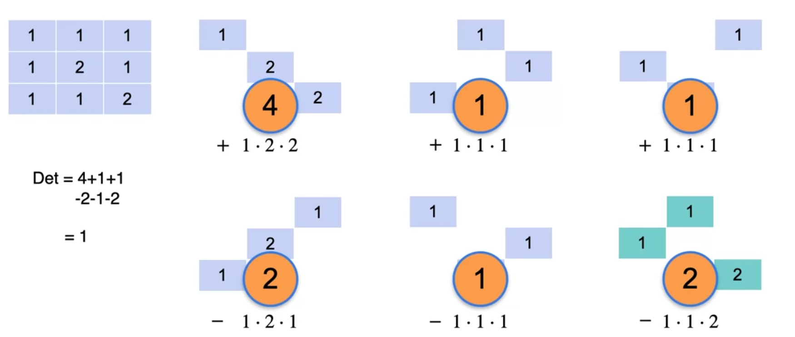

### Week 1

#### 2 Variables System

1. System of Sentences: Sentences are linear algebra equations for organizing the world's information.

2. Complete/Redundant/Contradictory System;

   Non-singular System -> Complete System;

   Singular System -> Redundant/Contradictory System;

   

   

3. Sentences to Equations

   

4. System of equations as lines

   

   The geometric notion of Singularity: We change the constants of the equations to zero, and then the lines move to the origin.

   

5. Systems of equations as matrices

   

6. (Linear) Dependence and Independence

   

7. Determinant Formula: to determine if a matrix is singular or not.

   

   $$ad$$ is the product of the main diagonal and $$bc$$ is the product of the antidiagonal.

   If the matrix is singular, then the determinant is equal to ***zero***.

#### 3 Variable System

More systems of equations.

Another example:

If we turn the constant into zero:

#### Linear Dependent and Independent in more complicated System

#### Linear Dependent 

Case 1:

The third equation depends on the first and the second equation.

Case 2:

#### Linear Indenpent

#### Determinant for 3x3

We should do this for each diagonal. If the diagonal is incomplete, we wrap around to the other side.

Case 3: A non-zero determinant means that it is a non-singular matrix.

Case 4: An upper triangular matrix. The determinant is the product of the diagonal entries.

### Week 2

#### Solving Non-singular System

Case 1:

#### Solving Singular System

Case 2:

Case 3:

#### Row Echelon Form

Definition:

1. The main diagonal should only contain 1 and 0;
2. The values below the main diagonal should only be 0;
3. The values of the 1's right of the diagonal could be anything;
4. The values of the 0's right of the diagonal must be 0;

#### Row Operations that Preserve Singularity

1. Switching Rows

   

2. Multiplying a Row by a non-zero scalar

   

3. Adding a Row to another row

   

   This will result in the same determinant.
