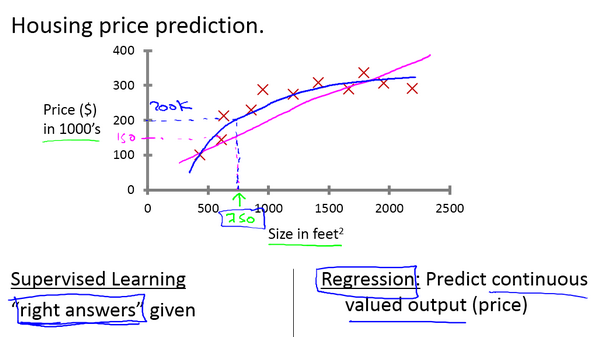

## Introduction

### Definition of Machine Learning

From Arthur Samuel

> Machine learning as the field of study that gives computers the ability to learn without being **explicitly programmed**.

From Tom Mitchell

> A computer program is said to learn from experience E with respect to some task T and some performance measure P, if its performance on T, as measured by P, improves with experience E.
>
> Example: playing checkers.
>
> - E = the experience of playing many games of checkers
>
> - T = the task of playing checkers.
>
> - P = the probability that the program will win the next game.

### Supervised Learning

**"You tell the program what is what and it will find the pattern by your guiding."**

> Supervised learning problems are **categorized into** "regression" and "classification" problems.
>
> In a regression problem, we are trying to predict results within a continuous output, meaning that we are trying to map input variables to some continuous function.
>
> In a classification problem, we are instead trying to predict results in a discrete output. In other words, we are trying to map input variables into discrete categories.

Given data about the size of houses on the real estate market, try to predict their price. Price as a function of size is a continuous output, so this is a regression problem.

We could turn this example into a classification problem by instead making our output about whether the house "sells for more or less than the asking price." Here we are classifying the houses based on price into two discrete categories.

#### Regression Problem

The picture shown above is a **regression problem** to be solved.

> **Predict** **continuous** valued output.

#### Classification Problem

The picture shown above is a **classification problem** to be solved.

> **Discrete** valued output(there might be more than 2 values).

\*More attributes can be used in the problem.

### Unsupervised Learning

We do not tell the program what sort of data have what labels, we let the program find the clusters among a set of datas.

> Unsupervised learning allows us to approach problems with little or no idea what our results should look like. We can derive structure from data where we don't necessarily know the effect of the variables.
>
> We can derive this structure by clustering the data based on relationships among the variables in the data.
>
> With unsupervised learning there is no feedback based on the prediction results.
>
> **Example:**
>
> Clustering: Take a collection of 1,000,000 different genes, and find a way to automatically group these genes into groups that are somehow similar or related by different variables, such as lifespan, location, roles, and so on.
>
> Non-clustering: The "Cocktail Party Algorithm", allows you to find structure in a chaotic environment. (i.e. identifying individual voices and music from a mesh of sounds at a [cocktail party](https://en.wikipedia.org/wiki/Cocktail_party_effect)).

## Univariate Linear Regression

### Model Representation

**"The model is the line of the result of our hypothesis function."**

Given an example:

To establish notation for future use, we’ll use

- $x^{(i)}$ to denote the “**input**” variables (living area in this example), also called input features.

- $ y^{(i)}$ to denote the “**output**” or target variable that we are trying to predict (price).

- a pair $(x^{(i)} , y^{(i)} )$ is called a training example, and the dataset that we’ll be using to learn—a list of m training examples $(x^{(i)} , y^{(i)}); i = 1, . . . , m$—is called a training set.

We will also use $X$ to denote the space of **input values**, and $Y$ to denote the space of **output values**.

To describe the supervised learning problem slightly more formally, our goal is, given a training set, to learn a function $h : X → Y $ so that $h(x)$ is a “good” predictor for the corresponding value of $y$.

For historical reasons, this function h is called a **hypothesis**.

When the target variable that we’re trying to predict is continuous, such as in our housing example, we call the learning problem a **regression problem**.

When $y$ can take on only a small number of discrete values (such as if, given the living area, we wanted to predict if a dwelling is a house or an apartment, say), we call it a **classification problem**.

### Cost Function

**"This will let us to figure out how to fit the best possible straight line to the data."**

Back to the example of the house prices, with hypothesis:

$$
h_\theta(x) = \theta_0 + \theta_1x
$$

and with $\theta_i$ represent the **parameters** of the **model**, it is time to find out what $\theta_0$ and $\theta_1$ stand for.

The mission is to **find out $\theta_0$ and $\theta_1$** to make our hypothesis function close to our training set.

Which means we will find the minimization of the **difference** of the **hypothesis** $h(\theta)$ and the **actual result** $y$.

Hence we have:

$$
J(\theta_0, \theta_1) = {1 \over 2m}\stackrel{m}{\sum_{i=1}}(h_\theta(x^{(i)}) \space\space - \space\space y^{(i)})^2
$$

We want the find out the **minimization** of the function:

$$
minimize \space J(\theta_0, \theta_1)
$$

We call $J(\theta_0, \theta_1)$ a **Cost function** or **Square error cost function**.It is the most commonly used function for most linear regression function.

This takes an **average difference** $\frac{1}{2m}$ (actually a fancier version of an average, better than $\frac{1}{m}$) of all the results of the hypothesis with inputs from $x$'s and the actual output $y$'s.

The **mean(平均数) is halved($\frac{1}{2}$)** as a convenience for the computation of the gradient descent, as the derivative term of the square function will cancel out the $\frac{1}{2}$ term(因为平方函数的导数项将抵消掉$\frac{1}{2}$项).

#### Cost Function Intuition I

Say we have a hypothesis of $h_\theta(x)$ where $\theta$ contains only $\theta_1$, and $m = 3$, then we have:

$$
h_\theta(x) = \theta_1x
\newline
J(\theta_1) = {1 \over 2m}\stackrel{m}{\sum_{i=1}}(h_\theta(x^{(i)}) \space\space - \space\space y^{(i)})^2
$$

then when:

- $\theta_1 = 0$, $J(\theta_1) = \frac{1}{2m}(1^2 + 2 ^ 2 + 3^2) = \frac{1}{6} \cdot14$
- $\theta_1 = 1$, $J(\theta_1) = \frac{1}{2m}(0^2 + 0^2 + 0^2) = 0$
- ...

we can plot $J(\theta_1)$ as the second picture shows, the minimize result will be 0 when $\theta_1 = 1$.

### Gradient Decent

**"This algorithm is for minimizing the cost function. And it will be used in all over the machine learning, not just in linear regression."**

Say:

Imagine that we graph our **hypothesis function** based on its fields $\theta_0$ and $\theta_1$ (actually we are graphing the cost function as a function of the parameter estimates).

We are not graphing **_x_** and **_y_** itself, but the parameter range of our hypothesis function and the cost resulting from selecting a particular set of parameters.

We put $\theta_0$ on the **_x axis_** and $\theta_1$on the **_y axis_**, with the **cost function** on the vertical **z axis**. The points on our graph will be the result of the cost function using our hypothesis with those specific theta parameters. The graph below depicts such a setup.

> The **gradient descent algorithm** is:
>
> repeat until convergence:
>
> $$
> \theta_j := \theta_j - \alpha \frac{\partial}{\partial \theta_j} J(\theta_0, \theta_1)
> $$
>
> where $j=0,1$ represents the feature index number.
>
> Some details:
>
> - the $:=$ means assignment;
> - $\alpha$ is the learning rate;
> - $\partial$ means derivative or $d$;

We will know that we have succeeded when our cost function is **at the very bottom of the pits** in our graph, i.e. when its value is the minimum.

The red arrows show the minimum points in the graph.

The way we do this is by taking the **derivative（导数）** (the **tangential line（正切线）** to a function) of our cost function. The **slope of the tangent（切面的坡度）** is the **derivative** at that point and it will give us a direction to move towards.

We make steps down the cost function in the direction with the steepest descent. The **size** of each step is determined by the parameter $\alpha$, which is called the **learning rate**.

For example, the distance between each 'star' in the graph above represents a step determined by our parameter $\alpha$. A **smaller** $\alpha$ would result in a **smaller step** and a **larger** $\alpha$ results in a **larger step**.

The direction in which the step is taken is determined by the **partial derivative** of $J(\theta_0,\theta_1)$.

Depending on **where one starts** on the graph, one could end up **at different points**. The image above shows us two different starting points that end up in two different places.

At each iteration j, one should **simultaneously update** the parameters $\theta_1, \theta_2,...,\theta_n$. Updating a specific parameter prior to calculating another one on the $j^{(th)}$ iteration would yield to a wrong implementation.

> $\textcolor{#228B22}{temp0} \enspace := \enspace \theta_0 - \alpha \frac{\partial}{\partial \theta_0} J(\theta_0, \theta_1)$
>
> $\textcolor{#228B22}{temp1} \enspace := \enspace \theta_1 - \alpha \frac{\partial}{\partial \theta_1} J(\theta_0, \theta_1)$
>
> $\theta_0 \enspace := \enspace \textcolor{#228B22}{temp0} $
>
> $\theta_1 \enspace := \enspace \textcolor{#228B22}{temp1} $

#### Gradient Descent Intuition

What we presented before of the descent algorithm, there is a derivative term which use $\partial$ symbol, but in mathematic area, it should use $d$ to represent. Hence we can also have:

$$
\theta_j := \theta_j - \alpha \frac{d}{d \theta_j} J(\theta_0, \theta_1)
$$

**Regardless** of the slope's sign for $\frac{d}{d\theta_1} J(\theta_1)$, $\theta_1$ eventually converges to its minimum value. The following graph shows that when the slope is negative, the value of $\theta_1$ increases and when it is positive, the value of $\theta_1$ decreases.

On a side note, **we should adjust** our parameter $\alpha$ to ensure that the gradient descent algorithm converges in a reasonable time. Failure to converge or too much time to obtain the minimum value imply that our step size is wrong.

#### How does gradient descent converge with a fixed step size $\alpha$?

The intuition behind the convergence is that $\frac{d}{d\theta_1} J(\theta_1)$ approaches 0 as we approach the bottom of our convex function. At the minimum, the derivative will always be 0 and thus we get:

$$
\theta_1:=\theta_1-\alpha * 0
$$

This means that once we hit the local minimal point, the update of the gradient descent will **remain unchanged** cause the derivative term will always be zero.

#### Gradient Descent for Linear Regression

Going back to the linear regression model we discussed before, if we are trying to use the gradient descent algorithm on that, we can come up with:

$$
\begin{aligned}
\frac{d}{d\theta_j} J(\theta_0, \theta_1) &= \frac{d}{d\theta_j} \cdot {1 \over 2m}\cdot  \stackrel{m}{\sum_{i=1}}(h_\theta(x^{(i)}) \space\space - \space\space y^{(i)})^2
\\
&=
\frac{d}{d\theta_j} \cdot {1 \over 2m}\cdot  \stackrel{m}{\sum_{i=1}}(\theta_0 + \theta_1x^{(i)} \space\space - \space\space y^{(i)})^2
\end{aligned}
$$

Then we need to figure out the **partial derivative** of two $\theta s$. And we get:

$$
\begin{aligned}
j = 0, \enspace \frac{d}{d\theta_0} J(\theta_0, \theta_1) &=\frac{1}{m}\stackrel{m}{\sum_{i=1}}(h_\theta(x^{(i)}) - y^{(i)})
\\
j = 1, \enspace \frac{d}{d\theta_1} J(\theta_0, \theta_1) &=\frac{1}{m}\stackrel{m}{\sum_{i=1}}((h_\theta(x^{(i)}) - y^{(i)}) \space \cdot \space x^{(i)})
\end{aligned}
$$

Then we can repeat:

$$
\begin{aligned}
\theta_0 &:= \space \theta_0 - \alpha \frac{1}{m}\stackrel{m}{\sum_{i=1}}(h_\theta(x^{(i)}) - y^{(i)})
\\
\theta_1 &:= \space \theta_1 - \alpha \frac{1}{m}\stackrel{m}{\sum_{i=1}}((h_\theta(x^{(i)}) - y^{(i)}) \space \cdot \space x^{(i)})
\end{aligned}
$$

and we should update $\theta_0$ and $\theta_1$ **simultaneously**.

And we have this bowl shaped function or convex function:

hence we can always get the global optimum where there is no local optimum in the shape.

So, this is simply gradient descent on the original cost function J. This method looks at every example in the entire training set on every step, and is called **batch gradient descent**.
