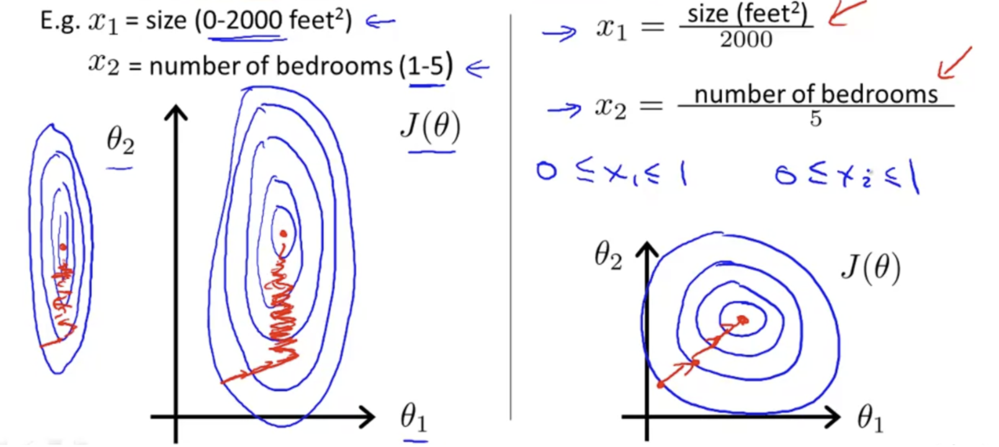
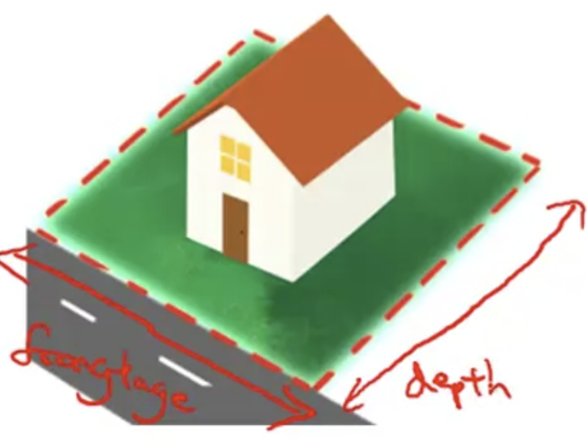
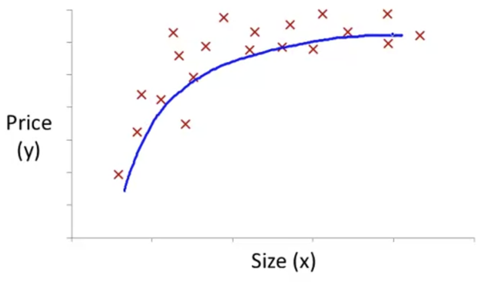
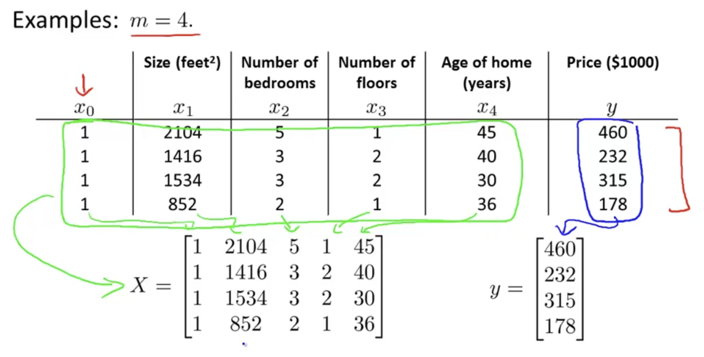

## Multivariate Linear Regression

### Multiple Features

Linear regression with multiple variables is also known as "multivariate linear regression".

We now introduce notation for equations where we can have any number of input variables.

$x_j^{(i)}=$ the value of feature $j$ in the $i$ th training example

$x^{(i)}=$ the input (features) of the $i$ th training example

$m=$ the number of training **examples**

$n=$ the number of **features**

The multivariable form of the **hypothesis aka. $h$** function accommodating these multiple features is as follows:

$$
h_\theta(x) = \theta_0 + \theta_1x_1 + \theta_2x_2 + \cdots + \theta_nx_n
$$

In order to develop intuition about this function, we can think about $\theta_0$ as the **basic price** of a house, $\theta_1$ as **the price per square meter**, $\theta_2$ as the **price per floor**, etc.

$x_1$ will be the number of square meters in the house, $x_2$ the number of floors, etc.

Using the definition of **matrix multiplication**, our **multivariable hypothesis function** can be concisely represented as:

$$
h_\theta(x) =
[\theta_1 \enspace \theta_2 \enspace \theta_3 \enspace \cdots \enspace \theta_4]
\begin{bmatrix}
   x_0 \newline
   x_1 \newline
   x_2 \newline
   \vdots\newline
   x_n
\end{bmatrix}
=\theta^Tx
$$

This is a **vectorization** of our hypothesis function for one training example; see the lessons on vectorization to learn more.

Note that for convenience reasons in this course we assume $x_0^{(i)} =  for (i\in1,\dots,m)$.

This allows us to do matrix operations with theta and $x$.

Hence making the two vectors $\theta$ and $x^{(i)} $ match each other element-wise (that is, have the same number of elements: $n+1$).

### Gradient Descent with Multiple Features

#### The Equation

The gradient descent equation itself is generally the same form; we just have to repeat it for our 'n' features:

repeat until convergence:{

$$
\begin{aligned}
\theta_0 &:= \space \theta_0 - \alpha \frac{1}{m}\stackrel{m}{\sum_{i=1}}(h_\theta(x^{(i)}) - y^{(i)}) \space\cdot\space x_0^{(i)}

\\
\theta_1 &:= \space \theta_1 - \alpha \frac{1}{m}\stackrel{m}{\sum_{i=1}}((h_\theta(x^{(i)}) - y^{(i)}) \space \cdot \space x^{(i)}) \space\cdot\space x_1^{(i)}

\\
\theta_2 &:= \space \theta_2 - \alpha \frac{1}{m}\stackrel{m}{\sum_{i=1}}((h_\theta(x^{(i)}) - y^{(i)}) \space \cdot \space x^{(i)}) \space\cdot\space x_2^{(i)}

\\
\dots
\end{aligned}
$$

}

#### Feature Scaling & Mean Normalization

**"Choose an sufficient scale of the features."**

The idea of the scaling is to make sure features are on a nicer and similar scale to make the process reach the optima more faster.

Every feature should around approximately $-1 \space \le x_i \le 1$.



Replace $x_i$ with following formula and this do not apply to $x_0$.

$$
x_i:= \frac{x_i - \mu_i}{s_i}
$$

Where $μ_i$ is the **average** of all the values for feature (i) and $s_i$ is the range of values $ (max - min)$, or $s_i$ is the standard deviation.

E.g.

$$
\begin{aligned}
x_1 &= \frac{size - 1000}{(max\space number\space of\space x_1) - (min\space number\space of\space x_1)}
\\
x_2 &= \frac{\#bedrooms - 2}{(max\space number\space of\space x_2) - (min\space number\space of\space x_2)}
\end{aligned}
$$

will get this approximately:

$$
-0.5 \le x_1 \le 0.5 \space,\space -0.5 \le x_2 \le 0.5
$$

#### The Learning Rate

**"Choose a sufficient learning rate of the features."**

**Debugging gradient descent.** Make a plot with **_number of iterations_** on the x-axis. Now plot the cost function, $J(θ)$ over the number of iterations of gradient descent. If $J(θ)$ ever increases, then you probably need to decrease $α$.


#### Polynomial Regression

**"Some data can not be represent with just a straight line, things are more complicated."**



Suppose we want to know the price of the house, and we have two features which lead to the following hypothesis:

$$
h_\theta(x) = \theta_0 + \theta_1 \times frontage + \theta_2 \times depth
$$

we can merge those two features into one feature like this:

$$
h_\theta(x) = \theta_0 + \theta_1 \times area, \qquad area = frontage \times depth
$$

And suppose we have the following training set:



the quadratic function:

$$
h_\theta(x) = \theta_0 + \theta_1(size) + \theta_2(size)^2
$$

and the cube function:

$$
h_\theta(x) = \theta_0 + \theta_1(size) + \theta_2(size)^2 + \theta_3(size)^3
$$

are not the best choice to fit this model, maybe we can use the square root function:

$$
h_\theta(x) = \theta_0 + \theta_1(size) + \theta_2\sqrt{(size)}
$$

### Normal Equation

**“Another way for getting the $\theta$ in one step analytically.”**

Previously with the gradient descent function, we can get the result by examining the data set and iterating them. But that requires derivation and calculus involved.

Say we got an example:



and we can get the $\theta$ by computing this:

$$
\theta = (X^TX)^{-1}X^Ty
$$

where $(X^TX)^{-1}$ is the inverse of the matrix $X^TX$. This is called **_Normal Equation_**.

This equation require no feature scaling.

Characteristic of those two methods:

| Gradient Descent             | Normal Equation                                |
| :--------------------------- | :--------------------------------------------- |
| Need to choose alpha         | No need to choose alpha                        |
| Needs many iterations        | No need to iterate                             |
| $O (kn^2)$                   | $O (n^3)$, need to calculate inverse of $X^TX$ |
| Works well when $n$ is large | Slow if $n$ is very large                      |

## Programming Homework

Suppose we have data:

```
6.1101,17.592
5.5277,9.1302
8.3829,11.886
7.4764,4.3483
...
```

where first column is X and then Y.

### Data loading

We process the data:

```octave
% read data
data = load('ex1data1.txt');
X = data(:, 1); y = data(:, 2);

X = [ones(m, 1), data(:,1)]; % Add a column of ones to x
theta = zeros(2, 1); % initialize fitting parameters
```

Then we got:

$$
X = \begin{bmatrix}
   ~1 & 6.1101~ \\
   ~1 & 5.5277~ \\
   ~1 &\cdots~
\end{bmatrix}
,~~
Y = \begin{bmatrix}
   ~17.592~ \\
   ~9.1302~ \\
   \cdots
\end{bmatrix}
$$

The objective of linear regression is to **minimize the cost function**:

$$
J(\theta) = {1 \over 2m}\stackrel{m}{\sum_{i=1}}(h_\theta(x^{(i)}) \space\space - \space\space y^{(i)})^2
$$

where the hypothesis is:

$$
h(\theta) = \theta^TX = \theta_0 + \theta_1X_1
$$

### Cost Function Impl

In octave, the cost function can be harvested:

```octave
function J = computeCost(X, y, theta)
  %COMPUTECOST Compute cost for linear regression
  %   J = COMPUTECOST(X, y, theta) computes the cost of using theta as the
  %   parameter for linear regression to fit the data points in X and y

  m = length(y); % number of training examples
  J = (1 / (2 * m)) * sum(power(X * theta - y, 2))
end
```

$$
J(\theta) = {1 \over 2m} sum[(\theta^TX - Y)^2]
$$

### Gradient Descent Impl

One way to do this is to use the **batch gradient descent algorithm**. In batch gradient descent, each

iteration performs the update

$$
\theta_j := \theta_j - \alpha {1 \over m}\stackrel{m}{\sum_{i=1}}(h_\theta(x^{(i)}) \space\space - \space\space y^{(i)}) x_j^{(i)}
$$

In octave

```octave
function [theta, J_history] = gradientDescentMulti(X, y, theta, alpha, num_iters)
  %GRADIENTDESCENTMULTI Performs gradient descent to learn theta
  %   theta = GRADIENTDESCENTMULTI(x, y, theta, alpha, num_iters) updates theta by
  %   taking num_iters gradient steps with learning rate alpha

  m = length(y); % number of training examples
  J_history = zeros(num_iters, 1);
  for iter = 1:num_iters
      temp = zeros(size(theta, 1), 1);
      for j = 1: size(X, 2)
          temp(j) = theta(j) - alpha * (1 / m) * sum((X * theta - y) .* X(:, j));
      end
      theta = temp
      % Save the cost J in every iteration
      J_history(iter) = computeCostMulti(X, y, theta);
  end
end
```

Then we can exam the cost function and get the minimum:

```octave
% Some gradient descent settings
iterations = 1500;
alpha = 0.01;

theta = gradientDescent(X, y, theta, alpha, iterations);
```

### Prediction

Once we got our right theta, we can commit a prediction:

```octave
predict1 = [1, 3.5] *theta;
fprintf('For population = 35,000, we predict a profit of %f\n',...
  predict1*10000);
predict2 = [1, 7] * theta;
fprintf('For population = 70,000, we predict a profit of %f\n',...
    predict2*10000);
```

### Feature Normalization

```octave
function [X_norm, mu, sigma] = featureNormalize(X)
  %FEATURENORMALIZE Normalizes the features in X
  %   FEATURENORMALIZE(X) returns a normalized version of X where
  %   the mean value of each feature is 0 and the standard deviation
  %   is 1. This is often a good preprocessing step to do when
  %   working with learning algorithms.

  mu = mean(X)
  sigma = std(X)
  X_norm = (X .- mu) ./ sigma
end
```

Explain:

- Subtract the mean value of each feature from the dataset.
- After subtracting the mean, additionally scale (divide) the feature values by their respective “standard deviations.”.

### Normal Equation Impl

```octave
function [theta] = normalEqn(X, y)
  %NORMALEQN Computes the closed-form solution to linear regression
  %   NORMALEQN(X,y) computes the closed-form solution to linear
  %   regression using the normal equations.

	theta = pinv(X' * X) * X' * y;
end
```
