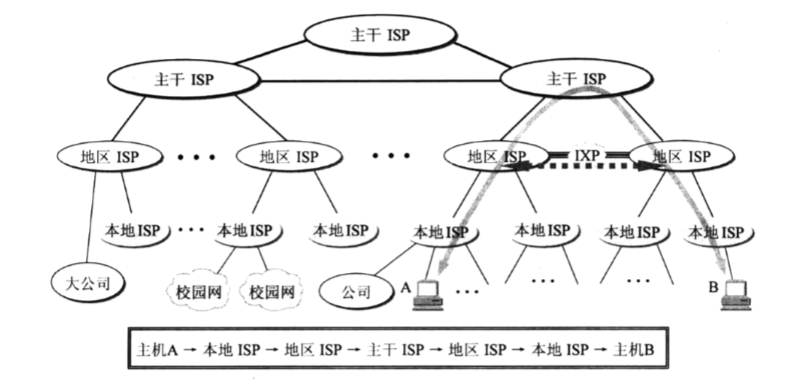
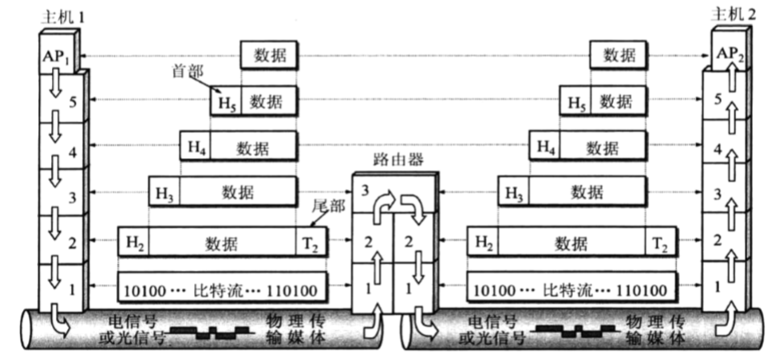
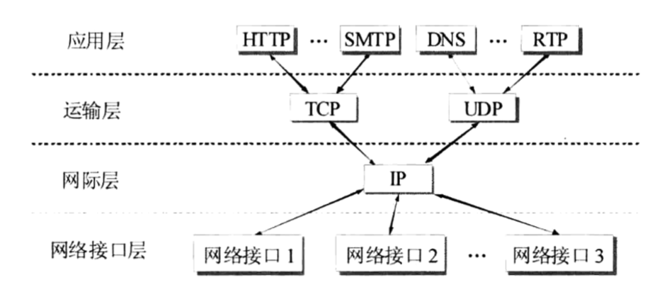

### 前言

一周前考完了计算机网络，不得不说，计算机网络确实是一个精妙而繁杂的体系产物，虽然民大的考试都很水，但是计网这门课我是认认真真复习好了的，并不是当作考试去复习，每个点都看了，书上的课后习题都大概刷了 80%（谢希仁前辈出的这本书，习题量很多），基本上每个点都吃透了一遍。

虽然后面还有两门考试，但很容易就过，也不需要准备，主要的复习科目也考完了，所以趁热打铁，马上进行计网的笔记整理和复习。

因为学时有限，学校上的课程只教到第五章运输层，后面的没教，我准备先把前五章的笔记都整理下来，再继续看后面的内容，看完再整理。

所以这一系列的笔记也是按照谢希仁前辈的《计算机网络》第七版的内容顺序整理的**（可能会跳一些顺序，可能会改一些章节标题）**。

本来想的只是按需记录，但是觉得还是要对得起自己的劳动，所以这一系列的笔记等于是考试重点笔记，意思是事无巨细的都记下来，甚至把课本后的习题解答（自己的解答）都记录下来。

### Chapter1-概述

#### 1.1 计算机网络与信息时代

##### Internet

（1）因特网（旧译）

（2）**互联网：**这个翻译是最流行最被接受的。Internet 是**由数量极大的各种计算机网络互连起来的网络的统称。**

##### 互联网提供的服务

- **连通性：**互联网用户无论地域距离有多远，在互联网上都可以**非常便捷、非常经济地交换各种信息**，**好像**这些用户终端彼此直接连通一样。
- **共享：**指资源共享，可以是信息共享、软件共享，也可以是硬件共享。由于网络的存在，**好像**这些资源就在用户身边一样可以直接使用。

#### 1.2 互联网概述

##### 1.2.1 网络的网络

###### 计算机网络

简称为网络，由若干**结点（node）**和连接在这些结点的**链路（link）**组成。网络中的结点可以是计算机、集线器、交换机或路由器等。

###### 互联网

上述的网络还可以通过**路由器**互连起来，这样就构成了一个覆盖范围更大的计算机网络，这样的网络称为**互联网**，这也是**“网络的网络”**说法来源。

##### 1.2.2 互联网发展的三个阶段

1. 单个网络**ARPANET**向互联网发展的过程，主要解决多网络互联的问题。
2. **三级结构的互联网**，分为主干网、地区网、校园网（企业网）。
3. 多层次的 ISP 结构互联网。

###### ISP

互联网服务提供者，提供商，在国内，中国移动、联通电信就是 ISP。ISP 可以从互联网管理机构申请到很多**IP 地址**，同时拥有**通信线路**以及**路由器**等联网设备。个人用户需要向 ISP 付费获取提供的 IP 地址，**持有 IP 地址才可以接入互联网**，也就是我们说的“上网”。

ISP 也分层次：主干 ISP、地区 ISP、本地 ISP。

###### 主干 ISP

由几个专门的公司创建和维持，服务面积大，一般能够覆盖到国家范围，并且拥有高速主干网，地区 ISP 可以直接和主干 ISP 相连。

###### 地区 ISP

较小的 ISP，通常几个地区 ISP 通过一个主干 ISP 相连。

###### 本地 ISP

本地 ISP 直接给用户提供服务，本地 ISP 可以连接到地区也可以连接到主干。绝大多数用户是直接连到本地 ISP 的。

###### IXP

为了提高转发分组的效率，以及如何更有效得利用网络资源，**互联网交换点（Internet eXchange Point，IXP）**应运而生。IXP 允许两个网络直接相连并交换分组，而不需要通过第三个网络来转发分组。

#### 1.3 互联网组成

（1）边缘部分：由所有连接在互联网上的主机组成。这部分是用户直接使用的，用来进行通信和资源共享。

（2）核心部分：由大量网络和连接这些网络的路由器组成。这部分是**为边缘部分提供服务的（连通性和交换）。**

##### 1.3.1 边缘部分

边缘部分指的是用户使用的主机，这些主机又称为端系统。需要明确一个观点：我们说**“主机 A 和主机 B 在通信”**实际上说的是**“运行在主机 A 上的某程序和运行在主机 B 上的某程序在通信”**。计算机之间的通讯通常可分为两大类：客户-服务器方式（C/S 方式）和对等方式（P2P 方式）。

###### C/S 和 P2P 的区别

C/S 里：**客户是服务请求方，服务器是服务提供方。**而 P2P 方式，两端**既是请求方也是服务方。**

##### 1.3.2 核心部分和分组交换（packet switching）

网络核心部分是互联网最复杂的地方，这里面起特殊作用的是**路由器（router）**，它是一种专用计算机（但并不是主机）。路由器是实现**分组交换（packet switching）**的关键构件，其任务是转发收到的分组，这是网络中最核心最重要的功能。我们先介绍电路交换的基本概念。

###### 电路交换

以前的电话通讯是以电路交换作为交换方式的，从通信资源的分配角度上看，**交换（switching）**就是按照某种方式动态地分配传输线路的资源。

电路交换步骤：

- 建立连接：建立一条专用的物理线路，并在释放之前一直占用该线路
- 通话：占用该线路
- 释放连接：归还通信资源

特点：通话的时候，两端始终占用当前线路，线路传输效率**（note：这里说传输线路的利用率更好）**往往很低。

###### 分组交换

分组交换采用**存储转发**技术，表示把一个报文划分为几个分组后再进行传送。把要发送的整块数据称为一个**报文（message）**，在发送报文之前，把较长的报文划分为一个个更小的等长数据段，在数据段的前面加上一些由必要控制信息组成的**首部（header）**，就构成了一个**分组（packet）**，分组又称为**“包”**，是在互联网中传送的数据单元。

互联网中的网络通讯可不止分组交换这样简单，做成了分组之后，还需要路由器还需要进行**存储转发**，路由器收到一个分组之后，先暂时存储一下，检查其首部，查找转发表，按照首部中的目的地址，找到合适的接口转发出去，把分组交给下一个路由器。

这样一步步的，分组通过网络上的每一段由路由器或者其他结点隔开的链路，最终送到目的主机。

这里需要注意两点：

- 段链路只是有分组在传递的时候才被占用，没分组传递的链路依然可以使用
- 路由器存储的只是分组，而不是整个报文，每个分组到了合适的时机就会被转发出去

分组交换在传送数据之前不必先占用一条端到端的链路通信资源，互联网采用专门的措施，保证数据传送具有可靠性，当链路中某些阶段突然出现故障的时候，在各路由器中运行的路由选择协议可以自动找到合适的转发分组路径。

###### 三种方式的比较

- **电路交换**
  - 优点：
    - 稳定、安全
  - 缺点：
    - 线路利用率低、有连接管理成本
    - 适合大量数据连续传输
- **分组交换**
  - 优点：
    - 线路利用率高、因为无连接，所以效率快
    - 适合突发传输
  - 缺点：
    - 无连接、分组头部开销、转发有一定时延

#### 1.6 计算机网络的性能

##### 1. 速率

计算机发出的信号都是离散信号，也就是数字形式的，比特（bit）来源于 binary digit，意思是一个“二进制数字”。网络技术中**速率(SpeedRate)**指的是**数据的传送速率**，它也称为**数据率(DataRate)**或者**比特率(BitRate)**，单位是 bit/s（比特每秒，有时也写为**bps**），当数据率高的时候，可以在 bit/s 前面加上一个字母。

- k bit/s = 10^3 bit/s（注意 k 是小写）
- M = 10^6
- G = 10^9
- T = 10^12

比如说，1Mbit/s 可以说是 1 秒中吐出 10^6 比特的数据，特别要注意的是，这里速率的 kMGT 和数据体积单位的 k（K）MGT 不一样，后者：

- 1 k = 2^10 byte = 2^10 \* 8 bit
- 1 M = 2^10 k = 2^20 byte
- 依此类推

##### 2. 带宽

在计算机网络中，带宽用来表示网络中某**通道**传送数据的**能力（也就是一种度量）**，因此网络带宽表示在单位时间内网络中的某信道所能通过的**“最高数据率”**，这种意义的带宽的单位，就是数据率的单位 bit/s。

##### 3. 吞吐量

吞吐量（throughput）表示在单位时间内通过某个网络的实际的数据量。

##### 4. 时延

（1）发送时延，是主机或者路由器发送数据帧所需要的时间，也就是从发送数据帧的第一个比特开始算起，到该帧的最后一个比特发送完毕所需要的时间。

$$
TransmissionDelay = \dfrac{DataBitLength(bit)}{BitRate(bit/s)}
$$

> 数据帧长度 / 速率

（2）传播时延，是电磁波在信道中传播一定距离需要花的时间。

$$
PropagationDelay = \dfrac{ChannelLength(m)}{ElectWaveSpeedRate(m/s)}
$$

> 信道长度 / 电磁波在信道上的传播速率

还有两个时延需要知道

（3）处理时延，主机或者路由器在给帧做加工工作的时候，或者查找目的地接口的时候，需要的处理时间。

（4）排队时延，分组在网络传输中，要经过许多路由器，路由器一次处理的分组数量有限，一般会有一个排队机制，先来的先处理，后来的在队尾等候。

##### 5. 时延带宽积（略）

$$
DelayBandWidthProduct =  TransmissionDelay \times BandWidth
$$

##### 6. 往返时间 RTT

Round-Trip Time 是一个重要的指标，它代表了双向交互一次所需要的时间。比如，如果 A 向 B 发送数据，数据长度是 100MB，发送速率是 100 Mbit/s

$$
TranmissionDelay = \dfrac{DataBitLength}{BitRate} = \dfrac{100 \times 2^{20} \times 8}{100 \times 10^{6}} \thickapprox 8.39s
$$

如果 B 正确收完 100MB 的数据之后，就立即向 A 发送确认，假定 A 只有在收到 B 的确认信息后，才能继续向 B 发送数据。显然这需要等一个 RTT 的时间。如果 RTT = 2s，那么有效数据率为：

$$
EffectiveBitRate = \dfrac{DataBitLength}{TransmissionDelay + RTT} = \dfrac{100 \times 2^{20} \times 8}{8.39 + 2} \thickapprox 80.7Mbit/s
$$

可以看出，考虑上 RTT 之后，实际有效的速率会大受影响。

##### 7. 利用率

利用率有信道利用率和网络利用率两种：

- 信道利用率：某信道有百分之几的时间是被利用的（有数据通过），完全空闲的信道利用率是 0
- 网络利用率：是全网络的信道利用率的加权平均值

对于利用率我们要知道：**信道或网络利用率过高会产生非常大的时延**，所以通常利用率控制在不超过 50%

#### 1.7 计算机网络体系结构

##### 1.7.1 协议与层次

###### 协议

在计算机网络中要做到有条不紊地交换数据，就必须遵守一些实验约定好的规则，**这些规则明确规定了所交换的数据的格式以及有关的同步问题，这里的同步指的是广义的同步，即在一定条件下发生什么事件，按序发生。**

这些**为网络中的数据交换而建立的规则、标准或约定称为网络协议（network protocol），简称协议。**

协议三要素：

- 语法：数据和控制信息的结构或格式
- 语义：需要发出何种信息，完成何种动作以及做出何种响应
- 同步：事件的顺序说明

###### 层次划分

好处：

- 各层独立，上层无需关心下层实现，仅需要知道相接的接口服务即可
- 灵活，一层发生变化的时候，只要保证接口关系不变，相接层不会收到影响
- 结构上分割，每一层都用最适合的技术去实现
- 易于实现和维护，分层优点
- 促进标准化，每一层都有自己的标准，明确

##### 1.7.2 五层协议体系结构

###### 体系结构

最开始计算机网络协议是由**ISO（International Organization for Standardization，国际标准化组织）**在 1977 年成立的专门的机构去制订的**开放系统互连基本参考模型 OSI/RM（Open System Interconnection Reference Model）**，进行非垄断开放的标准，只要遵循该标准，在世界上任何地方都可以接入互联网。

但是我们现在使用的计算机体系结构其实并不是**OSI**这套，而是著名的**TCP/IP**这套，为什么 OSI 会失败，主要原因还是**“OSI 标准在完成的时候，缺乏根本的商业动力”**，没有实际经验，实现过分复杂，层次划分不合理，标准周期长。等等这些原因告诉我们，**一个新标准的出现，有时候不一定是反映最先进的技术水平，而是往往有一定的市场背景，从某种意义上来说，能占领市场的才是标准。**

OSI 的七层协议体系结构的概念清楚，体系也完整，但是它既复杂又不实用。TCP/IP 的体系结构不一样，它只有四风结构，实质上说，TCP/IP 只有最上面的三层，因为最下面一层其实没有什么内容，所以在学习的时候，往往采用折中的方法，一种五层协议结构，结合了 TCP/IP 和 OSI 的优点。

其中每层的用处，这里略过，后面每篇文章讲一层。

###### 数据传递过程

假定主机 1 的应用进程 AP1 向主机 2 的应用进程 AP2 传输数据：

- AP1 先将数据交给本层主机的第五层（应用层）
- 第五层加上必要的控制信息（Header）就变成了下层的**数据单元**，往下传
- 第四层（传输层）接到这个**数据单元**之后，加上本层必要控制信息，往下传
- 第三层（网络层）加头部，往下传
- 到了第二层（数据链路层），控制信息被分成两部分，加在**数据单元**的头部和尾部
- 到了第一层（物理层）这时候传输的是比特流，就不用加控制信息了

OSI 把**对等层**之间传输的单元称为该层的**协议数据单元（Protocol Data Unit, PDU）**

虽然 AP1 传输数据，要经过上图这么复杂的过程才能到 AP2，但是在 AP1 看来，数据好像是直接就交到 AP2 手上一样，AP1 并不需要关心下层的细节，下层的复杂细节都被屏蔽掉了。同理，第五层也好像是直接交到对等的第五层手上了，其他层也一样。**这是一个很重要的思维方式。**

##### 1.7.3 协议、服务、服务访问点

###### 协议的本质

协议是控制两个对等实体间的通信，使得本层能够向上一层提供服务。要实现本层协议，还需要下一层提供服务。

###### 协议和服务的区别

- 协议的实现保证了能够**向上一层提供服务**，使用本层服务的实体只能看见服务而无法看见下层协议，也即**下层协议对上层实体的透明的。**
- **协议是“水平的”**，协议是控制**对等实体之间的通讯规则**，而**服务是“垂直的”**，即服务是下层向上层实现协议所提供的。

###### 服务访问点 SAP（Service Access Point）

同系统中相邻两层的实体进行交换信息的地方交 SAP

###### 服务数据单元 SDU（Service Data Unit）

层与层之间交换的数据单元叫做 SDU

##### 1.7.4 TCP/IP 结构

这里有两个很重要的概念：

- **everything over IP：**TCP/IP 协议可以为各式各样的应用提供服务
- **IP over everything：**TCP/IP 协议允许 IP 协议在各式各样的网络构成的互联网上运行
