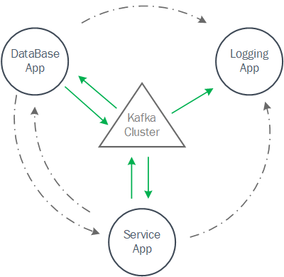

#### Graduation Design

- Title：Tracing Monitoring System of Kafka-Cluster with Opentracing API
- Framework：B/S
- Technology stack：

  - back-end：

    - Microservice：spring-boot
    - MessageSystem：kafka
    - TracingSystem：opentracing

  - front-end：

    - normal html/css/js

#### System Design：

> ##### Demo：
>
> 1. We got three microservice application :
>
>    1. Service App
>    2. Logging App
>    3. DataBase App
>
>    With their name we can easily figure out how this three work：`Service App `handle the **USER Request** and send **CRUD Request** to`DataBase App`，then get the **Result** from`DataBase App`，and every **Request/Response Information** between those two app were gonna **send** to the`Logging App`and **log as record**.
>
> 2. We got two pages：
>
>    1. User pages：to serve for **User**，**USER Requset** was send from here
>    2. Logging pages：to show the system-operation-log to **Apps manager**
>
> ##### Besides：
>
> 1. Every request/response/msg were transfered by message system ：**Kafka Cluster**
>
> 2. Every request/response/msg were traced by tracing system ：**Opentracing**
>
>    > so that we could know some information for a single **"USER Requset process"**，such as：
>    >
>    > 1. processing timeout
>    > 2. msg transfer path
>    > 3. service line tracing
>    > 4. info/error/warning for single process
>    > 5. etc...
>
> ##### Main Goal & Result:
>
> We could see the tracing result on a **"tracing monitoring page"**，every **"USER Requset process"** are display on this page to assess our system's preformence

#### System Design Map

As the map show，the green arrows are request/response/msg，we will trace every msg from Kafka Producers/Consumers.
