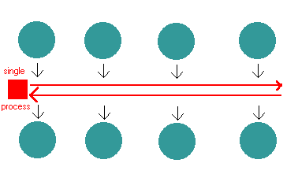

> 转载自：http://blog.mixu.net/2011/02/01/understanding-the-node-js-event-loop/

### Understanding the nodejs' event loop

The first basic thesis of node.js is that I/O is expensive:


So the largest waste with current programming technologies comes from waiting for I/O to complete. There are several ways in which one can deal with the performance impact (from [Sam Rushing](http://www.nightmare.com/medusa/async_sockets.html)):

- **synchronous**: you handle one request at a time, each in turn. _pros_: simple _cons_: any one request can hold up all the other requests
- **fork a new process**: you start a new process to handle each request. _pros_: easy _cons_: does not scale well, hundreds of connections means hundreds of processes. fork() is the Unix programmer's hammer. Because it's available, every problem looks like a nail. It's usually overkill
- **threads**: start a new thread to handle each request. _pros_: easy, and kinder to the kernel than using fork, since threads usually have much less overhead _cons_: your machine may not have threads, and threaded programming can get very complicated very fast, with worries about controlling access to shared resources.

The second basis thesis is that thread-per-connection is memory-expensive: [e.g. that graph everyone showns about Apache sucking up memory compared to Nginx]

Apache is multithreaded: it spawns a [thread per request](http://httpd.apache.org/docs/2.0/mod/worker.html) (or [process](http://httpd.apache.org/docs/2.0/mod/prefork.html), it depends on the conf). You can see how that overhead eats up memory as the number of concurrent connections increases and more threads are needed to serve multiple simulataneous clients. Nginx and Node.js are not multithreaded, because threads and processes carry a heavy memory cost. They are single-threaded, but event-based. This eliminates the overhead created by thousands of threads/processes by handling many connections in a single thread.

### **Node.js keeps a single thread for your code...**

It really is a single thread running: you can't do any parallel code execution; doing a "sleep" for example will block the server for one second: `js while(new Date().getTime() &lt; now + 1000) { // do nothing }`

### **...however, everything runs in parallel except your code**

There is no way of making code run in parallel within a single request. However, all I/O is evented and asynchronous, so the following won't block the server: [codesyntax lang="javascript"]

```
 c.query(
   'SELECT SLEEP(20);',
   function (err, results, fields) {
     if (err) {
       throw err;
     }
     res.writeHead(200, {'Content-Type': 'text/html'});
     res.end('&lt;html&gt;&lt;head&gt;&lt;title&gt;Hello&lt;/title&gt;&lt;/head&gt;&lt;body&gt;&lt;h1&gt;Return from async DB query&lt;/h1&gt;&lt;/body&gt;&lt;/html&gt;');
     c.end();
    }
);
```

If you do that in one request, other requests can be processed just fine while the database is running it's sleep.

### Why is this good? When do we go from sync to async/parallel execution?

Having synchronous execution is good, because it simplifies writing code (compared to threads, where concurrency issues have a tendency to result in WTFs).

In node.js, you aren't supposed to worry about what happens in the backend: just use callbacks when you are doing I/O; and you are guaranteed that your code is never interrupted and that doing I/O will not block other requests without having to incur the costs of thread/process per request (e.g. memory overhead in Apache).

Having asynchronous I/O is good, because I/O is more expensive than most code and we should be doing something better than just waiting for I/O.



An event loop is "an entity that handles and processes external events and converts them into callback invocations". So I/O calls are the points at which Node.js can switch from one request to another. At an I/O call, your code saves the callback and returns control to the node.js runtime environment. The callback will be called later when the data actually is available.

Of course, on the backend, there are [threads and processes for DB access and process execution](http://stackoverflow.com/questions/3629784/how-is-node-js-inherently-faster-when-it-still-relies-on-threads-internally). However, these are not explicitly exposed to your code, so you can't worry about them other than by knowing that I/O interactions e.g. with the database, or with other processes will be asynchronous from the perspective of each request since the results from those threads are returned via the event loop to your code. Compared to the Apache model, there are a lot less threads and thread overhead, since threads aren't needed for each connection; just when you absolutely positively must have something else running in parallel and even then the management is handled by Node.js.

Other than I/O calls, Node.js expects that all requests return quickly; e.g. [CPU-intensive work should be split off to another process](http://stackoverflow.com/questions/3491811/node-js-and-cpu-intensive-requests) with which you can interact as with events, or by using an abstraction like [WebWorkers](http://blog.std.in/2010/07/08/nodejs-webworker-design/). This (obviously) means that you can't parallelize your code without another thread in the background with which you interact via events. Basically, all objects which emit events (e.g. are instances of EventEmitter) support asynchronous evented interaction and you can interact with blocking code in this manner e.g. using files, sockets or child processes all of which are EventEmitters in Node.js. [Multicore can be done](http://developer.yahoo.com/blogs/ydn/posts/2010/07/multicore_http_server_with_nodejs/) using this approach; see also: node-http-proxy.

**Internal implementation**

[Internally](https://github.com/ry/node/tree/master/deps), node.js relies on [libev](http://software.schmorp.de/pkg/libev.html) to provide the event loop, which is supplemented by [libeio](http://software.schmorp.de/pkg/libeio.html) which uses pooled threads to provide asynchronous I/O. To learn even more, have a look at the [libev documentation](http://pod.tst.eu/http://cvs.schmorp.de/libev/ev.pod).

### So how do we do async in Node.js?

Tim Caswell describes the patterns in his [excellent presentation](http://creationix.com/jsconf.pdf)

- First-class functions. E.g. we pass around functions as data, shuffle them around and execute them when needed.
- Function composition. Also known as having anonymous functions or closures that are executed after something happens in the evented I/O.
