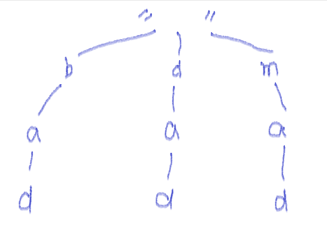
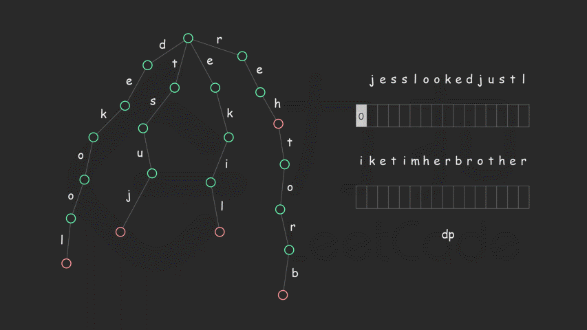

本篇主要介绍一个用于字符串前后缀快速搜索的数据结构——前缀树，这篇也是在 Leetcode 里的一个数据结构[专题](https://leetcode-cn.com/explore/learn/card/trie/)，专题里已经把前缀树的实现方式以及实际应用都介绍了一下，这里稍微整理一下这个专题

关于前缀树的概念，可以参考：[什么是前缀树？](https://leetcode-cn.com/explore/learn/card/trie/165/introduction-to-trie/641/)

关于前缀树的表示，可以参考：[如何表示一个前缀树？](https://leetcode-cn.com/explore/learn/card/trie/165/introduction-to-trie/642/)

我们一般使用数组的方式去表示前缀树，虽然它会多占用一些空间，但是在查找的执行效率上，要比 HashMap 快上不少

### 数组实现

我们假定场景单词只有 26 个小写字母：

```java
class Trie {
    private boolean isEnd   = false;
    private Trie[] children = new Trie[26];
    public Trie() {}

    // 录入单词
    public void insert(String word) {
        Trie cur = this;
        for (char c: word.toCharArray()) {
            int cn = c - 'a';
            if (cur.children[cn] == null) {
                cur.children[cn] = new Trie();
            }
            cur = cur.children[cn];
        }
        cur.isEnd = true;
    }

    // 是否存在某个单词
    public boolean search(String word) {
        Trie cur = this;
        for (char c: word.toCharArray()) {
            int cn = c - 'a';
            if (cur.children[cn] == null) {
                return false;
            }
            cur = cur.children[cn];
        }
        return cur.isEnd;
    }

    // 是否存在某个前缀
    public boolean startsWith(String prefix) {
        Trie cur = this;
        for (char c: prefix.toCharArray()) {
            int cn = c - 'a';
            if (cur.children[cn] == null) {
                return false;
            }
            cur = cur.children[cn];
        }
        return true;
    }
}
```

### 相关题目

#### 记录权值 - Map Sum Pairs

实现一个 MapSum 类里的两个方法，`insert` 和 `sum`。

对于方法 `insert`，你将得到一对（字符串，整数）的键值对。字符串表示键，整数表示值。如果键已经存在，那么原来的键值对将被替代成新的键值对。

对于方法 `sum`，你将得到一个表示前缀的字符串，你需要返回所有以该前缀开头的键的值的总和。

**示例 1:**

```
输入: insert("apple", 3), 输出: Null
输入: sum("ap"), 输出: 3
输入: insert("app", 2), 输出: Null
输入: sum("ap"), 输出: 5
```

这题的关键就是要在**每个缀点**上都记录**权值**，所以我们设计的前缀树要同时支持**权值**记录，这里稍微要注意的是已存在键的**权值**的替换，我们的`search`方法返回的是该前缀的**最后一个缀点**，以便获取该前缀的旧**权值**

```java
class Trie {
    public boolean isEnd = false;
    public int sum = 0;
    public Trie[] children = new Trie[26];
    public Trie() {}

    public void insert(String word, int sum) {
        // 搜索出该前缀是否已经存在
        Trie oldTrie = search(word);
        boolean addOn = oldTrie == null;
        Trie cur = this;
        for (char c: word.toCharArray()) {
            int cn = c - 'a';
            if (cur.children[cn] == null) {
                cur.children[cn] = new Trie();
            }
            if (addOn) {
                // 如果是新的前缀 那么就直接在原权值上加
                cur.children[cn].sum += sum;
            } else {
                // 如果是已存在的前缀 那么需要减去旧的权值 然后再加上新的权值
                cur.children[cn].sum = cur.children[cn].sum - oldTrie.sum + sum;
            }
            cur = cur.children[cn];
        }
        cur.isEnd = true;
    }

    public Trie search(String word) {
        Trie cur = this;
        for (char c: word.toCharArray()) {
            int cn = c - 'a';
            if (cur.children[cn] == null) {
                return null;
            }
            cur = cur.children[cn];
        }
        return cur.isEnd ? cur : null;
    }

    public int getSum(String prefix) {
        Trie cur = this;
        for (char c: prefix.toCharArray()) {
            int cn = c - 'a';
            if (cur.children[cn] == null) {
                return 0;
            } else {
                cur = cur.children[cn];
            }
        }
        return cur.sum;
    }
}
```

#### 查询前缀 - 单词替换

在英语中，我们有一个叫做 `词根`(root)的概念，它可以跟着其他一些词组成另一个较长的单词——我们称这个词为 `继承词`(successor)。例如，词根`an`，跟随着单词 `other`(其他)，可以形成新的单词 `another`(另一个)。

现在，给定一个由许多词根组成的词典和一个句子。你需要将句子中的所有`继承词`用`词根`替换掉。如果`继承词`有许多可以形成它的`词根`，则用最短的词根替换它。

你需要输出替换之后的句子。

**示例：**

```
输入：dict(词典) = ["cat", "bat", "rat"] sentence(句子) = "the cattle was rattled by the battery"
输出："the cat was rat by the bat"
```

**提示：**

- 输入只包含小写字母。
- `1 <= dict.length <= 1000`
- `1 <= dict[i].length <= 100`
- 1 <= 句中词语数 <= 1000
- 1 <= 句中词语长度 <= 1000

这题首先把字典录入到前缀树，然后根据构造的前缀树，查询所有输入单词的前缀然后替换即可

```java
class Solution {
    public String replaceWords(List<String> dict, String sentence) {
        if (sentence.length() <= 1) return sentence;

        Trie trie = new Trie();
        for (String word: dict) {
            trie.insert(word);
        }

        String[] words = sentence.split(" ");

        StringBuilder sb = new StringBuilder("");
        for (String word: words) {
            // 搜索前缀长度
            int length = trie.getPrefix(word);
            if (length == 0) length = word.length();
            sb.append(word.substring(0, length)).append(" ");
        }
        return sb.deleteCharAt(sb.length() - 1).toString();
    }
}

class Trie {
    public boolean isEnd  = false;
    public Trie[] children = new Trie[26];
    public Trie() {}
    public void insert(String word) {
        Trie cur = this;
        for (char c: word.toCharArray()) {
            int cn = c - 'a';
            if (cur.children[cn] == null) {
                cur.children[cn] = new Trie();
            }
            cur = cur.children[cn];
        }
        cur.isEnd = true;
    }

    // 返回前缀的长度
    public int getPrefix(String word) {
        Trie cur = this;
        int length = 0;
        for (char c: word.toCharArray()) {
            int cn = c - 'a';
            if (cur.children[cn] == null || cur.isEnd) {
                // 如果已经到底了 说明当前缀点就是最短的前缀
                break;
            }
            cur = cur.children[cn];
            length++;
        }
        return cur.isEnd ? length : 0;
    }
}
```

#### 有通配符 - 添加与搜索单词

设计一个支持以下两种操作的数据结构：

```
void addWord(word)
bool search(word)
```

search(word) 可以搜索文字或正则表达式字符串，字符串只包含字母 `.` 或 `a-z` 。 `.` 可以表示任何一个字母。

**示例:**

```
addWord("bad")
addWord("dad")
addWord("mad")
search("pad") -> false
search("bad") -> true
search(".ad") -> true
search("b..") -> true
```

**说明:**

你可以假设所有单词都是由小写字母 `a-z` 组成的。

这题的关键就是处理通配符，对于像`b.a`，`b..`这样的用例，每当遇到`.`的时候，我们就需要遍历当前缀点的所有子缀点，比如实例上能构造前缀树：



当我们搜索到第一个缀点 b 的子缀点的时候，发现是通配符，于是我们需要遍历 b 的所有有效子缀点`(trie != null)`来搜索后续的字符所以我们的`search`方法可以修改为

```java
public static boolean search(String word, Trie root, int begin) {
    Trie cur = root;
    for (int i = begin; i < word.length(); i++) {
        char c = word.charAt(i);
        if (c == '.') {
            // 遍历当前子缀点，并从当前子缀点继续搜索
            for (Trie t: cur.next) {
                if (t != null && search(word, t, i + 1)) return true;
            }
            return false;
        } else {
            // 正常的搜索
            int cn = c - 'a';
            if (cur.next[cn] == null) {
                return false;
            } else {
                cur = cur.next[cn];
            }
        }
    }
    return cur.isEnd;
}
```

#### 深度回溯 - 单词搜索 II

给定一个二维网格 **board** 和一个字典中的单词列表 **words**，找出所有同时在二维网格和字典中出现的单词。

单词必须按照字母顺序，通过相邻的单元格内的字母构成，其中“相邻”单元格是那些水平相邻或垂直相邻的单元格。同一个单元格内的字母在一个单词中不允许被重复使用。

**示例:**

```
输入:
words = ["oath","pea","eat","rain"] and board =
[
  ['o','a','a','n'],
  ['e','t','a','e'],
  ['i','h','k','r'],
  ['i','f','l','v']
]

输出: ["eat","oath"]
```

**说明:**
你可以假设所有输入都由小写字母 `a-z` 组成。

本体就在**二维数组上进行深度优先**再运用上**前缀树的缀点进行回溯**，难度不大，关键是要优化到 99%

```java
class Solution {

    int[][] direction = {
        {0, 1},
        {0,-1},
        {1, 0},
        {-1,0}
    };

    int m;
    int n;
    int wc;

    public List<String> findWords(char[][] board, String[] words) {
        Trie trie = new Trie();
        wc = words.length;
        for (String word: words) {
            trie.insert(word);
        }
        m = board.length;
        List<String> ans = new ArrayList<>();
        if (m == 0) return ans;
        n = board[0].length;
        if (n == 0) return ans;

        for (int row = 0; row < m; row++) {
            for (int col = 0; col < n; col++) {
                // 优化4：一旦字典找满了 则后面的搜索就没必要做了 因为答案是不重复记录
                if (ans.size() < wc) {
                    back(board, row, col, trie, ans);
                }
            }
        }
        return ans;
    }

    public void back(char[][] board, int row, int col, Trie trie, List<String> ans) {
        // 优化3：直接使用缀点去进行查询 快速剪枝
        Trie t = trie.next[board[row][col] -'a'];
        if (t != null) {
            if (t.word != null && !t.visited) {
                ans.add(t.word);
                t.visited = true;
            }
            char tmp = board[row][col];
            board[row][col] = '#';
            for (int[] d: direction) {
                int newRow = row + d[0];
                int newCol = col + d[1];

                if (newRow < 0 || newRow >= m || newCol < 0 || newCol >= n) continue;
                if (board[newRow][newCol] == '#') continue;

                back(board, newRow, newCol, t, ans);
            }
            board[row][col] = tmp;
        }
    }
}

class Trie {
    public Trie[]  next    = new Trie[26];
    // 优化1：单词记录在最后一个缀点上，这样就不用在回溯的时候用StringBuilder去一个个记录字符
    public String  word    = null;
    // 优化2：使用一个布尔值去记录这个答案是否被访问过了，以达到答案去重的目的
    public boolean visited = false;

    public void insert(String word) {
        Trie cur = this;
        for (char c: word.toCharArray()) {
            int cn = c - 'a';
            if (cur.next[cn] == null) {
                cur.next[cn] = new Trie();
            }
            cur = cur.next[cn];
        }
        cur.word = word;
    }
}
```

#### 有后缀树 - 恢复空格

哦，不！你不小心把一个长篇文章中的空格、标点都删掉了，并且大写也弄成了小写。像句子`"I reset the computer. It still didn’t boot!"`已经变成了`"iresetthecomputeritstilldidntboot"`。在处理标点符号和大小写之前，你得先把它断成词语。

当然了，你有一本厚厚的词典`dictionary`，不过，有些词没在词典里。假设文章用`sentence`表示，设计一个算法，把文章断开，要求未识别的字符最少，返回未识别的字符数。

**注意：**本题相对原题稍作改动，只需返回未识别的字符数

**示例：**

```
输入：
dictionary = ["looked","just","like","her","brother"]
sentence = "jesslookedjustliketimherbrother"
输出： 7
解释： 断句后为"jess looked just like tim her brother"，共7个未识别字符。
```

**提示：**

- `0 <= len(sentence) <= 1000`
- `dictionary`中总字符数不超过 150000。
- 你可以认为`dictionary`和`sentence`中只包含小写字母。



刚开思考的时候，确实是正向思考的，录入了一颗前缀树，但是这样的坏处是，无法在 n^2 的时间内很好地进行单词的划分与判断，所以参考了一下官方给的思路，构造一颗后缀树，从后缀往前摸，不得不说这个思路确实很漂亮

而且这里还运用到了动态规划，申请了 n+1 长度的数组`dp`，`dp[i]`表示前 `i` 个字符最少的未识别的字符数量，从前往后计算 dp 值

考虑转移方程，每次转移的时候我们考虑第 `j(j <= i)`个到第 `i` 个字符组成的子串 `sentence[j−1⋯i−1] `（注意字符串下标从 0 开始）是否能在词典中找到，如果能找到的话按照定义转移方程为：

$$
dp[i]=min(dp[i],\enspace dp[j−1])
$$

否则没有找到的话我们可以复用 \textit{dp}[i-1]dp[i−1] 的状态再加上当前未被识别的第 ii 个字符，因此此时 \textit{dp}dp 值为

$$
dp[i]=dp[i−1]+1
$$

dp 的取值过程在动图里已经展示了

```java
class Solution {
    /**
     * 参考官方解答
     */
    public int respace(String[] dictionary, String sentence) {
        if (sentence.length() == 0) return 0;
        BackTrie backtrie = new BackTrie();
        for (String word: dictionary) {
            backtrie.insert(word);
        }
        int length = sentence.length();
        int[] dp = new int[length + 1];
        dp[0] = 0;
        for (int i = 1; i <= length; i++) {
            dp[i] = dp[i - 1] + 1;

            BackTrie cur = backtrie;
            for (int j = i - 1; j >= 0; j--) {
                if (dp[i] == 0) {
                    break;
                }
                int cn = sentence.charAt(j) - 'a';
                if (cur.next[cn] == null) {
                    break;
                } else if (cur.next[cn].isEnd) {
                    dp[i] = Math.min(dp[i], dp[j]);
                }
                // 一旦是某个单词的后缀 就往前摸
                cur = cur.next[cn];
            }
        }
        return dp[length];
    }
}

/**
 * 后缀树
 */
class BackTrie {

    public boolean isEnd = false;
    public BackTrie[] next;

    public BackTrie() {
        next = new BackTrie[26];
    }

    public void insert(String word) {
        BackTrie cur = this;
        for (int i = word.length() - 1; i >= 0; i--) {
            int cn = word.charAt(i) - 'a';
            if (cur.next[cn] == null) {
                cur.next[cn] = new BackTrie();
            }
            cur = cur.next[cn];
        }
        cur.isEnd = true;
    }
}
```
