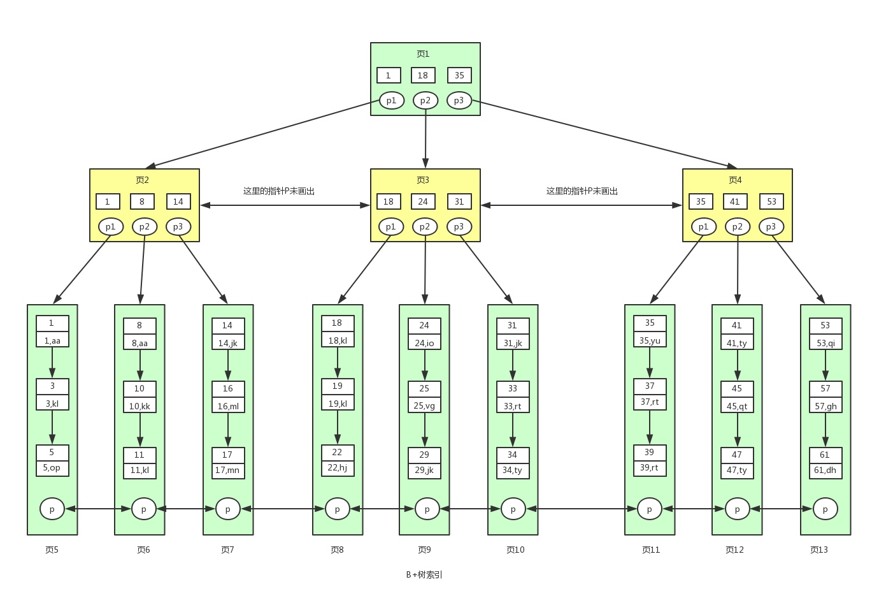
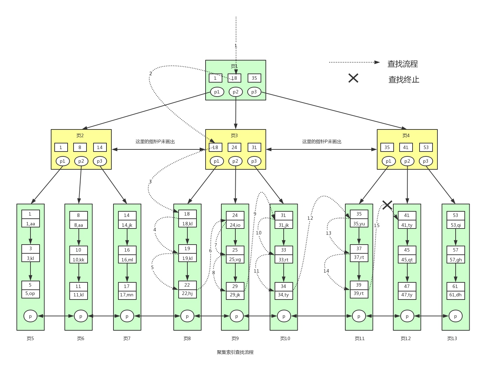

本篇主要是再来聊聊 MySQL 中 InnoDB 的索引的细节，主要聊到引擎是如何利用 B+树去检索数据的

以及整理一些关于索引的问题与回答，所以本篇的形式还是以问题点为驱动，回答一个个的问题

在开始之前，再强调一些 B+树的细节：

- **“高扇出性”**，为了减少 IO 次数，而尽可能一次 IO 读取更多的数据；
- **“范围查找”**，由于索引存储的特点，相比于**_哈希索引的等值查找_**，它还能胜任范围查找；
- **“顺序排序”**，因为索引是顺序存储，所以查询结果天然排序；
- **“索引即数据，数据即索引”**，聚集索引的存储值就是数据本身；

### 使用 B+树的索引过程



现在假设我们要查找`id>=18`并且`id<40`的用户数据

对应的 sql 语句如下，其中 id 为主键：

```sql
select * from user where id>=18 and id <40
```

具体的查找过程如下：

1. 一般根节点都是常驻内存的，也就是说`页1`已经在内存中了，此时不需要到磁盘中读取数据，直接从内存中读取即可。从内存中读取到`页1`，要查找这个`id>=18 and id <40`或者范围值，我们首先需要找到`id=18`的键值。从`页1`中我们可以找到键值`18`，此时我们需要根据指针`p2`，定位到`页3`。

2. 要从`页3`中查找数据，我们就需要拿着`p2`指针去磁盘中进行读取`页3`。从磁盘中读取`页3`放入内存中，然后进行查找，我们可以找到键值`18`，然后再拿到`页3`中的指针`p1`，定位到`页8`。

3. 同样的`页8`不在内存中，我们需要再去磁盘中将`页8`读取到内存中。将`页8`读取到内存中后，因为页中的数据是链表进行连接的，而且键值是按照顺序存放的，此时可以根据二分查找法定位到键值`18`。

   **此时因为已经到数据页了**，此时我们已经找到一条满足条件的数据了，就是键值`18`对应的数据。因为是范围查找，而且此时所有的数据又都存在叶子节点，并且是有序排列的，那么我们就可以对页 8 中的键值依次进行遍历查找并匹配满足条件的数据。我们可以一直找到键值为`22`的数据，然后`页8`中就没有数据了，此时我们需要拿着`页8`中的`p指针`去读取`页9`中的数据。

4. 因为`页9`不在内存中，就又会加载`页9`到内存中，并通过和`页8`中一样的方式进行数据的查找，直到将`页12`加载到内存中，发现`41`大于`40`，此时不满足条件。

   **那么查找到此终止**。

最终我们找到满足条件的所有数据为：`(18,kl),(19,kl),(22,hj),(24,io),(25,vg),(29,jk),(31,jk),(33,rt),(34,ty),(35,yu),(37,rt),(39,rt)`，总共 12 条记录。

具体流程如：



而非聚集索引的查找流程也一样，只不过它最终返回的是记录的主键，然后再通过主键去聚集索引中查找数据，我们称这个行为叫做**“回表”**

### 索引匹配过程

#### Explain 命令

在了解索引匹配之前，我们先了解了解 MySQL 中一个对 SQL 执行过程进行解释的命令`explain`，

我们需要了解各列的含义，接下来的内容转载整理自：https://www.cnblogs.com/mzhaox/p/11203042.html

##### id

id 列的编号是 select 的序列号，有几个 select 就有几个 id，并且 id 的顺序是按 select 出现的顺序增长的。MySQL 将 select 查询分为简单查询和复杂查询。复杂查询分为三类：**简单子查询、派生表（from 语句中的子查询）、union 查询**。

1. 简单子查询

   ```sql
   mysql> explain select (select 1 from actor limit 1) from film;
   +----+-------------+-------+-------+---------------+----------+---------+------+------+-------------+
   | id | select_type | table | type  | possible_keys | key      | key_len | ref  | rows | Extra       |
   +----+-------------+-------+-------+---------------+----------+---------+------+------+-------------+
   |  1 | PRIMARY     | film  | index | NULL          | idx_name | 32      | NULL |    1 | Using index |
   |  2 | SUBQUERY    | actor | index | NULL          | PRIMARY  | 4       | NULL |    2 | Using index |
   +----+-------------+-------+-------+---------------+----------+---------+------+------+-------------+
   ```

2. from 子句中的子查询

   ```sql
   mysql> explain select id from (select id from film) as der;
   +----+-------------+------------+-------+---------------+----------+---------+------+------+-------------+
   | id | select_type | table      | type  | possible_keys | key      | key_len | ref  | rows | Extra       |
   +----+-------------+------------+-------+---------------+----------+---------+------+------+-------------+
   |  1 | PRIMARY     | <derived2> | ALL   | NULL          | NULL     | NULL    | NULL |    2 | NULL        |
   |  2 | DERIVED     | film       | index | NULL          | idx_name | 32      | NULL |    1 | Using index |
   +----+-------------+------------+-------+---------------+----------+---------+------+------+-------------+
   ```

   这个查询执行时有个临时表别名为 der，外部 select 查询引用了这个临时表

3. union 查询

   ```sql
   mysql> explain select 1 union all select 1;
   +----+--------------+------------+------+---------------+------+---------+------+------+-----------------+
   | id | select_type  | table      | type | possible_keys | key  | key_len | ref  | rows | Extra           |
   +----+--------------+------------+------+---------------+------+---------+------+------+-----------------+
   |  1 | PRIMARY      | NULL       | NULL | NULL          | NULL | NULL    | NULL | NULL | No tables used  |
   |  2 | UNION        | NULL       | NULL | NULL          | NULL | NULL    | NULL | NULL | No tables used  |
   | NULL | UNION RESULT | <union1,2> | ALL  | NULL          | NULL | NULL    | NULL | NULL | Using temporary |
   +----+--------------+------------+------+---------------+------+---------+------+------+-----------------+
   ```

   union 结果总是放在一个匿名临时表中，临时表不在 SQL 总出现，因此它的 id 是 NULL。

##### select_type

select_type 表示对应行是是简单还是复杂的查询，如果是复杂的查询，又是上述三种复杂查询中的哪一种。

1. **simple**：简单查询。查询不包含子查询和 union；

2. **primary**：复杂查询中最外层的 select；

3. **subquery**：包含在 select 中的子查询（不在 from 子句中）；

4. **derived**：包含在 from 子句中的子查询。MySQL 会将结果存放在一个临时表中，也称为派生表；

   ```sql
   mysql> explain select (select 1 from actor where id = 1) from (select * from film where id = 1) der;
   +----+-------------+------------+--------+---------------+---------+---------+-------+------+-------------+
   | id | select_type | table      | type   | possible_keys | key     | key_len | ref   | rows | Extra       |
   +----+-------------+------------+--------+---------------+---------+---------+-------+------+-------------+
   |  1 | PRIMARY     | <derived3> | system | NULL          | NULL    | NULL    | NULL  |    1 | NULL        |
   |  3 | DERIVED     | film       | const  | PRIMARY       | PRIMARY | 4       | const |    1 | NULL        |
   |  2 | SUBQUERY    | actor      | const  | PRIMARY       | PRIMARY | 4       | const |    1 | Using index |
   +----+-------------+------------+--------+---------------+---------+---------+-------+------+-------------+
   ```

5. **union**：在 union 中的第二个和随后的 select；

6. **union result**：从 union 临时表检索结果的 select；

   ```sql
   mysql> explain select 1 union all select 1;
   +----+--------------+------------+------+---------------+------+---------+------+------+-----------------+
   | id | select_type  | table      | type | possible_keys | key  | key_len | ref  | rows | Extra           |
   +----+--------------+------------+------+---------------+------+---------+------+------+-----------------+
   |  1 | PRIMARY      | NULL       | NULL | NULL          | NULL | NULL    | NULL | NULL | No tables used  |
   |  2 | UNION        | NULL       | NULL | NULL          | NULL | NULL    | NULL | NULL | No tables used  |
   | NULL | UNION RESULT | <union1,2> | ALL  | NULL          | NULL | NULL    | NULL | NULL | Using temporary |
   +----+--------------+------------+------+---------------+------+---------+------+------+-----------------+
   ```

##### table

这一列表示 explain 的一行正在访问哪个表。

当 from 子句中有子查询时，table 列是 \<derivenN\> 格式，表示当前查询依赖 id=N 的查询，于是先执行 id=N 的查询。

当有 union 时，UNION RESULT 的 table 列的值为 <union1,2>，1 和 2 表示参与 union 的 select 行 id。

##### type（重点）

这一列表示关联类型或访问类型，即 MySQL 决定如何查找表中的行。

依次从最优到最差分别为：**system > const > eq_ref > ref > fulltext > ref_or_null > index_merge > unique_subquery > index_subquery > range > index > ALL**

- **NULL**：mysql 能够在优化阶段分解查询语句，在执行阶段用不着再访问表或索引。

  例如：在索引列中选取最小值，可以单独查找索引来完成，不需要在执行时访问表

  ```sql
  mysql> explain select min(id) from film;
  +----+-------------+-------+------+---------------+------+---------+------+------+------------------------------+
  | id | select_type | table | type | possible_keys | key  | key_len | ref  | rows | Extra                        |
  +----+-------------+-------+------+---------------+------+---------+------+------+------------------------------+
  |  1 | SIMPLE      | NULL  | NULL | NULL          | NULL | NULL    | NULL | NULL | Select tables optimized away |
  +----+-------------+-------+------+---------------+------+---------+------+------+------
  ```

- **eq_ref**：primary key 或 unique key 索引的所有部分被连接使用 ，最多只会返回一条符合条件的记录。这可能是在 const 之外最好的联接类型了，简单的 select 查询不会出现这种 type。

  ```sql
  mysql> explain select * from film_actor left join film on film_actor.film_id = film.id;
  +----+-------------+------------+--------+---------------+-------------------+---------+-------------------------+------+-------------+
  | id | select_type | table      | type   | possible_keys | key               | key_len | ref                     | rows | Extra       |
  +----+-------------+------------+--------+---------------+-------------------+---------+-------------------------+------+-------------+
  |  1 | SIMPLE      | film_actor | index  | NULL          | idx_film_actor_id | 8       | NULL                    |    3 | Using index |
  |  1 | SIMPLE      | film       | eq_ref | PRIMARY       | PRIMARY           | 4       | test.film_actor.film_id |    1 | NULL        |
  +----+-------------+------------+--------+---------------+-------------------+---------+-------------------------+------+-------------+
  ```

- **ref**：相比 `eq_ref`，不使用唯一索引，而是使用普通索引或者唯一性索引的**部分前缀**，索引要和某个值相比较，可能会找到多个符合条件的行。

  ```sql
  1. 简单 select 查询，name是普通索引（非唯一索引）
  mysql> explain select * from film where name = "film1";
  +----+-------------+-------+------+---------------+----------+---------+-------+------+--------------------------+
  | id | select_type | table | type | possible_keys | key      | key_len | ref   | rows | Extra                    |
  +----+-------------+-------+------+---------------+----------+---------+-------+------+--------------------------+
  |  1 | SIMPLE      | film  | ref  | idx_name      | idx_name | 33      | const |    1 | Using where; Using index |
  +----+-------------+-------+------+---------------+----------+---------+-------+------+--------------------------+

  2.关联表查询，idx_film_actor_id是film_id和actor_id的联合索引，这里使用到了film_actor的左边前缀film_id部分。
  mysql> explain select * from film left join film_actor on film.id = film_actor.film_id;
  +----+-------------+------------+-------+-------------------+-------------------+---------+--------------+------+-------------+
  | id | select_type | table      | type  | possible_keys     | key               | key_len | ref          | rows | Extra       |
  +----+-------------+------------+-------+-------------------+-------------------+---------+--------------+------+-------------+
  |  1 | SIMPLE      | film       | index | NULL              | idx_name          | 33      | NULL         |    3 | Using index |
  |  1 | SIMPLE      | film_actor | ref   | idx_film_actor_id | idx_film_actor_id | 4       | test.film.id |    1 | Using index |
  +----+-------------+------------+-------+-------------------+-------------------+---------+--------------+--
  ```

- **ref_or_null**：类似`ref`，但是可以搜索值为 NULL 的行。

  ```sql
  mysql> explain select * from film where name = "film1" or name is null;
  +----+-------------+-------+-------------+---------------+----------+---------+-------+------+--------------------------+
  | id | select_type | table | type        | possible_keys | key      | key_len | ref   | rows | Extra                    |
  +----+-------------+-------+-------------+---------------+----------+---------+-------+------+--------------------------+
  |  1 | SIMPLE      | film  | ref_or_null | idx_name      | idx_name | 33      | const |    2 | Using where; Using index |
  +----+-------------+-------+-------------+---------------+----------+---------+-------+------+--------------------------+
  ```

- **index_merge**：表示使用了索引合并的优化方法。

  例如下表：id 是主键，tenant_id 是普通索引。or 的时候没有用 primary key，而是使用了 primary key(id) 和 tenant_id 索引

  ```sql
  mysql> explain select * from role where id = 11011 or tenant_id = 8888;
  +----+-------------+-------+-------------+-----------------------+-----------------------+---------+------+------+-------------------------------------------------+
  | id | select_type | table | type        | possible_keys         | key                   | key_len | ref  | rows | Extra                                           |
  +----+-------------+-------+-------------+-----------------------+-----------------------+---------+------+------+-------------------------------------------------+
  |  1 | SIMPLE      | role  | index_merge | PRIMARY,idx_tenant_id | PRIMARY,idx_tenant_id | 4,4     | NULL |  134 | Using union(PRIMARY,idx_tenant_id); Using where |
  +----+-------------+-------+-------------+-----------------------+-----------------------+---------+------+------+-------------------------------------------------+
  ```

- **range**：范围扫描通常出现在 in(), between ,> ,<, >= 等操作中。使用一个索引来检索给定范围的行。

  ```sql
  mysql> explain select * from actor where id > 1;
  +----+-------------+-------+-------+---------------+---------+---------+------+------+-------------+
  | id | select_type | table | type  | possible_keys | key     | key_len | ref  | rows | Extra       |
  +----+-------------+-------+-------+---------------+---------+---------+------+------+-------------+
  |  1 | SIMPLE      | actor | range | PRIMARY       | PRIMARY | 4       | NULL |    2 | Using where |
  +----+-------------+-------+-------+---------------+---------+---------+------+------+-------------+
  ```

- **index**：和 ALL 一样，不同就是 mysql 只需扫描索引树，这通常比 ALL 快一些。

  ```sql
  mysql> explain select count(*) from film;
  +----+-------------+-------+-------+---------------+----------+---------+------+------+-------------+
  | id | select_type | table | type  | possible_keys | key      | key_len | ref  | rows | Extra       |
  +----+-------------+-------+-------+---------------+----------+---------+------+------+-------------+
  |  1 | SIMPLE      | film  | index | NULL          | idx_name | 33      | NULL |    3 | Using index |
  +----+-------------+-------+-------+---------------+----------+---------+------+------+-------------+
  ```

- **ALL**：即全表扫描，意味着 mysql 需要从头到尾去查找所需要的行。通常情况下这需要增加索引来进行优化了

  ```sql
  mysql> explain select * from actor;
  +----+-------------+-------+------+---------------+------+---------+------+------+-------+
  | id | select_type | table | type | possible_keys | key  | key_len | ref  | rows | Extra |
  +----+-------------+-------+------+---------------+------+---------+------+------+-------+
  |  1 | SIMPLE      | actor | ALL  | NULL          | NULL | NULL    | NULL |    2 | NULL  |
  +----+-------------+-------+------+---------------+------+---------+------+------+-------+
  ```

##### possible_keys

这一列显示查询可能使用哪些索引来查找。

explain 时可能出现 possible_keys 有列，而 key 显示 NULL 的情况，这种情况是因为表中数据不多，mysql 认为索引对此查询帮助不大，选择了全表查询。

如果该列是 NULL，则没有相关的索引。在这种情况下，可以通过检查 where 子句看是否可以创造一个适当的索引来提高查询性能，然后用 explain 查看效果。

##### key

这一列显示 mysql 实际采用哪个索引来优化对该表的访问。
如果没有使用索引，则该列是 NULL。如果想强制 mysql 使用或忽视 possible_keys 列中的索引，在查询中使用 force index、ignore index。

##### key_len

这一列显示了 mysql 在索引里使用的字节数，通过这个值可以算出具体使用了索引中的哪些列。

##### ref

这一列显示了在 key 列记录的索引中，表查找值所用到的列或常量，常见的有：const（常量），func，NULL，字段名（例：film.id）

##### rows

这一列是 mysql 估计要读取并检测的行数，注意这个不是结果集里的行数。

##### filtered

某个表经过搜索条件过滤后剩余记录条数的百分比

##### extra

这一列展示的是额外信息。常见的重要值如下：

- **distinct**: 一旦 mysql 找到了与行相联合匹配的行，就不再搜索了

  ```sql
  mysql> explain select distinct name from film left join film_actor on film.id = film_actor.film_id;
  +----+-------------+------------+-------+-------------------+-------------------+---------+--------------+------+------------------------------+
  | id | select_type | table      | type  | possible_keys     | key               | key_len | ref          | rows | Extra                        |
  +----+-------------+------------+-------+-------------------+-------------------+---------+--------------+------+------------------------------+
  |  1 | SIMPLE      | film       | index | idx_name          | idx_name          | 33      | NULL         |    3 | Using index; Using temporary |
  |  1 | SIMPLE      | film_actor | ref   | idx_film_actor_id | idx_film_actor_id | 4       | test.film.id |    1 | Using index; Distinct        |
  +----+-------------+------------+-------+-------------------+-------------------+---------+--------------+------+------------------------------+
  ```

- **Using index**：这发生在对表的请求列都是同一索引的部分的时候，返回的列数据只使用了索引中的信息，而没有再去访问表中的行记录。是性能高的表现。

  ```sql
  mysql> explain select id from film order by id;
  +----+-------------+-------+-------+---------------+---------+---------+------+------+-------------+
  | id | select_type | table | type  | possible_keys | key     | key_len | ref  | rows | Extra       |
  +----+-------------+-------+-------+---------------+---------+---------+------+------+-------------+
  |  1 | SIMPLE      | film  | index | NULL          | PRIMARY | 4       | NULL |    3 | Using index |
  +----+-------------+-------+-------+---------------+---------+---------+------+------+-------------+
  ```

- **Using where**：mysql 服务器将在存储引擎检索行后再进行过滤。就是先读取整行数据，再按 where 条件进行检查，符合就留下，不符合就丢弃。

  ```sql
  mysql> explain select * from film where id > 1;
  +----+-------------+-------+-------+---------------+----------+---------+------+------+--------------------------+
  | id | select_type | table | type  | possible_keys | key      | key_len | ref  | rows | Extra                    |
  +----+-------------+-------+-------+---------------+----------+---------+------+------+--------------------------+
  |  1 | SIMPLE      | film  | index | PRIMARY       | idx_name | 33      | NULL |    3 | Using where; Using index |
  +----+-------------+-------+-------+---------------+----------+---------+------+------+--------------------------+
  ```

- **Using temporary**：mysql 需要创建一张临时表来处理查询。出现这种情况一般是要进行优化的，首先是想到用索引来优化。

  ```sql
  1. actor.name没有索引，此时创建了张临时表来distinct
  mysql> explain select distinct name from actor;
  +----+-------------+-------+------+---------------+------+---------+------+------+-----------------+
  | id | select_type | table | type | possible_keys | key  | key_len | ref  | rows | Extra           |
  +----+-------------+-------+------+---------------+------+---------+------+------+-----------------+
  |  1 | SIMPLE      | actor | ALL  | NULL          | NULL | NULL    | NULL |    2 | Using temporary |
  +----+-------------+-------+------+---------------+------+---------+------+------+-----------------+

  2. film.name建立了idx_name索引，此时查询时extra是using index,没有用临时表
  mysql> explain select distinct name from film;
  +----+-------------+-------+-------+---------------+----------+---------+------+------+-------------+
  | id | select_type | table | type  | possible_keys | key      | key_len | ref  | rows | Extra       |
  +----+-------------+-------+-------+---------------+----------+---------+------+------+-------------+
  |  1 | SIMPLE      | film  | index | idx_name      | idx_name | 33      | NULL |    3 | Using index |
  +----+-------------+-------+-------+---------------+----------+---------+------+------+-------------+
  ```

- **Using filesort**：mysql 会对结果使用一个外部索引排序，而不是按索引次序从表里读取行。此时 mysql 会根据联接类型浏览所有符合条件的记录，并保存排序关键字和行指针，然后排序关键字并按顺序检索行信息。这种情况下一般也是要考虑使用索引来优化的。

  ```sql
  1. actor.name未创建索引，会浏览actor整个表，保存排序关键字name和对应的id，然后排序name并检索行记录
  mysql> explain select * from actor order by name;
  +----+-------------+-------+------+---------------+------+---------+------+------+----------------+
  | id | select_type | table | type | possible_keys | key  | key_len | ref  | rows | Extra          |
  +----+-------------+-------+------+---------------+------+---------+------+------+----------------+
  |  1 | SIMPLE      | actor | ALL  | NULL          | NULL | NULL    | NULL |    2 | Using filesort |
  +----+-------------+-------+------+---------------+------+---------+------+------+----------------+

  2. film.name建立了idx_name索引,此时查询时extra是using index
  mysql> explain select * from film order by name;
  +----+-------------+-------+-------+---------------+----------+---------+------+------+-------------+
  | id | select_type | table | type  | possible_keys | key      | key_len | ref  | rows | Extra       |
  +----+-------------+-------+-------+---------------+----------+---------+------+------+-------------+
  |  1 | SIMPLE      | film  | index | NULL          | idx_name | 33      | NULL |    3 | Using index |
  +----+-------------+-------+-------+---------------+----------+---------+------+------+-------------+
  ```

#### 匹配过程

假如我们有表：

```sql
mysql root@youyinnn.top:test> show create table mytable3\G
***************************[ 1. row ]***************************
Table        | mytable3
Create Table | CREATE TABLE `mytable3` (
  `a` int(11) NOT NULL AUTO_INCREMENT,
  `b` varchar(30) NOT NULL,
  `c` varchar(20) NOT NULL,
  `d` int(11) DEFAULT NULL,
  `e` int(11) DEFAULT NULL,
  PRIMARY KEY (`a`,`b`,`c`)
) ENGINE=InnoDB AUTO_INCREMENT=7 DEFAULT CHARSET=utf8
```

并且有 3 个列组成的聚集索引：

```sql
mysql root@youyinnn.top:test> show index from mytable3;
+----------+------------+----------+--------------+-------------+-----------+-------------+----------+--------+------+------------+---------+---------------+
| Table    | Non_unique | Key_name | Seq_in_index | Column_name | Collation | Cardinality | Sub_part | Packed | Null | Index_type | Comment | Index_comment |
+----------+------------+----------+--------------+-------------+-----------+-------------+----------+--------+------+------------+---------+---------------+
| mytable3 | 0          | PRIMARY  | 1            | a           | A         | 6           | <null>   | <null> |      | BTREE      |         |               |
| mytable3 | 0          | PRIMARY  | 2            | b           | A         | 6           | <null>   | <null> |      | BTREE      |         |               |
| mytable3 | 0          | PRIMARY  | 3            | c           | A         | 6           | <null>   | <null> |      | BTREE      |         |               |
+----------+------------+----------+--------------+-------------+-----------+-------------+----------+--------+------+------------+---------+---------------+
```

##### 全列查询

如果我们提供了所有主键的等值条件，那么就会使用 const 类型的查询

```sql
mysql root@youyinnn.top:test> explain select * from mytable3 where a = '1' and b = 'name' and c = 'age';
+----+-------------+----------+------------+-------+---------------+---------+---------+-------------------+------+----------+--------+
| id | select_type | table    | partitions | type  | possible_keys | key     | key_len | ref               | rows | filtered | Extra  |
+----+-------------+----------+------------+-------+---------------+---------+---------+-------------------+------+----------+--------+
| 1  | SIMPLE      | mytable3 | <null>     | const | PRIMARY       | PRIMARY | 158     | const,const,const | 1    | 100.0    | <null> |
+----+-------------+----------+------------+-------+---------------+---------+---------+-------------------+------+----------+--------+
```

##### 最左前缀查询

```sql
mysql root@youyinnn.top:test> explain select * from mytable3 where a = '1';
+----+-------------+----------+------------+------+---------------+---------+---------+-------+------+----------+--------+
| id | select_type | table    | partitions | type | possible_keys | key     | key_len | ref   | rows | filtered | Extra  |
+----+-------------+----------+------------+------+---------------+---------+---------+-------+------+----------+--------+
| 1  | SIMPLE      | mytable3 | <null>     | ref  | PRIMARY       | PRIMARY | 4       | const | 1    | 100.0    | <null> |
+----+-------------+----------+------------+------+---------------+---------+---------+-------+------+----------+--------+
```

我们的索引有 3 列，但我们只用到了最左边的一列，所以 type 为 ref

##### 非最左前缀查询

但是当我们不从索引列的最左边开始提供条件的时候：

```sql
mysql root@youyinnn.top:test> explain select * from mytable3 where b = 'name' and c = '1';
+----+-------------+----------+------------+------+---------------+--------+---------+--------+------+----------+-------------+
| id | select_type | table    | partitions | type | possible_keys | key    | key_len | ref    | rows | filtered | Extra       |
+----+-------------+----------+------------+------+---------------+--------+---------+--------+------+----------+-------------+
| 1  | SIMPLE      | mytable3 | <null>     | ALL  | <null>        | <null> | <null>  | <null> | 6    | 16.67    | Using where |
+----+-------------+----------+------------+------+---------------+--------+---------+--------+------+----------+-------------+
```

可以看到，这里直接使用了全表扫描，是效率最低的一种查询方式；为了优化，我们可以填上最左缺省的前缀主键，为了不破坏准确性，我们可以将全表扫描提升为**范围扫描（range）**类型的查询：

```sql
mysql root@youyinnn.top:test> explain select * from mytable3 where b = 'name' and c = '1' and a in(1, 1000000);
+----+-------------+----------+------------+-------+---------------+---------+---------+--------+------+----------+-------------+
| id | select_type | table    | partitions | type  | possible_keys | key     | key_len | ref    | rows | filtered | Extra       |
+----+-------------+----------+------------+-------+---------------+---------+---------+--------+------+----------+-------------+
| 1  | SIMPLE      | mytable3 | <null>     | range | PRIMARY       | PRIMARY | 158     | <null> | 2    | 100.0    | Using where |
+----+-------------+----------+------------+-------+---------------+---------+---------+--------+------+----------+-------------+
```

##### 表达式查询

很不幸，如果查询条件中含有函数或表达式，则 MySQL 不会为这列使用索引（虽然某些在数学意义上可以使用）：

```sql
mysql root@youyinnn.top:test> explain select * from mytable3 where a - 1 = 1;
+----+-------------+----------+------------+------+---------------+--------+---------+--------+------+----------+-------------+
| id | select_type | table    | partitions | type | possible_keys | key    | key_len | ref    | rows | filtered | Extra       |
+----+-------------+----------+------------+------+---------------+--------+---------+--------+------+----------+-------------+
| 1  | SIMPLE      | mytable3 | <null>     | ALL  | <null>        | <null> | <null>  | <null> | 6    | 100.0    | Using where |
+----+-------------+----------+------------+------+---------------+--------+---------+--------+------+----------+-------------+
```

##### or 查询

对于**同列**的 or 查询，它实际上就转成一个针对该列的范围查询（如果是最左的话）；

对于**不同列**的 or 查询，我们就把 or 的子条件当成一个独立的子句，如果子句不符合最左前缀，那子句查询还是会走全表扫描：

```sql
mysql root@youyinnn.top:test> explain select * from mytable3 where a = '1' or b = 'name';
+----+-------------+----------+------------+------+---------------+--------+---------+--------+------+----------+-------------+
| id | select_type | table    | partitions | type | possible_keys | key    | key_len | ref    | rows | filtered | Extra       |
+----+-------------+----------+------------+------+---------------+--------+---------+--------+------+----------+-------------+
| 1  | SIMPLE      | mytable3 | <null>     | ALL  | PRIMARY       | <null> | <null>  | <null> | 6    | 30.56    | Using where |
+----+-------------+----------+------------+------+---------------+--------+---------+--------+------+----------+-------------+
```

就算把它们拆成 union 也是一样的

### 索引的选择

#### 索引的建立

并不是所有的查询我们都需要为其建立索引，索引虽然加快了查询速度，但索引也是有代价的：

- 索引文件本身要消耗存储空间；
- 同时索引会加重插入、删除和修改记录时的负担；
- MySQL 在运行时也要消耗资源维护索引，因此索引并不是越多越好。一般两种情况下不建议建索引；

**以下两种情况可以不建立索引：**

1. 表记录比较少，例如一两千条甚至只有几百条记录的表，没必要建索引，让查询做全表扫描就好了；

2. 索引的选择性较低；

   > **“选择性”**这个概念我们在索引概述的时候讲过，通俗的说就是像性别这种列，就算用定值去选都能选半张表的列就是**选择性低**的列；
   >
   > 而对于选择性低的列，如果**已经成为索引**了，而且会在一定程度上影响最左前缀匹配，可以使用填坑的方式去满足最左前缀，而触发索引；

#### 主键选择

**在使用 InnoDB 存储引擎时，如果没有特别的需要，请永远使用一个与业务无关的自增字段作为主键。**

我们从 B+树索引的特性中可以明白，索引本质上还是依赖主键的值去排序、排列、分页的，如果选用非自增的值作为主键，可能会导致索引树频繁进行移动、分页而产生大量的碎片，这样索引的性能会很低

### 优化器行为

#### 覆盖索引

这个在上节中说过，这回来 explain 一下：

```sql
mysql root@youyinnn.top:test> explain select a from mytable3 where e >= 0 and e <= 3000;
+----+-------------+----------+------------+-------+---------------+-------+---------+--------+------+----------+--------------------------+
| id | select_type | table    | partitions | type  | possible_keys | key   | key_len | ref    | rows | filtered | Extra                    |
+----+-------------+----------+------------+-------+---------------+-------+---------+--------+------+----------+--------------------------+
| 1  | SIMPLE      | mytable3 | <null>     | range | idx_e         | idx_e | 5       | <null> | 4    | 100.0    | Using where; Using index |
+----+-------------+----------+------------+-------+---------------+-------+---------+--------+------+----------+--------------------------+
```

假如有 e 的辅助索引，在查询 a 值的时候，直接返回结果，不回表全表扫

#### 不使用索引

有的时候我们有**某非主键字段进行范围查找整行数据（select \*）**的情况，对某个非主键字段进行范围查找，这时候虽然该字段可能有辅助索引，但是辅助索引并不能包含整行信息，于是查到辅助索引还要再查一次聚集索引，因为是书签，所以在磁盘上进行的是离散的而不是顺序的读操作，这时候优化器会选择直接利用聚集索引来依次查找

### 索引相关面试题

1. 为什么采用 B+树而不采用哈希索引？

   > - 高扇出，减少 IO
   > - 适合范围查找
   > - 天然排序

2. B+树叶子节点里都存什么？

   > 聚集索引存整行数据，非聚集索引存主键

3. 什么情况下非聚集索引不需要回表？

   > 在**覆盖索引**发生的情况下，可以不用回表

4. 覆盖索引什么时候回发生？

   > 在辅助索引完全能够返回查询结果的情况下，不需要回表，比如直接查询主键的值、一些统计语句

5. 什么时候优化器不会使用索引？

   > 有时候使用一些没有索引或者辅助索引覆盖不了全部表的时候，优化器会直接进行全表扫

6. 创建索引要考虑哪些因素？

   > - 根据业务查询比重建立索引；
   > - 满足查询的最左前缀；

7. 什么时候要使用联合索引？

   > 可以通过联合索引来做天然排序而不用调用`filesort`；

8. 怎么看索引的选择情况？

   > 使用 explain；

### 参考

- [Hollis](https://www.hollischuang.com/archives/4110)；

- [张洋](http://blog.codinglabs.org/articles/theory-of-mysql-index.html)；
- https://www.cnblogs.com/mzhaox/p/11203042.html；
