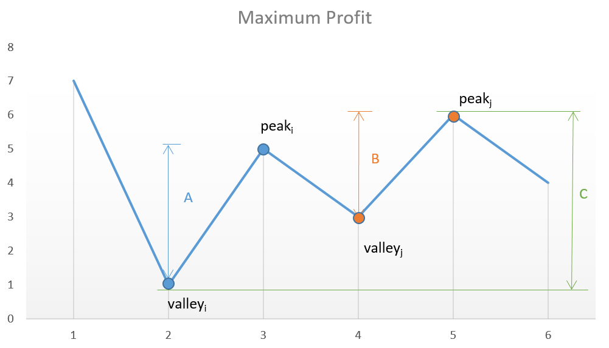
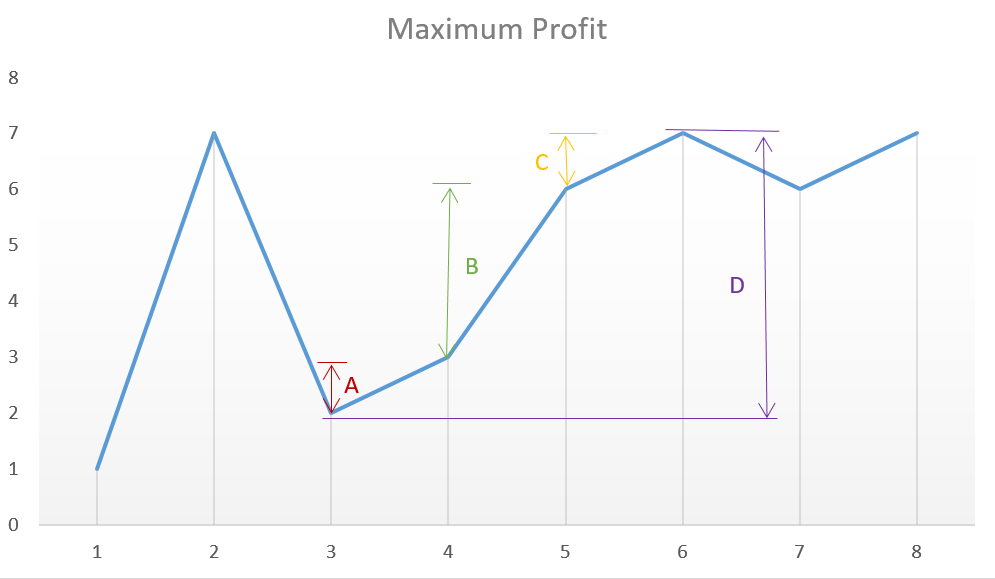

前几天碰到一套经典的题，《买卖股票》系列，其中最简单那道题我之前还在字节碰到过，然而当时我菜得连最简单的题都没做出来

这个系列从简到难思路变化还挺大，但有趣的是中等难度之后的题开始涉及到状态机的思路，我觉得可以整理一下

本篇所有的思路都是整理自**官方题解**以及[liweiwei1419](https://leetcode-cn.com/problems/best-time-to-buy-and-sell-stock-iii/solution/dong-tai-gui-hua-by-liweiwei1419-7/)同学的思路

### Ⅰ

给定一个数组，它的第 `i `个元素是一支给定股票第 i 天的价格。

如果你最多只允许完成一笔交易（即买入和卖出一支股票一次），设计一个算法来计算你所能获取的最大利润。

**注意：**你不能在买入股票前卖出股票。

示例 1:

> 输入: [7,1,5,3,6,4]
> 输出: 5
> 解释: 在第 2 天（股票价格 = 1）的时候买入，在第 5 天（股票价格 = 6）的时候卖出，最大利润 = 6-1 = 5 。
> 注意利润不能是 7-1 = 6, 因为卖出价格需要大于买入价格；同时，你不能在买入前卖出股票。

示例 2:

> 输入: [7,6,4,3,1]
> 输出: 0
> 解释: 在这种情况下, 没有交易完成, 所以最大利润为 0。

#### O(n)

因为只能做一次交易，所以每天都把**之前天**的最小值当作**入股天**，然后把当天当中**出股天**，求得最大利益：

```java
public int maxProfit(int[] prices) {
    if (prices.length == 0) return 0;
    int max = 0, min = prices[0];
    for (int i = 1; i < prices.length; i++) {
        max = Math.max(max, prices[i] - min);
        min = Math.min(min, prices[i]);
    }
    return max;
}
```

### Ⅱ

给定一个数组，它的第 `i` 个元素是一支给定股票第 i 天的价格。

设计一个算法来计算你所能获取的最大利润。你可以尽可能地完成更多的交易（多次买卖一支股票）。

**注意：**你不能同时参与多笔交易（你必须在再次购买前出售掉之前的股票）。

示例 1:

> 输入: [7,1,5,3,6,4]
> 输出: 7
> 解释: 在第 2 天（股票价格 = 1）的时候买入，在第 3 天（股票价格 = 5）的时候卖出, 这笔交易所能获得利润 = 5-1 = 4 。
> 随后，在第 4 天（股票价格 = 3）的时候买入，在第 5 天（股票价格 = 6）的时候卖出, 这笔交易所能获得利润 = 6-3 = 3 。

示例 2:

> 输入: [1,2,3,4,5]
> 输出: 4
> 解释: 在第 1 天（股票价格 = 1）的时候买入，在第 5 天 （股票价格 = 5）的时候卖出, 这笔交易所能获得利润 = 5-1 = 4 。
> 注意你不能在第 1 天和第 2 天接连购买股票，之后再将它们卖出。
> 因为这样属于同时参与了多笔交易，你必须在再次购买前出售掉之前的股票。

示例 3:

> 输入: [7,6,4,3,1]
> 输出: 0
> 解释: 在这种情况下, 没有交易完成, 所以最大利润为 0。

#### O(n) - 线性贪婪

因为可以进行**无数次**交易，所以我们以贪婪的思路来看：当每天交易价比前一天交易价大的时候，我们就进行：**昨天入股今天出股**的交易，争取到每一次的正收益：



如图以谷峰法的思路来延伸到贪心思路，其中 A + B 肯定大于 C



而连续上升也等于该上升区间最高处减去最低处，这时候有正收益：

`price[6]-price[5] + price[5]-price[4]+price[4]-price[3]`

虽然从实际上来说我们只进行了`price[6]-price[3]`的这一次交易，即第三天买入第六天卖出

于是

```java
public int maxProfit(int[] prices) {
    int count = 0;
    for (int i = 1; i < prices.length; i++) {
        if (prices[i] > prices[i - 1])
            count += prices[i] - prices[i - 1];
    }
    return count;
}
```

#### O(n) - 动态规划+状态 1

我们将**第 i 天结束后的持股状态**分为：0、不持股；1、持股之后，我们某一天的收益可以分为：

0. **不持股**：代表前一天持股但是**今天卖了**，或者干脆前一天开始就不再持股了；
1. **持股**：代表前一天不持股但是**今天买了**，或者干脆前一天开始就已经持股了；

于是状态转移方程为：

$$
dp[i][0] = max(dp[i - 1][0],\enspace dp[i - 1][1] + prices[i])
\\\\
dp[i][1] = max(dp[i - 1][1],\enspace dp[i - 1][0] - prices[i])
$$

其中初始状态：

$$
\begin{aligned}
dp[0][0] &= 0
\\\\
dp[0][1] &= -prices[0]
\end{aligned}
$$

实际上我们的状态转移方程只依赖前一项，所以不必使用二维 dp，压缩至一维然后对前一项做缓存就行了，于是代码：

```java
public int maxProfit(int[] prices) {
    int n = prices.length;
    int[] dp = new int[2];
    dp[0] = 0;
    dp[1] = -prices[0];
    for (int i = 1; i < n; i++) {
        int dp0 = Math.max(dp[0], dp[1] + prices[i]);
        int dp1 = Math.max(dp[1], dp[0] - prices[i]);
        dp[0] = dp0;
        dp[1] = dp1;
    }
    return Math.max(0, Math.max(dp[0], dp[1]));
}
```

### Ⅱ+手续费

给定一个整数数组 `prices`，其中第 `i `个元素代表了第 `i `天的股票价格 ；非负整数 `fee` 代表了交易股票的手续费用。

你可以无限次地完成交易，但是你每笔交易都需要付手续费。如果你已经购买了一个股票，在卖出它之前你就不能再继续购买股票了。

返回获得利润的最大值。

**注意：**这里的一笔交易指买入持有并卖出股票的整个过程，每笔交易你只需要为支付一次手续费。

示例 1:

> 输入: prices = [1, 3, 2, 8, 4, 9], fee = 2
> 输出: 8
> 解释: 能够达到的最大利润:  
> 在此处买入 prices[0] = 1
> 在此处卖出 prices[3] = 8
> 在此处买入 prices[4] = 4
> 在此处卖出 prices[5] = 9
> 总利润: ((8 - 1) - 2) + ((9 - 4) - 2) = 8.

#### O(n) - 动态规划+状态 2

因为有了手续费，我们不能从贪婪的角度去解题了，但是我们还是能以 dp 加状态去打，只是状态转移方程要稍微修改一下，我们在不持股的时候，如果**前一天持股今天卖了**，那么就要手续费：

$$
\begin{aligned}
dp[i][0] &= max(dp[i - 1][0],\enspace dp[i - 1][1] + prices[i] - fee)
\\\\
dp[i][1] &= max(dp[i - 1][1],\enspace dp[i - 1][0] - prices[i])
\end{aligned}
$$

```java
public int maxProfit(int[] prices, int fee) {
    int n = prices.length;
    int[] dp = new int[2];
    dp[0] = 0;
    dp[1] = -prices[0];
    for (int i = 1; i < n; i++) {
        int dp0 = Math.max(dp[0], dp[1] + prices[i] - fee);
        int dp1 = Math.max(dp[1], dp[0] - prices[i]);

        dp[0] = dp0;
        dp[1] = dp1;
    }
    return Math.max(0, Math.max(dp[0], dp[1]));
}
```

### Ⅱ+冷冻期

给定一个整数数组，其中第 `i `个元素代表了第 i 天的股票价格 。

设计一个算法计算出最大利润。在满足以下约束条件下，你可以尽可能地完成更多的交易（多次买卖一支股票）:

你不能同时参与多笔交易（你必须在再次购买前出售掉之前的股票）。
卖出股票后，你无法在第二天买入股票 (即冷冻期为 1 天)。
示例:

> 输入: [1,2,3,0,2]
> 输出: 3
> 解释: 对应的交易状态为: [买入, 卖出, 冷冻期, 买入, 卖出]

#### O(n) - 动态规划+状态 3

因为有个冻结的状态，所以我们的状态机里加一种状态：0、持股 + 不冷冻；1、不持股 + 冷冻；2、不持股 + 不冷冻，于是我们某一天的收益可以分为：

0. **持股+不冷冻**：前一天不持股且不冷冻的时候入今天的股，或者前一天就已经持股了；
1. **不持股+冷冻**：前一天持股并今天进行了交易；
2. **不持股+不冷冻**：前一天是不持股冷冻期今天解冻了，或者前一天就已经是不持股不冷冻的状态；

于是状态转移方程为：

$$
\begin{aligned}
dp[i][0] &= max(dp[i - 1][0],\enspace dp[i - 1][2] - prices[i])
\\\\
dp[i][1] &= dp[i - 1][0] + prices[i]
\\\\
dp[i][2] &= max(dp[i - 1][1],\enspace dp[i - 1][2])
\end{aligned}
$$

压缩后的代码：

```java
public int maxProfit(int[] prices) {
    int l = prices.length;
    if (l == 0) return 0;
    int[] dp = new int[3];
    dp[0] = -prices[0];
    for (int i = 1; i < l; i++) {
        int dp0 = Math.max(dp[0], dp[2] - prices[i]);
        int dp1 = dp[0] + prices[i];
        int dp2 = Math.max(dp[1], dp[2]);
        dp[0] = dp0;
        dp[1] = dp1;
        dp[2] = dp2;
    }
    return Math.max(dp[1], dp[2]);
}
```

### Ⅲ 2 次交易

给定一个数组，它的第`i`个元素是一支给定的股票在第 `i `天的价格。

设计一个算法来计算你所能获取的最大利润。你最多可以完成 `两笔` 交易。

注意: 你不能同时参与多笔交易（你必须在再次购买前出售掉之前的股票）。

示例 1:

> 输入: [3,3,5,0,0,3,1,4]
> 输出: 6
> 解释: 在第 4 天（股票价格 = 0）的时候买入，在第 6 天（股票价格 = 3）的时候卖出，这笔交易所能获得利润 = 3-0 = 3 。
> 随后，在第 7 天（股票价格 = 1）的时候买入，在第 8 天 （股票价格 = 4）的时候卖出，这笔交易所能获得利润 = 4-1 = 3 。

示例 2:

> 输入: [1,2,3,4,5]
> 输出: 4
> 解释: 在第 1 天（股票价格 = 1）的时候买入，在第 5 天 （股票价格 = 5）的时候卖出, 这笔交易所能获得利润 = 5-1 = 4 。
>
> 注意你不能在第 1 天和第 2 天接连购买股票，之后再将它们卖出。 因为这样属于同时参与了多笔交易，你必须在再次购买前出售掉之前的股票。

示例 3:

> 输入: [7,6,4,3,1]
> 输出: 0
> 解释: 在这个情况下, 没有交易完成, 所以最大利润为 0。

#### O(n) - 动态规划+状态 4

这里的状态机又要多考虑一下，考虑第一次交易和第二次交易的入股的出股，以及不做任何交易的状态：

0. 第一次入股：之前都没入股，所以从当天开始入股；
1. 第一次出股：之前只有第一次入股，所以当天出股，或者之前就已经出过一次股了；
2. 第二次入股：在第一次出股的基础上，再入一股，或者之前就已经入了第二股了；
3. 第二次出股：之前是第二次入股，所以当天出股，或者之前就已经出了第二次股了；

方程：

$$
\begin{aligned}
dp[i][0] &= max(dp[i - 1][0],\enspace 0 - prices[i])
\\\\
dp[i][1] &= max(dp[i - 1][1],\enspace dp[i - 1][0] + prices[i])
\\\\
dp[i][2] &= max(dp[i - 1][2],\enspace dp[i - 1][1] - prices[i])
\\\\
dp[i][3] &= max(dp[i - 1][3],\enspace dp[i - 1][2] + prices[i])
\end{aligned}
$$

而且我们的初始状态要注意：

$$
\begin{aligned}
dp[0][0] &= -price[0]
\\\\
dp[0][2] &= Integer.MIN\_VALUE
\\\\
dp[0][3] &= Integer.MIN\_VALUE
\end{aligned}
$$

后面两个状态要取无效值，因为第一天结束之后是不可能完成第二次交易的

压缩后的代码：

```java
public int maxProfit(int[] prices) {
    int n = prices.length;
    if (n == 0) return 0;
    int[] dp = new int[4];

    dp[0] = -prices[0];
    dp[2] = Integer.MIN_VALUE;
    dp[3] = Integer.MIN_VALUE;

    for (int i = 1; i < n; i++) {
        int newdp0 = Math.max(dp[0],    0  - prices[i]);
        int newdp1 = Math.max(dp[1], dp[0] + prices[i]);
        int newdp2 = Math.max(dp[2], dp[1] - prices[i]);
        int newdp3 = Math.max(dp[3], dp[2] + prices[i]);
        dp[0] = newdp0;
        dp[1] = newdp1;
        dp[2] = newdp2;
        dp[3] = newdp3;
    }
    return Math.max(0, Math.max(dp[1], dp[3]));
}
```

### Ⅳ k 次交易

给定一个数组，它的第 `i` 个元素是一支给定的股票在第 `i `天的价格。

设计一个算法来计算你所能获取的最大利润。你最多可以完成 `k` 笔交易。

注意: 你不能同时参与多笔交易（你必须在再次购买前出售掉之前的股票）。

示例 1:

> 输入: [2,4,1], k = 2
> 输出: 2
> 解释: 在第 1 天 (股票价格 = 2) 的时候买入，在第 2 天 (股票价格 = 4) 的时候卖出，这笔交易所能获得利润 = 4-2 = 2 。

示例 2:

> 输入: [3,2,6,5,0,3], k = 2
> 输出: 7
> 解释: 在第 2 天 (股票价格 = 2) 的时候买入，在第 3 天 (股票价格 = 6) 的时候卖出, 这笔交易所能获得利润 = 6-2 = 4 。
> 随后，在第 5 天 (股票价格 = 0) 的时候买入，在第 6 天 (股票价格 = 3) 的时候卖出, 这笔交易所能获得利润 = 3-0 = 3 。

#### O(n) - 动态规划+状态 5

其实和考虑 2 次交易是一样的，只不过这里是`k`次，于是就有`k * 2`种状态，分析 2 次交易的状态，我们可以这样设计：

- 当状态`j`为奇数的时候，代表：
  - 已经进行了第`j`次入股，今天出股；
  - 之前就已经完成了，`j`次出股；
- 当状态`j`为偶数的时候，代表：
  - 已经进行了第`j-1`次出股，今天入股；
  - 之前就已经做了第`j`次的入股；

方程：

$$
dp[i][j] = \begin{cases}
			\begin{aligned}
			&max(dp[i - 1][0],\enspace 0 - prices[i]) \qquad &j &= 0
			\\\\
			&max(dp[i - 1][j],\enspace dp[i - 1][j - 1] + prices[i]) \qquad &j &= odd
			\\\\
			&max(dp[i - 1][j],\enspace dp[i - 1][j - 1] - prices[i]) \qquad &j &= even
			\end{aligned}
			\end{cases}
$$

而初始状态，在第一天结束的时候 所有入股状态都设为无效值：

$$
\begin{aligned}
dp[0][0] &= -price[0]
\\\\
dp[0][2] &= Integer.MIN\\_VALUE
\\\\
dp[0][4] &= Integer.MIN\\_VALUE
\\\\
\vdots
\\\\
dp[0][j + 2] &= Integer.MIN\\_VALUE
\end{aligned}
$$

压缩后的代码：

```java
public int maxProfit(int k, int[] prices) {
    int n = prices.length;
    if (n == 0) return 0;
    if (k == 0) return 0;
    // 按照两次交易的套路 设定k * 2个状态
    int[] dp  = new int[k * 2];
    // 前一行状态的缓存
    int[] tmp = new int[k * 2];
    dp[0] = -prices[0];
    // 在第一天结束的时候 所有入股状态都设为无效值
    for (int i = 2; i < k * 2; i += 2) {
        dp[i] = Integer.MIN_VALUE;
    }

    for (int i = 1; i < n; i++) {
        // 遍历状态
        for (int j = 0; j < k * 2; j++) {
            if (j == 0) {
                tmp[0] = Math.max(dp[0], 0 - prices[i]);
            } else if (j % 2 == 0) {
                // 偶数状态为入股状态
                tmp[j] = Math.max(dp[j], dp[j - 1] - prices[i]);
            } else {
                // 奇数状态为出股状态
                tmp[j] = Math.max(dp[j], dp[j - 1] + prices[i]);
            }
        }
        // 缓存
        int[] tt = tmp;
        tmp = dp;
        dp  = tt;
    }

    int max = 0;
    // 最大值为每次的出股状态和一股都不买的最大值
    for (int i = 1; i < k * 2; i += 2) {
        max = Math.max(max, dp[i]);
    }
    return max;
}
```

然而这样会出现一个问题，我们要考虑到一个情况：如果`k < prices.length / 2`，也就是说这里的问题已经转换为了无限次交易的问题，如果走原方法，题解会超时，所以我们可以不走动态规划和状态，直接使用**线性贪婪**的解法

最终代码为：

```java
public int maxProfit(int k, int[] prices) {
    int n = prices.length;
    if (n == 0) return 0;
    if (k == 0) return 0;
    // k如果大于交易天的一半 那么问题就直接转化为无限次交易
    if (k > n / 2) {
        return maxProfitOfII(prices);
    }

    // 和上面的一样
    return max;
}

/** 解决无限次交易的方法 也即问题 买卖股票的最佳时机 II
 *  https://leetcode-cn.com/problems/best-time-to-buy-and-sell-stock-ii/
 */
public int maxProfitOfII(int[] prices) {
    int res = 0;
    for (int i = 1; i < prices.length; i++) {
        if (prices[i] > prices[i - 1]) {
            res += prices[i] - prices[i - 1];
        }
    }
    return res;
}
```
