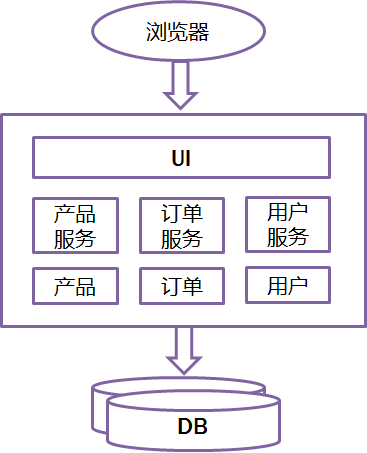
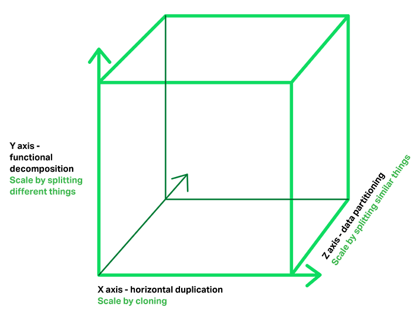
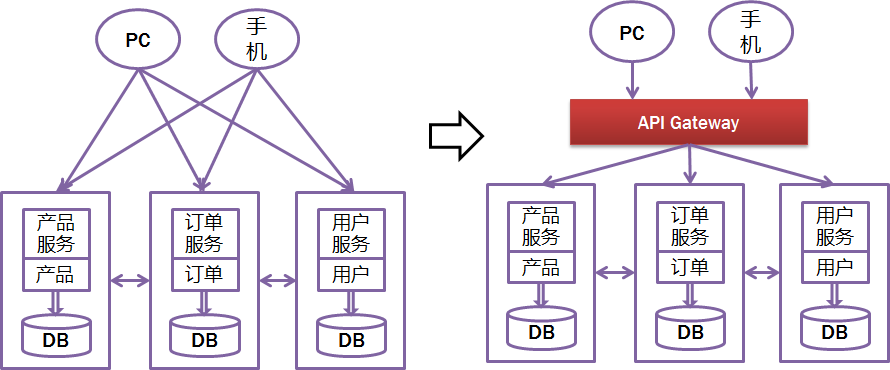
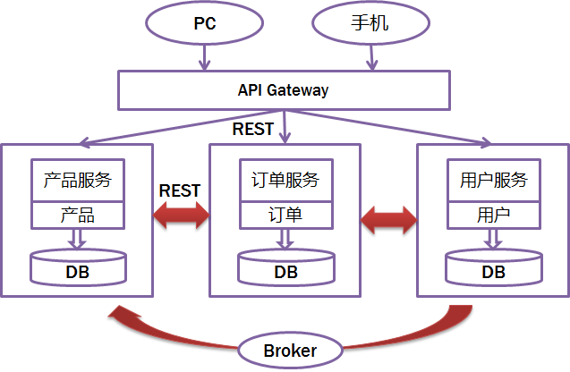
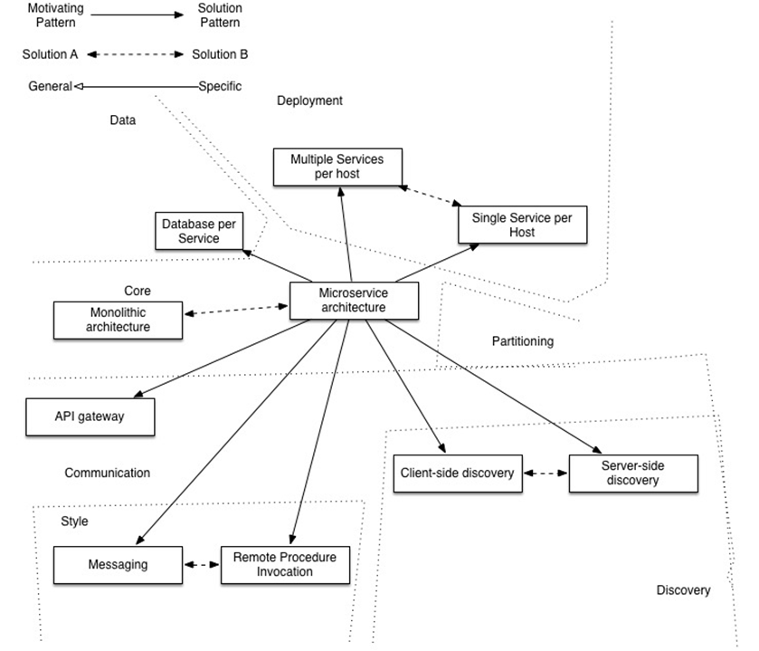
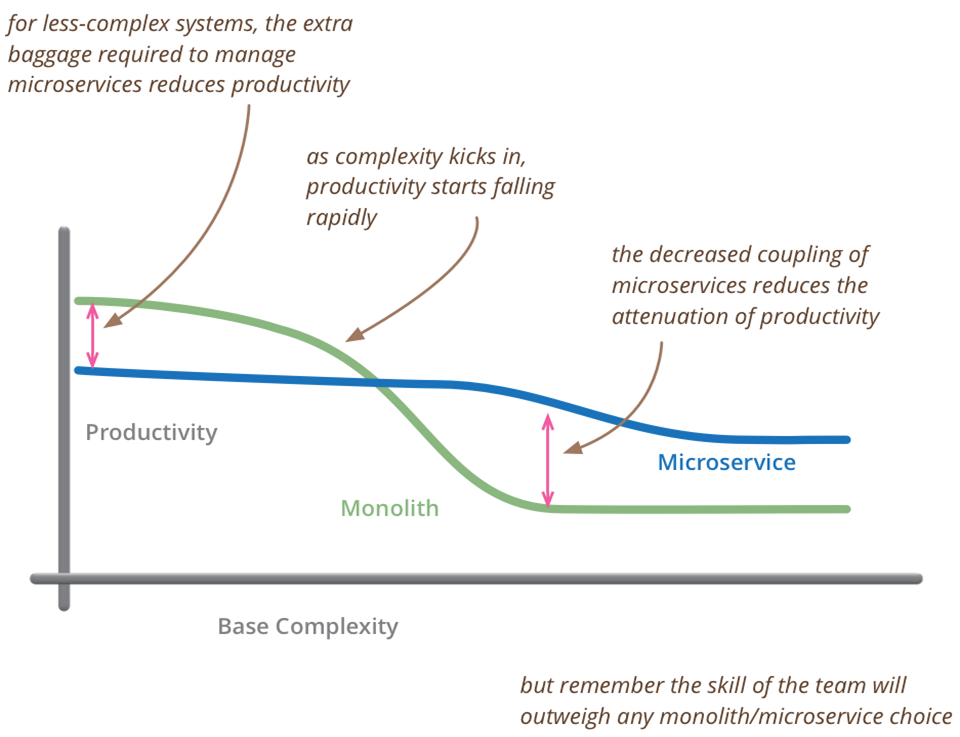
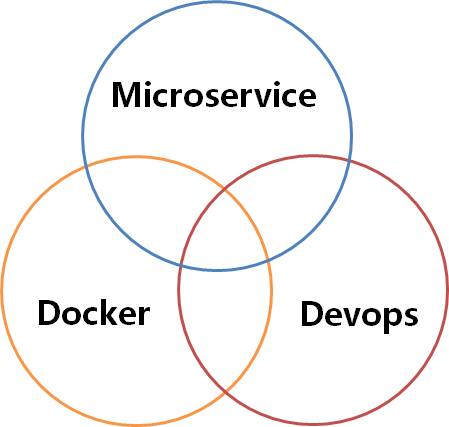

### 前言

> 微服务架构被提出很短的时间内，就被越来越多的开发人员推崇，简单来说其主要的目的是有效的拆分应用，实现敏捷开发和部署 。
>
> 本分享即尝试介绍微服务架构的一些实施细节和要求，探询微服务架构的由来，并最终提供我们团队内部的一些实践总结，希望对大家有帮助。

### WHAT - 什么是微服务

#### 微服务简介

这次参加JavaOne2015最大的困难就是听Microservice相关的session，无论内容多么水，只要题目带microservice，必定报不上名，可见Microservice有多火。最喜欢其中一页。关于这个典故，可以参考[this](
<http://knowyourmeme.com/memes/you-keep-using-that-word-i-do-not-think-it-means-what-you-think-it-means)，此图适用于一切高大上的名字——技术有SOA，Agile，CLOUD，DevOps等等，古代有道，气，八卦等等。此类名词的最大特点就是 **一解释就懂，一问就不知，一讨论就打架。** 


微服务的流行，Martin功不可没，这老头也是个奇人，特别擅长抽象归纳和制造概念，我觉的这就是最牛逼的markting啊，感觉这也是目前国人欠缺的能力。

> Martin Fowler是国际著名的OO专家，敏捷开发方法的创始人之一，现为ThoughtWorks公司的首席科学家.福勒（Martin Fowler），在面向对象分析设计、UML、模式、软件开发方法学、XP、重构等方面，都是世界顶级的专家，现为Thought Works公司的首席科学家。Thought Works是一家从事企业应用开发和集成的公司。早在20世纪80年代，Fowler就是使用对象技术构建多层企业应用的倡导者，他著有几本经典书籍：《企业应用架构模式》、《UML精粹》和《重构》等。—— 百度百科

先来看看传统的web开发方式，通过对比比较容易理解什么是Microservice Architecture。和Microservice相对应的，这种方式一般被称为Monolithic（比较难传神的翻译）。所有的功能打包在一个WAR包里，基本没有外部依赖（除了容器），部署在一个JEE容器（Tomcat，JBoss，WebLogic）里，包含了DO/DAO，Service，UI等所有逻辑。


Monolithic比较适合小项目，优点是：

- 开发简单直接，集中式管理
- 基本不会重复开发
- 功能都在本地，没有分布式的管理开销和调用开销

它的缺点也非常明显，特别对于互联网公司来说（不一一列举了）：

- 开发效率低：所有的开发在一个项目改代码，递交代码相互等待，代码冲突不断
- 代码维护难：代码功能耦合在一起，新人不知道何从下手
- 部署不灵活：构建时间长，任何小修改必须重新构建整个项目，这个过程往往很长
- 稳定性不高：一个微不足道的小问题，可以导致整个应用挂掉
- 扩展性不够：无法满足高并发情况下的业务需求

所以，现在主流的设计一般会采用Microservice Architecture，就是基于微服务的架构。简单来说， **微服务的目的是有效的拆分应用，实现敏捷开发和部署** 。


用《The art of scalability》一书里提到的scale cube比较容易理解如何拆分。你看，我们叫分库分表，别人总结成了scale cube，这就是抽象的能力啊，把复杂的东西用最简单的概念解释和总结。X轴代表运行多个负载均衡器之后运行的实例，Y轴代表将应用进一步分解为微服务（分库），数据量大时，还可以用Z轴将服务按数据分区（分表）


#### 微服务的具体特征

先看看最官方的定义吧

> The microservice architectural style is an approach to developing a single application as **a suite of small services**, each **running in its own process** and communicating with lightweight mechanisms, often an HTTP resource API. These services are **built around business capabilities** and independently deployable by fully automated deployment machinery. There is **a bare minimum of centralized management of these services** , which may be written in different programming languages and use different data storage technologies.
>
> ```
>             -- James Lewis and Martin Fowler
> ```

把Martin老头的定义大概的翻译一下就是下面几条，这个定义还是太抽象是不是，那就对了，就是要务虚，都说明白了谁还找他付费咨询啊，这么贵。

1. 一些列的独立的服务共同组成系统
2. 单独部署，跑在自己的进程里
3. 每个服务为独立的业务开发
4. 分布式的管理

Martin自己也说了，每个人对微服务都可以有自己的理解，不过大概的标准还是有一些的。

- 分布式服务组成的系统
- 按照业务而不是技术来划分组织
- 做有生命的产品而不是项目
- Smart endpoints and dumb pipes（我的理解是强服务个体和弱通信）
- 自动化运维（DevOps）
- 容错
- 快速演化

关于微服务的更多理论基础，可以参考[康威定律](https://yq.aliyun.com/articles/8611)。

#### SOA vs Microservice

除了Smart endpoints and dumb pipes都很容易理解对吗？相信很多人都会问一个问题，这是不是就是SOA换了个概念，挂羊头卖狗肉啊，有说法把Microservice叫成Lightway SOA。也有很多传统砖家跳出来说Microservice就是SOA。其实Martin也没否认SOA和Microservice的关系。

我个人理解，Microservice是SOA的传承，但一个最本质的区别就在于Smart endpoints and dumb pipes，或者说是真正的分布式的、去中心化的。Smart endpoints and dumb pipes本质就是去ESB，把所有的“思考”逻辑包括路由、消息解析等放在服务内部（Smart endpoints），去掉一个大一统的ESB，服务间轻（dumb pipes）通信，是比SOA更彻底的拆分。

### HOW - 怎么具体实践微服务

听上去好像都不错，具体怎么落地啊？这需要回答下面几个问题：

- 客户端如何访问这些服务？
- 服务之间如何通信？
- 这么多服务，怎么找?
- 服务挂了怎么办？

#### 客户端如何访问这些服务？

原来的Monolithic方式开发，所有的服务都是本地的，UI可以直接调用，现在按功能拆分成独立的服务，跑在独立的一般都在独立的虚拟机上的Java进程了。客户端UI如何访问他的？后台有N个服务，前台就需要记住管理N个服务，一个服务下线/更新/升级，前台就要重新部署，这明显不服务我们拆分的理念，特别当前台是移动应用的时候，通常业务变化的节奏更快。另外，N个小服务的调用也是一个不小的网络开销。还有一般微服务在系统内部，通常是无状态的，用户登录信息和权限管理最好有一个统一的地方维护管理（OAuth）。

所以，一般在后台N个服务和UI之间一般会一个代理或者叫API Gateway，他的作用包括

- 提供统一服务入口，让微服务对前台透明
- 聚合后台的服务，节省流量，提升性能
- 提供安全，过滤，流控等API管理功能

我的理解其实这个API Gateway可以有很多广义的实现办法，可以是一个软硬一体的盒子，也可以是一个简单的MVC框架，甚至是一个Node.js的服务端。他们最重要的作用是为前台（通常是移动应用）提供后台服务的聚合，提供一个统一的服务出口，解除他们之间的耦合，不过API Gateway也有可能成为单点故障点或者性能的瓶颈。

一般用过Taobao Open Platform的就能很容易的体会，TAO就是这个API Gateway。


#### 服务之间如何通信？

因为所有的微服务都是独立的Java进程跑在独立的虚拟机上，所以服务间的通行就是IPC（inter process communication），已经有很多成熟的方案。现在基本最通用的有两种方式。这几种方式，展开来讲都可以写本书，而且大家一般都比较熟悉细节了，就不展开讲了。

- 同步调用
  - REST（JAX-RS）
  - RPC（Dubbo）
- 异步消息调用(Kafka, Notify, MetaQ)



一般同步调用比较简单，一致性强，但是容易出调用问题，性能体验上也会差些，特别是调用层次多的时候。RESTful和RPC的比较也是一个很有意思的话题。一般REST基于HTTP，更容易实现，更容易被接受，服务端实现技术也更灵活些，各个语言都能支持，同时能跨客户端，对客户端没有特殊的要求，只要封装了HTTP的SDK就能调用，所以相对使用的广一些。RPC也有自己的优点，传输协议更高效，安全更可控，特别在一个公司内部，如果有统一个的开发规范和统一的服务框架时，他的开发效率优势更明显些。就看各自的技术积累实际条件，自己的选择了。

而异步消息的方式在分布式系统中有特别广泛的应用，他既能减低调用服务之间的耦合，又能成为调用之间的缓冲，确保消息积压不会冲垮被调用方，同时能保证调用方的服务体验，继续干自己该干的活，不至于被后台性能拖慢。不过需要付出的代价是一致性的减弱，需要接受数据最终一致性；还有就是后台服务一般要实现幂等性，因为消息发送出于性能的考虑一般会有重复（保证消息的被收到且仅收到一次对性能是很大的考验）；最后就是必须引入一个独立的broker，如果公司内部没有技术积累，对broker分布式管理也是一个很大的挑战。

#### 这么多服务，怎么找?

在微服务架构中，一般每一个服务都是有多个拷贝，来做负载均衡。一个服务随时可能下线，也可能应对临时访问压力增加新的服务节点。服务之间如何相互感知？服务如何管理？这就是服务发现的问题了。一般有两类做法，也各有优缺点。基本都是通过zookeeper等类似技术做服务注册信息的分布式管理。当服务上线时，服务提供者将自己的服务信息注册到ZK（或类似框架），并通过心跳维持长链接，实时更新链接信息。服务调用者通过ZK寻址，根据可定制算法，找到一个服务，还可以将服务信息缓存在本地以提高性能。当服务下线时，ZK会发通知给服务客户端。

- 客户端做：优点是架构简单，扩展灵活，只对服务注册器依赖。缺点是客户端要维护所有调用服务的地址，有技术难度，一般大公司都有成熟的内部框架支持，比如Dubbo。
- 服务端做：优点是简单，所有服务对于前台调用方透明，一般在小公司在云服务上部署的应用采用的比较多。


#### 这么多服务，服务挂了怎么办？

前面提到，Monolithic方式开发一个很大的风险是，把所有鸡蛋放在一个篮子里，一荣俱荣，一损俱损。而分布式最大的特性就是网络是不可靠的。通过微服务拆分能降低这个风险，不过如果没有特别的保障，结局肯定是噩梦。我们刚遇到一个线上故障就是一个很不起眼的SQL计数功能，在访问量上升时，导致数据库load彪高，影响了所在应用的性能，从而影响所有调用这个应用服务的前台应用。所以当我们的系统是由一系列的服务调用链组成的时候，我们必须确保任一环节出问题都不至于影响整体链路。相应的手段有很多：

- 重试机制
- 限流
- 熔断机制
- 负载均衡
- 降级（本地缓存）

这些方法基本上都很明确通用，就不详细说明了。比如Netflix的Hystrix：<https://github.com/Netflix/Hystrix>


#### WHY - 微服务的应用

[这里](http://microservices.io/patterns/microservices.html)有一个图非常好的总结微服务架构需要考虑的问题，包括

- API Gateway
- 服务间调用
- 服务发现
- 服务容错
- 服务部署
- 数据调用



微服务的优点和缺点（或者说挑战）一样明显。

- 优点
  - 开发简单
  - 技术栈灵活
  - 服务独立无依赖
  - 独立按需扩展
  - 可用性高
- 缺点（挑战）
  - 多服务运维难度
  - 系统部署依赖
  - 服务间通信成本
  - 数据一致性
  - 系统集成测试
  - 重复工作
  - 性能监控

没有最好的，只有适合自己的。

- 对于大的互联网公司，微服务架构是血液，是习惯，每家公司都有自己的套路和架构，细节有不同，但是核心理念是通的。
- 对于一般的公司而言，实践微服务有非常大的技术挑战，于是乎才有了这么多IT供应商考虑这里的商机。微服务比较适合未来有一定的扩展复杂度，且有很大用户增量预期的应用，说人话就是新兴的互联网公司。创业初期，不可能买大量的机器或者很贵的机器，但是又必须考虑应对成功后的巨量的用户，微服务架构成了最好的选择。
  

### So What - 思考

看到上面的图，不是不觉得特别的熟悉？其实我们N年前就用的滚瓜烂熟了好不好？裤子都拖了，你就给我看这个？


from: <https://github.com/Netflix/recipes-rss/wiki/Architecture>

其实本来所谓的微服务就是对互联网在应用技术的一个总结归纳，IT厂商鼓吹所有概念无非是为了生意（business），SOA是，Cloud是，Microservice也是。下面玩笑很有意思的概括了这个情况（我加了第一条线，原图见[这里](http://blog.gardeviance.org/2012/07/adoption-cycles.html)）


所以微服对我们的思考我觉得更多的是思维上的，对已微服务架构， **技术上不是问题，意识比工具重要。**

- 按照业务 或者客户需求组织资源（这是最难的）
- 做有生命的产品，而不是项目
- 头狼战队，全栈化
- 后台服务贯彻Single Responsibility Principle
- VM->Docker （to PE）
- DevOps (to PE)

同时，对于开发同学，有这么多的中间件和强大的PE支持固然是好事，我们也需要深入去了解这些中间件背后的原理，知其然知其所以然，设想下，如果我们是一个小公司的CTO，离开的阿里的大环境，在有限的技术资源如何通过开源技术实施微服务？

最后，一般提到微服务都离不开DevOps和Docker，理解微服务架构是核心，devops和docker是工具，是手段。下次在抽时间再学习整理下。


> 转载自：https://yq.aliyun.com/articles/2764