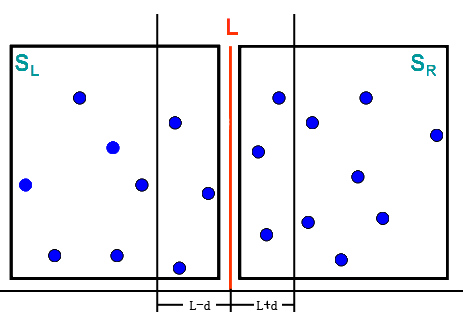

### Introduction

二维坐标中有一堆点集，记为 P，假设 P 中至少有 2 个点，那么求出 P 中距离最近的两个点；

首先为了问题准备好点和求两点距离的方法，其中如果两点距离的输入只有一个点，那么它的距离代表无穷大，它表示没有解

```java
class Point {
    double x;
    double y;

    Point(double x, double y) {
        this.x = x;
        this.y = y;
    }

    @Override
    public String toString() {
        return "Point{" +
                "x=" + x +
                ", y=" + y +
                '}';
    }
}

private double distanceOfTwoPoint(Point a, Point b) {
    if (a == null || b == null) {
        return Double.MAX_VALUE;
    }
    return Math.sqrt(Math.pow(a.x - b.x, 2) + Math.pow(a.y - b.y, 2));
}
```

#### Brute Force - O(n^2)

枚举，没什么说的

```java
public Point[] shortestDistance(Point[] set) {
    Point[] ans = new Point[2];
    double get = Double.MAX_VALUE;
    for (Point a : set) {
        for (Point b : set) {
            double tmp = distanceOfTwoPoint(a, b);
            if (tmp < get && a != b) {
                get = tmp;
                ans[0] = a;
                ans[1] = b;
            }
        }
    }
    return ans;
}
```

#### Divide And Conque - O(nlogn)

利用分治法的思想，我们将点集分为三种情况：

1. 点数小于等于二时：直接计算，求该两点之间的距离。

2. 集合中有三个点：两两比较，求三个点中的最近的两个点距离。

3. 点数大于三时：首先**划分**集合 S 为 SL 和 SR，使得 SL 中的每一个点位于 SR 中每一个点的左边，并且 SL 和 SR 中点数相同。分别在 SL 和 SR 中解决最近点对问题，得到 DL 和 DR，分别表示 SL 和 SR 中的最近点对的距离。令 d=min(DL,DR)。如果 S 中的最近点对(P1,P2)。P1、P2 两点一个在 SL 和一个在 SR 中，那么 P1 和 P2 一定在以 L 为中心的间隙内，以 L-d 和 L+d 为界。

   

针对这个基本思想，我们肯定是得有一个前提的，那就是怎么**划分**？如果说集合**P**是按照 x 坐标或者 y 坐标升降任意去排序的，那么我们就可以取集合中间下标的位置为**MID**，那么**MID**左右两边的点就是以 x 坐标或者 y 坐标值均匀分为两个子集，记为**P1，P2**；

**于是我们要求 P 必须是可划分的，也就是按照 x 或者 y 值去有序排列好的，否则得先对 P 进行排序，然后再划分**

然后就可以通过递归求解各自**n/2**的问题规模的解，各自的解记为**d1，d2**，定义`d = min{d1, d2}`

这时候，**dis**不一定是问题的解，因为解有可能跨两个子集，所以我们还得检查**MID 附近**可能的点集的解，最后再和**dis**比较，求出真正的解

假如说**P**以 x 坐标值为排序了，那么**MID 的附近**的点一定存在**范围关系：| MID.x - pi.x | < dis **，只有在这个范围内的点，才有可能存在解

**并且有以下事实：**如果有**跨 MID**的解的话，设解左边的点为**pl**，那么在上式范围内，右边的点存在的可能性不超过 6 个，于是说我们在范围关系内，左范围中的每一个点顶多再往后考虑 6 次右边范围内的点就行了，这样这个子过程时间就由线性缩为常量

于是我们整理一下逻辑：

1. 首先要求点集有序；
2. 如果点集只有一个点，则返回无穷大，表明这个点集绝对没有解；
3. 如果点集只有两个点，则直接返回两点距离，表明这个点集只有一个解；
4. 如果点集有三个点，则直接暴力解；
5. 如果三个点以上：
   1. 根据中点**MID**划分；
   2. 递归传入左右子集；
   3. 得到左右子集的解之后，取最小值为**dis**；
   4. 考虑**跨 MID**情况：
      1. 在当前递归集合范围中，以 **i = P.startIndex** 开始遍历**MID**左边的点，且只取符合 **pi.x >= MID.x - dis **的点作为**pl**
      2. 在当前递归集合范围中，针对**pl**，以 **j = MID** 开始遍历，且只取符合 **pj.x <= MID.x + dis** 的点作为**pr**，且最多只找 6 次
      3. 若 pl 和 pr 的距离小于 dis，则讲 pl 和 pr 作为备选解，继续往后
   5. 考虑完**跨 MID**情况后，选最小的一个情况为解；

```java
public Point[] shortestDistance2(Point[] set, int start, int end) {
    Point[] ans = new Point[2];
    int length = end - start + 1;
    if (length == 1) {
        ans[0] = set[start];
    } else if (length == 2) {
        ans[0] = set[start];
        ans[1] = set[end];
    } else if (length == 3) {
        // brute force
        return shortestInThree(set);
    } else {
        int mid = (length / 2) + start;
        Point[] leftAns = shortestDistance2(set, start, mid);
        Point[] rightAns = shortestDistance2(set, mid + 1, end);
        double ld = Double.MAX_VALUE, rd = Double.MAX_VALUE;
        if (leftAns.length == 2) {
            ld = distanceOfTwoPoint(leftAns[0], leftAns[1]);
        }
        if (rightAns.length == 2) {
            rd = distanceOfTwoPoint(rightAns[0], rightAns[1]);
        }
        double dis = Math.min(ld, rd);
        Point midP = set[mid];
        double midAnsD = Double.MAX_VALUE;
        // process 5.4.1
        for (int i = start; i <= end && set[i].x <= midP.x; i++) {
            Point pl = set[i];
            if (pl.x >= midP.x - dis) {
                // process 5.4.2
                for (int j = mid, count = 0;
                     j <= end && count < 6 && set[j].x <= midP.x + dis;
                     j++, count++) {
                    Point pr = set[j];
                    double tmp = distanceOfTwoPoint(pl, pr);
                    // process 5.4.3
                    if (tmp < dis && tmp != 0) {
                        ans[0] = pl;
                        ans[1] = pr;
                        midAnsD = tmp;
                    }
                }
            }
        }
        if (midAnsD <= dis) {
            return ans;
        } else if (ld <= rd) {
            return leftAns;
        } else {
            return rightAns;
        }
    }
    return ans;
}
```

#### Conclution

解法如果不知道**那个事实**的话，一般人是想不到的，而且还有更优化的理论，能把 6 个点缩为 4 个点，具体的引用可以[参考](https://blog.csdn.net/sinat_35678407/article/details/82874216)

反正在解法中，无论是规模减半还是合并子问题，算法都只需要线性的时间，而对 P 的排序我们可以选择一个**O(nlogn)**的算法，那么整体的算法效率也将是这个值，这也是该问题的最优效率

这也是这个问题很 tricky 的地方，关于排序，我自己选择是经过我自己优化的短几行的堆排序，它的效率正好是**O(nlogn)**：

```java
public Point[] sortByX(Point[] set) {
    for (int i = 0; i < set.length - 1; i++) {
        int heapLength = set.length - i;
        int lastParentIndex = (heapLength - 2) / 2;
        for (int j = lastParentIndex; j >= 0; j--) {
            int leftChildIndex = j * 2 + 1;
            int rightChildIndex = leftChildIndex + 1;
            int bigIndex = leftChildIndex;
            if (rightChildIndex < heapLength
                    && set[rightChildIndex].x > set[leftChildIndex].x) {
                bigIndex = rightChildIndex;
            }
            if (set[bigIndex].x > set[j].x) {
                swap(set, bigIndex, j);
            }
        }
        swap(set, 0, heapLength - 1);
    }
    return set;
}
```

#### Test Case

```java
private Point[] set = {
        new Point(0, 0),
        new Point(0.5, 2),
        new Point(1, 1),
        new Point(1, 3),
        new Point(1, 5),
        new Point(1, 7),
        new Point(-0.5, 2),
        new Point(-1, 1),
        new Point(-1, 3),
        new Point(-1, 5),
        new Point(-1, 7),
};
@Test
public void testSolution2(){
    Point[] points = sortByX(set);
    System.out.println(Arrays.toString(points));
    System.out.println(Arrays.toString(shortestDistance2(points, 0, set.length - 1)));
}
```
