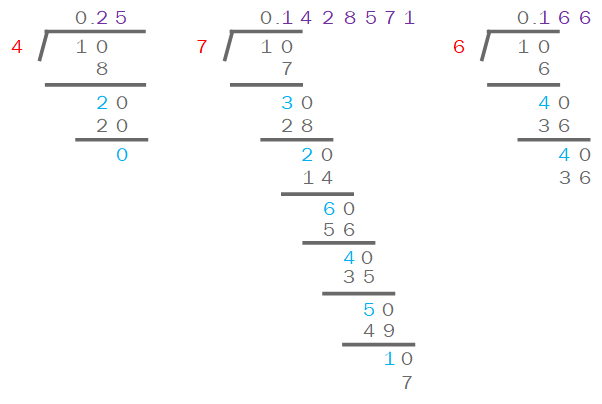

### 前言

这篇记录下从今天开始，复习到、新遇到的所有算法题

- 栈相关
- 数学逻辑相关

---

#### 栈相关

##### 汉诺塔（递归方法）

###### C 语言实现

```c
void hanoi(int n, char source, char help, char target) {
    // 讲塔座上按照直径大小自上而下编号为1到n的n个圆盘按规则搬到塔座target上，help做辅助塔
    if (n == 1) {
        move(source, 1, target);
    } else {
        hanoi(n-1, source, target, help);	// 将要搬离的n个盘中的前n-1个盘搬到help塔上，用target塔为辅助
        move(source, n, target);			// 将编号为n的盘移动到target塔上
        hanoi(n-1, help, source, target);	// 将之前的放在help塔上的n-1个盘移动到target塔，用souece塔做辅助塔
    }
}

void move(char source, int n, char target){
    // 将source塔上的盘子n搬到target塔上，移动步数加1（设置为全局变量）
    printf("Step: %i. Move disk %i from %c to %c\n", ++stepCount, n, x, z);
}
```

> 参考：《数据结构（C 语言版）》——严蔚敏. P55

---

#### 数学逻辑相关

##### 有理数的循环节

> 两次看到这题，第一次是在某年蓝桥杯上，第二次就是昨天（2018 年 9 月 10 日）的快手笔试。如出一辙，分码未写。
>
> 1/7 = 0.142857142... 是个无限循环小数。任何有理数都可以表示为无限循环小数的形式。本题目要求即是：给出一个数字的循环小数表示法。
>
> 例如：
>
> 输入：
> 1,5
>
> 则输出：
> 0.2
>
> 输入：
> 1,7
>
> 则输出：
>
> 0.[142857]
>
> 输入：
>
> 7,6
>
> 则输出:
>
> 1.1[6]
>
> 用户输入的格式是：
>
> 整数,整数
>
> 每个整数范围均为：1~1000
>
> 程序输出两个整数做除法产生的小数或无限循环小数（循环节用方括号括起）。

这题.....真是纯数学题，你要是不懂怎么判断循环节，那就凉了，然后就求循环嘛，然后又发现一个很尴尬的事情，余数不会求....折腾了大半天，搞定- -

首先我们手算 3 个例子，1/4 和 1/7 和 1/6



我们每次计算的时候，**都需要将余数乘以 10，再和除数取余，再进行下一轮计算，直到余数为 0 或者余数重复出现为止，与此同时我们可以记录每一轮的商**；

比如 1/4，余数是 1，`(1*10)%4=2`，再继续`(2*10)%4=0`，算到 0 就可以截止了

1/7，余数是 1，`(1*10)%7=3`，`(3*10)%7=2`，`(2*10)%7=6`，`(6*10)%7=4`，` (4*10)%7=5``(5*10)%7=1 `，又碰到一样的余数了，说明下一轮得到的商之前是已经求出来过的，所以已经找到循环节了；

###### Java 实现

```java
// resulet : k.(m1m2m3m4...mn)
private static String getRepetend(int a, int b) {
    int k = a / b;
    a = a % b;
    StringBuilder msb = new StringBuilder();
    msb.append(".");
    while (true) {
        int mi = (a * 10) / b;
        a = (a * 10) % b;
        int index = msb.indexOf(mi + "");
        if (index != -1) {
            msb.insert(index, "(");
            break;
        }
        msb.append(mi);
        if (a == 0) {
            break;
        }
    }
    msb.insert(0, k);
    if (msb.indexOf("(") != -1) {
        msb.append(")");
    }
    return msb.toString();
}
```
