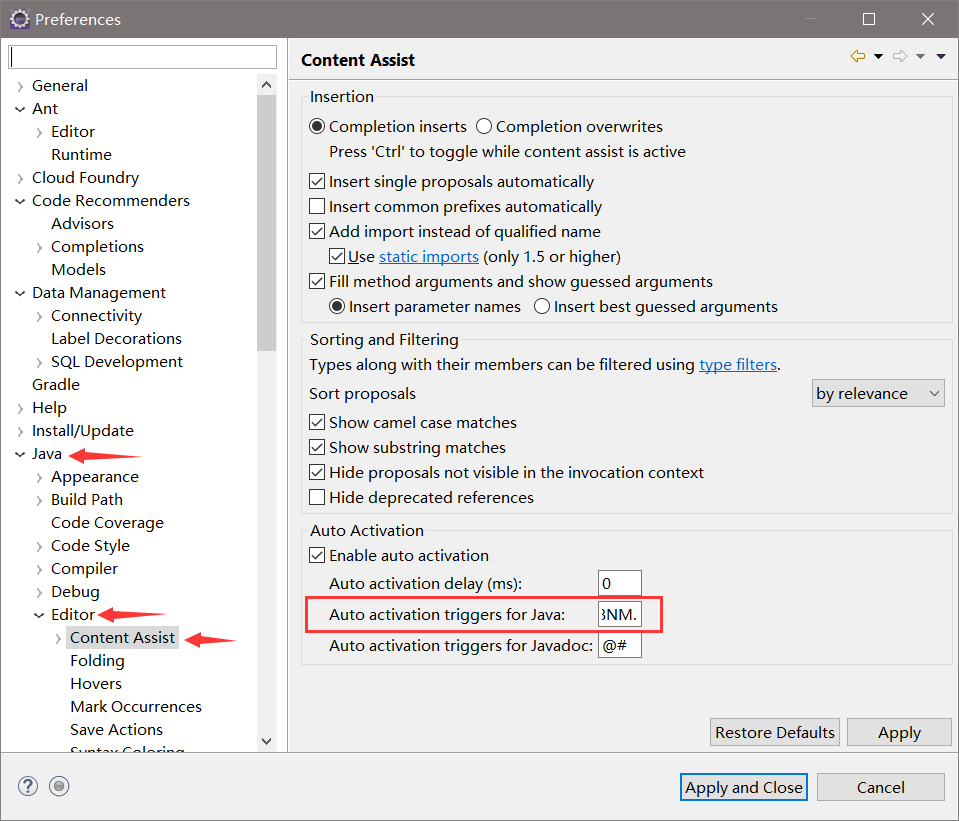
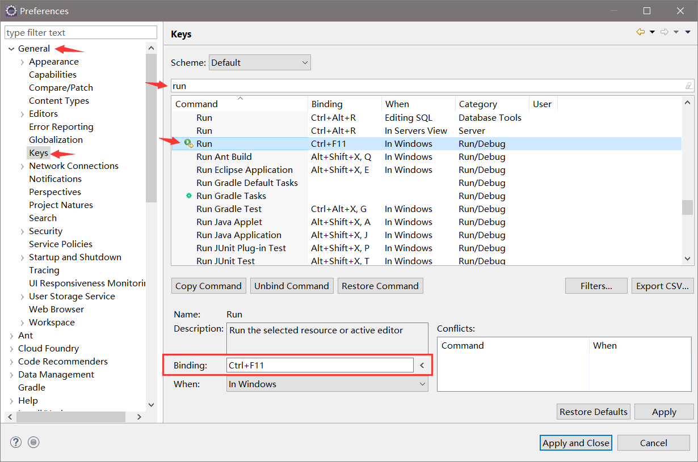
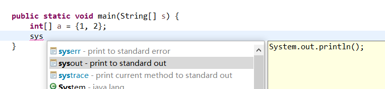
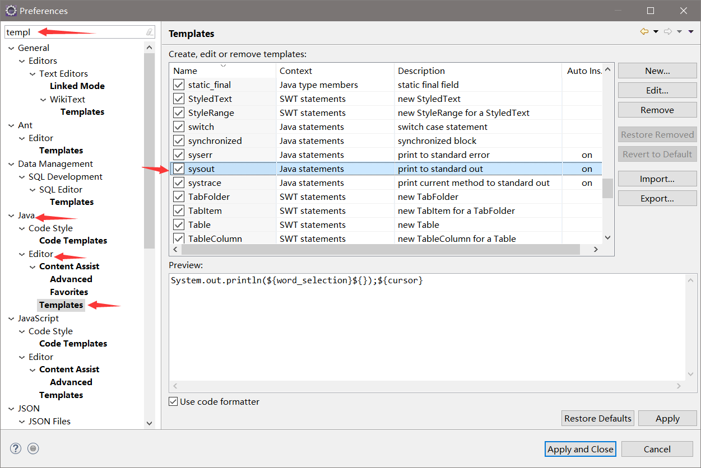
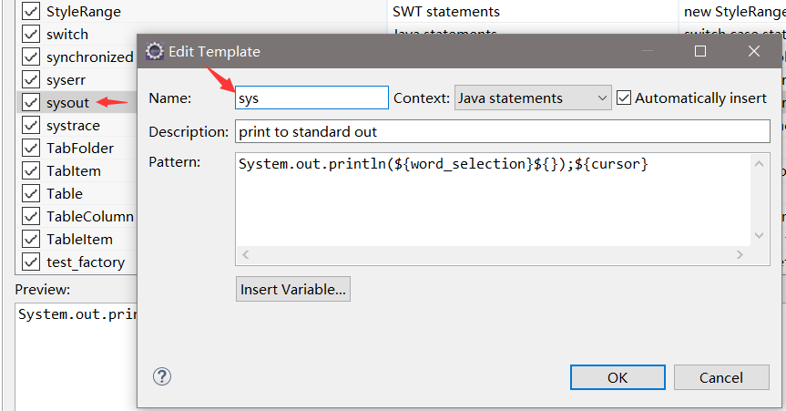
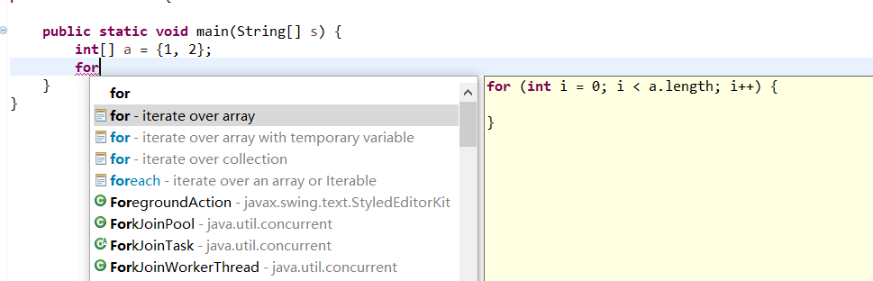

#### 目录

- eclipse 快捷键
- 数组的使用
- 初始化
- for-each 遍历
- 使用底层 API 快速复制
- 搭配 Arrays 类进行二分查找和排序
- String 类
- 截取/替换/匹配
- 转其他类型
- 分割/简单的单词提取/大小写字母转换
- StringBuffer 和 StringBuilder 类
- Math 类/Random 类
- 两个大数类
- 集合框架的基本使用/及自定义排序的比较器实现:
- ArrayList:放置/索引/移除/遍历
- HashSet/TreeSet:放置/索引/移除/遍历
- HashMap:放置/索引/移除/遍历
- Stack/Vector:结构特性使用到算法当中去
- 搭配 Collections 类进行:
- 二分查找(针对 List 且需要实现比较器)
- 最大最小值(针对 List 和 Set 且需要实现比较器)
- 快速替换(replaceAll,针对 List)
- 逆转顺序(reverse,针对 List)
- 距离轮换(rotate,针对 List)
- 排序(针对 List)
- 交换位置(针对 List)
- 数组和集合框架之间的转换
- 输入输出挂
- 快速进制转换
- 小数点精度处理

---

#### 1. Eclipse 快捷使用暴富

##### 1.1 开启自动代码提示

默认是只有.符号触发, 我们把所有字母的大小写和.一起加入代码提示的触发:

- 开启路径:Window->Perferences->Java->Editor->Content Assist 栏目, 在这个框里把字母大小写敲个遍, **不要忘记把点符号"."也加上**:
  

##### 1.2 快捷键优化

###### 1.2.1 Run 快捷键修改

- 开启路径:Window->Perferences->Keys
- 在 Keys 的搜索框里搜:run, 看到有图标的这个就是了, 默认是 Ctrl+F11, 但是这个键位跨度有点大, 我习惯改为 Alt+3
  

###### 1.2.2 Debug 快捷键修改

- 虽然说没啥事也用不上 Debug, 但是我还是习惯改为 Alt+4

###### 1.2.3 重复当前行

- 在 Keys 的搜索框里搜:duplicate, 同一个方法调用多次的时候, 需要快捷重复当前行, 我习惯改为 Ctrl+D

###### 1.2.4 上下移动某行代码

- 原来的快捷键就挺科学的了, alt+方向键上下

##### 1.3 代码模板快捷使用

###### 1.3.1 System.out.println();

- 默认是 sysout 呼出, 可以改为 sys, 看个人习惯- -
  

- 修改配置路径:Window->搜索框搜索:Templates, 找到 Java->Editor->Templates
  

- 双击之后就可以改, 它只是增加了一个 而不是把原来的改了
  

###### 1.3.2 for 循环/while 循环等

从上面的 Templates 中可以找到许多代码段, 自己试着呼出就好;


---

#### 2. 数组的使用

##### 2.1 初始化

```java
        int[] a = new int[]{1, 2, 3};
        double[] b = {1.1, 1.2};
        float[] c = new float[3];
```

##### 2.2 for-each 循环快速遍历

```java
        int[] a = new int[]{1, 2, 3};
        for (int i : a) {
            System.out.println(i);
        }
```

> 后面对于 List 和 Set 等容器类, 也可以用 for-each 循环来遍历, 需要特别注意的是, 这个语法只能用来遍历, 并不能用来访问修改, 如果在遍历的过程中你修改了要遍历的数组或者容器, 则会报错;

##### 2.3 底层 API 快速复制数组

```java
        int[] a = new int[]{1, 2, 3};
        int[] d = new int[3];
        System.arraycopy(a, 0, d, 0, a.length);
```

###### 数组复制 API

`public static void arraycopy(Object src,int srcPos,Object dest,int destPos,int length)`

参数：

- src - 源数组。
- srcPos - 源数组中的起始位置。
- dest - 目标数组。
- destPos - 目标数据中的起始位置。
- length - 要复制的数组元素的数量。

##### 2.4 搭配 Arrays 类

###### 2.4.1 二分查找

```java
        double[] b = {1.1, 1.2};
        System.out.println(Arrays.binarySearch(b, 1.0));
```

该 API 最好仅用于基本数据类型数组的二分查找, 虽然自定义类型也可以, 但是你还不如把自定义类存 List 里, 用 Collections 配套的二分查找;

###### 2.4.2 升序排序

```java
        int[] e = {4,66,234,32,4,1,23,3,0};
        Arrays.sort(e);
        System.out.println(Arrays.toString(e));
```

该 API 是对源数组进行排序, 所以调用之后 e 里面的元素顺序变为自然升序;

---

#### 3. String 类的使用

##### 3.1 截取/替换/匹配

```java
        String a = "Hello LanQiaoBei";
        System.out.println(a.substring(0, 5));
        System.out.println(a.replace('H', 'E'));
        System.out.println(a.replaceAll("[a-z]", "+"));
        System.out.println(a.replace("e", "*"));
        System.out.println(a.replaceFirst("e", "+"));
        System.out.println(a.contains("Lan"));
        System.out.println(a.indexOf("Lan"));
        System.out.println(a.lastIndexOf('e'));
```

结果

```console
Hello
Eello LanQiaoBei
H++++ L++Q+++B++
H*llo LanQiaoB*i
H+llo LanQiaoBei
true
6
14
```

###### 截取字串 API

`public String substring(int beginIndex,int endIndex)`

参数：

- beginIndex - 起始索引（包括）。
- endIndex - 结束索引（不包括）。

剩下的的 API 很简单, 需要注意: 1.是 replaceAll 的第一个参数传的是一个正则表达式; 2.有的是替换所有,有的是只替换第一次匹配到的;
3.indexOf 和 lastIndexOf 的 API 还有许多重写方法;

##### 3.2 String 及其他基本类型之间的互转

```java
        String b = "123456";
        int i = Integer.parseInt(b);
        String s = String.valueOf(i);
```

其他类型转换同理, 关键是使用基本数据类型的包装类提供的静态方法和 String 提供的静态方法;

##### 3.3 分割/简单的单词提取/大小写字母转换

```java
        String text = "Hello my name is LanQiaoBei!";
        String[] splitText = text.split(" ");
        System.out.println(Arrays.toString(splitText));
        for (String word : splitText) {
            System.out.println(word.toLowerCase());
        }
```

结果:

```console
[Hello, my, name, is, LanQiaoBei!]
hello
my
name
is
lanqiaobei!
```

###### 分割 API

`public String[] split(String regex)`

参数：

- regex - 定界正则表达式

上面的单词分割, 以一个空格为正则表达式去匹配分割,分割出的部分按照顺序放置在数组中;

---

#### 4. StringBuffer 和 StringBuilder

##### 4.1 介绍

这两个类主要是在处理字符和字符串的时候给一个缓冲区, 针对这个缓冲区我们可以在对整个源串进行很顺利的插入删除替换, 两个类的用法一直, 只是线程安全上的区别, 在算法比赛中可以随意选;

```java
        StringBuffer sb = new StringBuffer("");
        sb.append("Hello").append("my").append("name").append("is").append("youyinnn");
        System.out.println(sb);
        sb.insert(5, " ")
                .insert(8, " ")
                .insert(13," ")
                .insert(16, " ")
                .insert(sb.length() , "!");
        System.out.println(sb);
        System.out.println(sb.delete(sb.length() - 1, sb.length()));
        System.out.println(sb.reverse());
```

特别要注意,这两个类的对象方法是设计成链式调用的, 比如上面的 append 可以链式调用;
主要的方法也就 insert/append/delete, 其他方法都和 String 差不多;

---

#### 5. Math 和 Random

##### 5.1 Math 的基本使用

```java
        int a = -5;
        int abs = Math.abs(a);
        System.out.println(abs);
        double b = 2.0;
        int c = 3;
        double pow = Math.pow(c, b);
        System.out.println(pow);
        System.out.println(Math.random());
```

知道绝对值/次方/获取 0-1.0 之间的随机数即可;

##### 5.2 Random 类

看一下 API 即可, 各种 next 方法都跟简单;

#### 6. BigInteger 和 BigDecimal

##### 6.1 了解 Java 基本数据类型的精度表示范围

|  类型   | 位数  |                最大值                |               最小值                | 默认值 |                 补充说明                  |
| :-----: | :---: | :----------------------------------: | :---------------------------------: | :----: | :---------------------------------------: |
|  byte   | 8 位  |              127(2^7-1)              |             -128(-2^7)              |   0    |           有符号/二进制补码表示           |
|  short  | 16 位 |            32767(2^15-1)             |            -32768(-2^15)            |   0    |           有符号/二进制补码表示           |
|   int   | 32 位 |      2,147,483,647（2^31 - 1）       |       -2,147,483,648（-2^31）       |   0    |           有符号/二进制补码表示           |
|  long   | 64 位 | 9,223,372,036,854,775,807（2^63 -1） | -9,223,372,036,854,775,808（-2^63） |   0L   |           有符号/二进制补码表示           |
|  float  | 32 位 |                  -                   |                  -                  |  0.0f  | 单精度、32 位、符合 IEEE 754 标准的浮点数 |
| double  | 64 位 |                  -                   |                  -                  |  0.0d  | 双精度、64 位、符合 IEEE 754 标准的浮点数 |
| boolean | 1 位  |                  -                   |                  -                  | false  |          只有两个取值 true/fasle          |
|  char   | 16 位 |                \uffff                |               \u0000                |   -    |            16 位 Unicode 字符             |

可以看到, 基本数据类型要表示的数的范围还有限, 整数太短, 浮点数无法实现精度控制,因此需要大整数和大浮点数来充足表示大数据和精确的大浮点数;

##### 6.1 BigInteger 大整数

```java
        BigInteger i =
                new BigInteger("1000000000000000000000000000" +
                "000000000000000000000000000000000000000" +
                "000000000000000000000000000000000000000" +
                "000000000000000000000000000000000000000" +
                "000000000000000000000000000000000000000" +
                "000000000000000000000000000000000000000" +
                "00000000000000000000000000000000");
        BigInteger add = i.add(BigInteger.ONE);
        System.out.println(add);
```

注意: 1.大数类的构造就传一个纯数字字符串就好了; 2.因为大数类不是基本数据类型, 所以不能用符号去进行算数运算, 所以大数类的方法提供了加减乘除绝对值模运算和各种逻辑运算,; 3.大整数还有四个静态常量可以引用, 0 和 10 和正负 1;

##### 6.2 BigDecimal 大浮点数

同理大整数, 略;

#### 7. 集合框架

##### 7.0 概念规定

- 有序: 放入元素的顺序和元素在容器里存放的顺序一致, 如连续 add 3,1,2, 其底层三个元素的存放顺序也是 3,1,2;
- 无序: 放入元素的顺序和元素在容器里存放的顺序不一致, 即元素在容器中的放置顺序是和容器规定的排序规则所决定的, 如连续 add 3,1,2, 若是存放在 TreeSet 中, 则存放顺序会根据元素的"自然属性"排序, 可以是 1,2,3; 默认是升序, 你也可以在构造 TreeSet 的时候给一个降序的比较器, 则存放顺序可以是 3,2,1;

##### 7.1 ArrayList

其实 List 还有其他的实现比如 LinkedList 链表, 但是用的多的就 ArrayList, 底层对应数据结构里面的顺序表, 是用数组实现的表;

```java
        ArrayList<Integer> integers = new ArrayList<>();
        for (int i = 0 ; i < 10 ; ++i) {
            integers.add(i);
        }
        for (Integer integer : integers) {
            System.out.print(integer + " ");
        }
        System.out.println();
        System.out.println(integers.contains(5));
        System.out.println(integers.size());
        System.out.println(integers.indexOf(6));
        integers.remove(0);
        System.out.println(integers);
        System.out.println(integers.get(8));
```

结果:

```console
0 1 2 3 4 5 6 7 8 9
true
10
6
[1, 2, 3, 4, 5, 6, 7, 8, 9]
9
```

具体的自己看 API, **主要用到的特性就是这个容器我可以根据下表去访问元素, 或者操作某个下标的元素**;

##### 7.2 HashSet/TreeSet/比较器

**Set 主要就是用到其自动排序, 和集合元素唯一性的特性**

HashSet:HashSet 的放置顺序是按照哈希表来放置的;

```java
        HashSet<Double> doubles = new HashSet<>();
        doubles.add(5.68);
        doubles.add(3.25);
        doubles.add(7.41);
        doubles.add(5.68);
        System.out.println(doubles);
```

结果:

```console
[7.41, 5.68, 3.25]
```

这里就很自然而然地去重了, 5.68 只添加好了一次, 而且遍历出来的容器元素是无序的;

TreeSet:TreeSet 的放置顺序是按照元素的"自然顺序"放置的, 只有数类型的基本数据类型才有"自然顺序", 即默认按照数的升序排序;

```java
        TreeSet<Integer> t1 = new TreeSet<>();
        t1.add(8);
        t1.add(4);
        t1.add(9);
        t1.add(0);
        System.out.println(t1);
```

结果:

```console
[0, 4, 8, 9]
```

若我们想自定义排序规则, 则需要实现比较器, 比较器的实现有两种:

- 一种是内部实现, 需要实现 Comparable 接口, 即你要将比较方法写在你要排序的类中, 这种方法需要修改该类的源代码;
- 一种是外部实现, 需要实现 Comparator 接口, 即单独写一个类, 这个类专门用来写比较方法, 不需要改比较类的源代码;

例如我们上述的 TreeSet 是按照数的升序排列, 我下面实现一个降序比较器:

```java
class IntComparator implements Comparator<Integer>{

    @Override
    public int compare(Integer o1, Integer o2) {
        if (o1 > o2) {
            return -1;
        } else if (o1 < o2) {
            return 1;
        } else {
            return 0;
        }
    }
}
```

然后我们在构造 TreeSet 的时候传入该比较器对象:

```java
        TreeSet<Integer> t1 = new TreeSet<>(new IntComparator());
        t1.add(8);
        t1.add(4);
        t1.add(9);
        t1.add(0);
        System.out.println(t1);
```

结果:

```console
[9, 8, 4, 0]
```

对于 Set, 我们可操作的方法就很少, 一般在经过了排序和去重的场景之后, 如果我们还要对某个元素进行操作的话, 可以把该 Set 对象传到 ArrayList 的构造方法里, 用 ArrayList 结构去处理元素;

```java
    ArrayList<Double> doubles1 = new ArrayList<>(doubles);
```

##### 7.3 HashMap

Map 就用的比较少了;

```java
        HashMap<Integer, String> map = new HashMap<>();
        map.put(19, "a");
        map.put(9, "b");
        map.put(19, "c");
        map.put(8, "e");
        for (Integer key : map.keySet()) {
            System.out.println(key + " : " + map.get(key));
        }
        for (Map.Entry<Integer, String> entry : map.entrySet()) {
            System.out.println(entry.getKey() + " : " + entry.getValue());
        }
```

结果:

```console
19 : c
8 : e
9 : b
19 : c
8 : e
9 : b
```

先说 map, map 其实存储的是 key-value 组成的键值对其中:

- key 在 map 中是用 Set 存储的, 所以不能存在多个 key, 如上面我放了两个 key19, 但是 map 中存了后面的那个 value:c
- map 有多种遍历方法, 我上面举例了两个, 一个是根据 key 的集合去遍历 key 对应的 value, 另一种是使用 Map 对象中的内部类, 每一个 Map 对象都有一个 Map.Entry 对象, 这个对象可以理解将为 key 和 value 绑在一起的那根链子, 我牵起这根链子我就可以拿到链子两头的东西;

##### 7.4 搭配 Collections

自己看 API, 主要操作的就是 List, 二分查找, 自定义排序, 逆转, 替换, 复制等操作;

##### 7.5 数组和集合框架之间的转换

```java
        Integer[] a = {1 , 2, 3, 4};
        // 数组转ArrayList
        ArrayList<Integer> list = new ArrayList<>(Arrays.asList(a));
        // ArrayList转数组
        Integer[] objects = list.toArray(new Integer[list.size()]);
```

##### 7.6 Stack 和 Vector

这两个是比较老的容器类, 完全可以使用 ArrayList 替代;

#### 8. 输入输出挂

一般很少会用这个, 所谓输出输出挂就是, 一般的`System.out`这个输出流, 以及`Scanner in = new Scanner(System.in)`这种输入方式, 并不是最快的输入输出方式, 如果我们写的程序比较差, 运行时间长的话, 我们就需要使用更快输入输出去减少这两方面所耗费的时间, 我们把最快的输入输出方式称之为输入输出挂;

输入挂:

```java
        Scanner in = new Scanner (System.in);//基本方法
        Scanner in = new Scanner (new BufferedInputStream(System.in));//更快
```

输出挂:

```java
        System.out.println(n); //基本的输出方法
        PrintWriter out = new PrintWriter(new BufferedOutputStream(System.out));//使用缓存加速，比直接使用System.out快
        out.println(n);
```

#### 9. 快速进制转换

```java
        int a = 6;
        //a是10进制数 把a转换为3进制数的String类型
        String b = Integer.toString(a,3);
        System.out.println(b);
        //把String类型的b当作3进制数转换为10进制数
        int c = Integer.parseInt(b,3);
        System.out.println(c);
        //快速转换10进制为2进制字符串
        System.out.println(Integer.toBinaryString(a));
        //快速转换10进制到16进制字符串
        System.out.println(Integer.toHexString(127));
        //快速转换10进制到8进制字符串
        System.out.println(Integer.toOctalString(9));
```

结果:

```console
20
6
110
7f
11
```

#### 10. 小数点精度处理

小精度小数点

```java
        double a = 1.258;
        String format = String.format("%.2f", a);
        System.out.println(format);
```

结果:

```console
1.26
```

使用大浮点数 API 处理:

```java
        BigDecimal b =
                new BigDecimal(
                        "100000000000000000000000" +
                                "000000000000000000000" +
                                "000000000000000000000" +
                                "000000000000000000000" +
                                "00000000000000000000." +
                                "66666666666666666666");

        //四舍五入
        System.out.println(b.setScale(5, BigDecimal.ROUND_UP));
        //截断
        System.out.println(b.setScale(5, BigDecimal.ROUND_DOWN));
```
