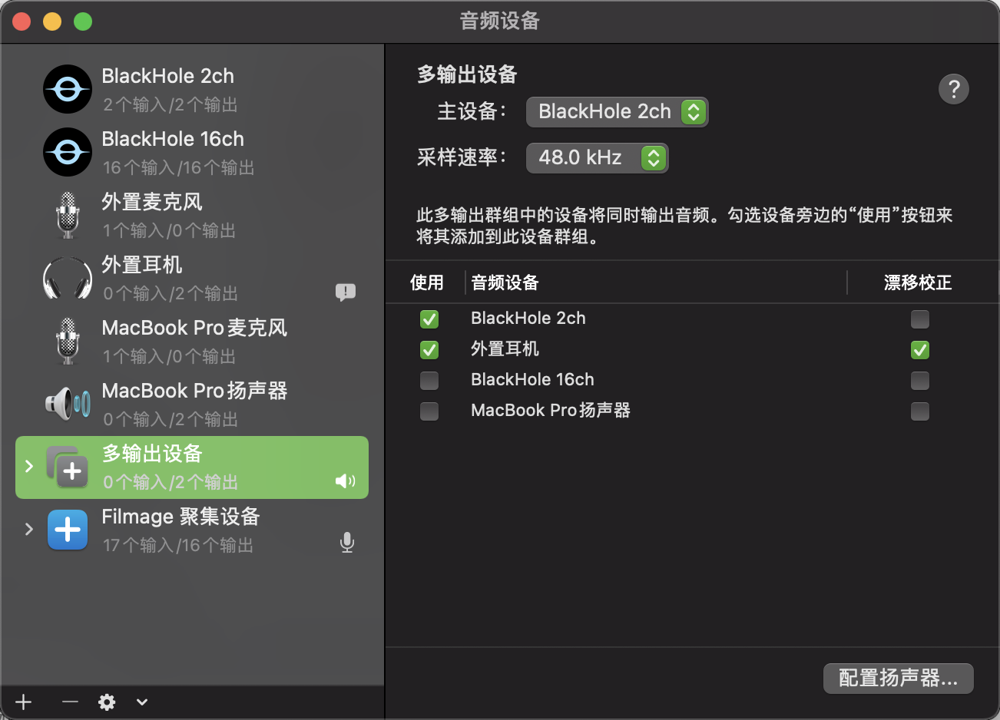
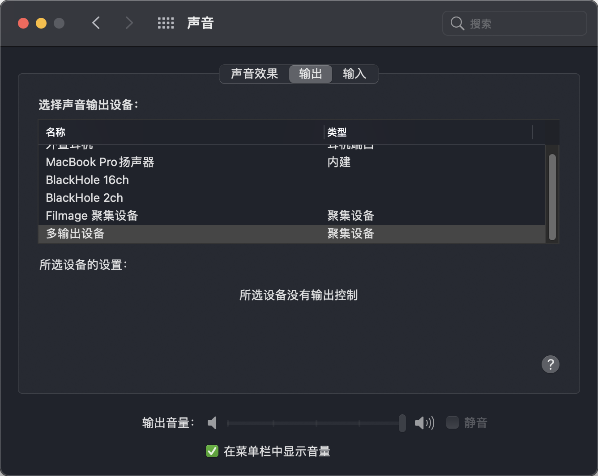

## MAC

### MAC M1系统怎么进入恢复模式

Intel的MAC是在开机显示logo的时候按下`command + R`，而M1的MAC只需要长按开机键就能进入了


### MAC启动安全性实用工具

https://support.apple.com/zh-cn/HT208198


### MAC M1视频录制录入系统声音

**Intel**的Mac是可以用[Soundflower](https://github.com/mattingalls/Soundflower/releases/tag/2.0b2)来解决

但是它不支持**M1**，所以找到了替代品

https://apple.stackexchange.com/questions/414072/soundflower-replacement-on-m1-macs

就是这个[BlackHole](https://existential.audio/blackhole/)

安装好之后打开



添加聚合设备之后，再打开声音设置->输出->选上你刚设置的输出源



### MAC M1安装Homebrew

选择国内镜像安装

``` bash
/bin/zsh -c "$(curl -fsSL https://gitee.com/cunkai/HomebrewCN/raw/master/Homebrew.sh)"
```


### 关于Big Sur没有权限打开应用程序的解决方法

https://zhuanlan.zhihu.com/p/331816664


### MAC查看SSD写入和电源使用情况

``` bash
brew install smartmontools
smartctl -a disk0
```

