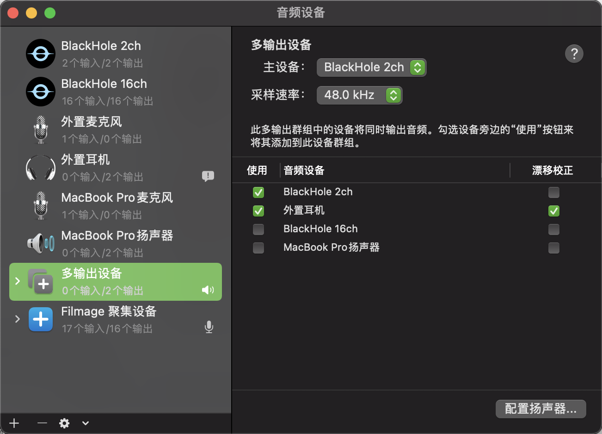
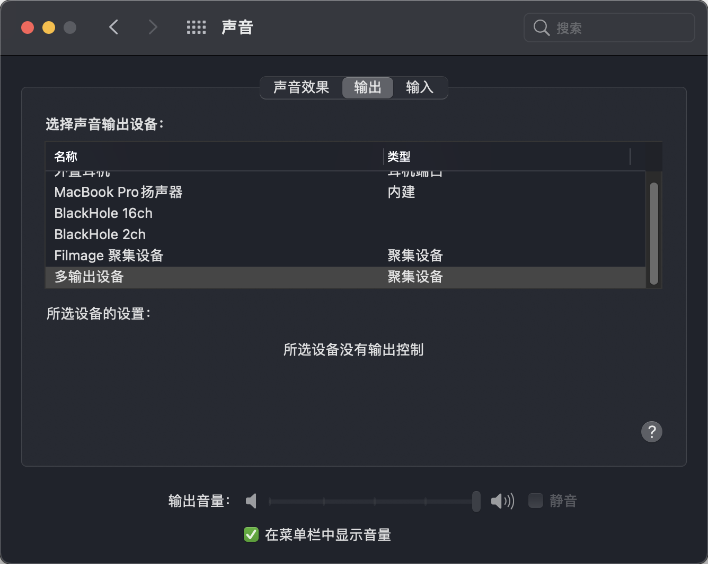

## MAC

### M1

#### 系统怎么进入恢复模式

Intel 的 MAC 是在开机显示 logo 的时候按下`command + R`，而 M1 的 MAC 只需要长按开机键就能进入了

#### 启动安全性实用工具

https://support.apple.com/zh-cn/HT208198

#### 视频录制录入系统声音

**Intel**的 Mac 是可以用[Soundflower](https://github.com/mattingalls/Soundflower/releases/tag/2.0b2)来解决

但是它不支持**M1**，所以找到了替代品

https://apple.stackexchange.com/questions/414072/soundflower-replacement-on-m1-macs

就是这个[BlackHole](https://existential.audio/blackhole/)

安装好之后打开



添加聚合设备之后，再打开声音设置->输出->选上你刚设置的输出源



#### 安装 ARM Homebrew

选择国内镜像安装

```bash
/bin/zsh -c "$(curl -fsSL https://gitee.com/cunkai/HomebrewCN/raw/master/Homebrew.sh)"
```

位置：

```bash
yinnnyou@yinnndeMBP: which brew
/opt/homebrew/bin/brew
```

#### 安装 X86 Hombrew

https://medium.com/mkdir-awesome/how-to-install-x86-64-homebrew-packages-on-apple-m1-macbook-54ba295230f

When you install Homebrew on an Intel Mac, it installs in the `/usr/local/homebrew` directory.

Create a `~/Downloads/homebrew` and download Homebrew tarball and extract it to the `~/Downloads/homobrew` directory.

```bash
cd ~/Downloads
mkdir homebrew
curl -L https://github.com/Homebrew/brew/tarball/master | tar xz --strip 1 -C homebrew
```

Move the `homebrew` directory to `/usr/local/homebrew`. You need the `sudo` command:

```bash
sudo mv homebrew /usr/local/homebrew
```

Add a path to the `.zshrc` file:

```bash
export PATH=$HOME/bin:/usr/local/bin:$PATH
```

By now you can use `arch -x86_64 /usr/local/homebrew/bin/brew` to install apps to the `/usr/local/homebrew/Cellar` directory.

Let’s add an alias and path in the `~/.zshrc` file:

```bash
# If you come from bash you might have to change your $PATH.
# need this for x86_64 brew
export PATH=$HOME/bin:/usr/local/bin:$PATH# for intel x86_64 brew
alias axbrew='arch -x86_64 /usr/local/homebrew/bin/brew'
```

Now you can install apps for Intel processors:

```bash
axbrew install package-name
```

### 关于 Big Sur 没有权限打开应用程序的解决方法

https://zhuanlan.zhihu.com/p/331816664

### MAC 查看 SSD 写入和电源使用情况

```bash
brew install smartmontools
smartctl -a disk0
```
