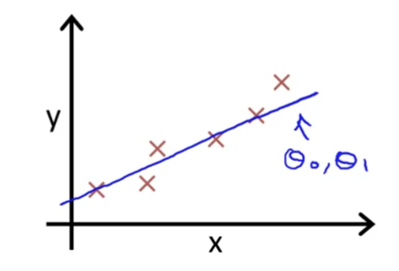

## ML

### Concept

#### ML

From Arthur Samuel

> Machine learning as the field of study that gives computers the ability to learn without being explicitly learned

From Tom Mitchell

> A computer program is said to learn from experience E with respect to some task T and some performance measure P, if its performance on T, as measured by P, improves with experience E.

#### Supervised Learning

You tell the program what is what and it will find the pattern by your guiding.

##### Regression

The picture shown above is a **regression problem** to be solved.

> **Predict** **continuous** valued output.

##### Classification

The picture shown above is a **classification problem** to be solved.

> **Discrete** valued output(there might be more than 2 values).

*More attributes can be used in the problem.

#### Singlevariate Linear Regression

Given an example:

To establish notation for future use, we’ll use

- $x^{(i)}$ to denote the “**input**” variables (living area in this example), also called input features.

- $ y^{(i)}$ to denote the “**output**” or target variable that we are trying to predict (price). 

- a pair $(x^{(i)} , y^{(i)} )$ is called a training example, and the dataset that we’ll be using to learn—a list of m training examples $(x^{(i)} , y^{(i)}); i = 1, . . . , m$—is called a training set. 

We will also use $X$ to denote the space of **input values**, and $Y$ to denote the space of **output values**.

To describe the supervised learning problem slightly more formally, our goal is, given a training set, to learn a function $h : X → Y $ so that $h(x)$ is a “good” predictor for the corresponding value of $y$. 

For historical reasons, this function h is called a **hypothesis**.

When the target variable that we’re trying to predict is continuous, such as in our housing example, we call the learning problem a **regression problem**. 

When $y$ can take on only a small number of discrete values (such as if, given the living area, we wanted to predict if a dwelling is a house or an apartment, say), we call it a **classification problem**.

##### The Cost Function

Back to the example of the house prices, with hypothesis:
$$
h_\theta(x) = \theta_0 + \theta_1x
$$
and with $\theta_i$ represent the **parameters** of the **model**, it is time to find out what $\theta_0$ and $\theta_1$ stand for.

The mission is to **find out $\theta_0$ and $\theta_1$** to make our hypothesis function close to our tranning set.

Hence we have:
$$
J(\theta_0, \theta_1) = {1 \over 2m}\stackrel{m}{\sum_{i=1}}(h_\theta(x^{(i)}) \space\space - \space\space y^{(i)})^2
$$
We want the find out the **minimization** of the function:
$$
\substack{minimize\\\theta_0,\theta_1} \space J(\theta_0, \theta_1)
$$
We call $J(\theta_0, \theta_1)$ a **Cost function** or **Square error cost function**.It is the most commonly used function for most linear regression function.

This takes an **average difference** $\frac{1}{2m}$ (actually a fancier version of an average, better than $\frac{1}{m}$) of all the results of the hypothesis with inputs from $x$'s and the actual output $y$'s.

The **mean is halved($\frac{1}{2}$)** as a convenience for the computation of the gradient descent, as the derivative term of the square function will cancel out the $\frac{1}{2}$ term(因为平方函数的导数项将抵消掉$\frac{1}{2}$项).

#### Multivariate Linear Regression

Linear regression with multiple variables is also known as "multivariate linear regression".

We now introduce notation for equations where we can have any number of input variables.

$x_j^{(i)}=$ the value of feature $j$ in the $i$ th training example

$x^{(i)}=$ the input (features) of the $i$ th training example

$m=$ the number of training **examples**

$n=$ the number of **features**

The multivariable form of the **hypothesis aka $h$** function accommodating these multiple features is as follows:
$$
h_\theta(x) = \theta_0 + \theta_1x_1 + \theta_2x_2 + \cdots + \theta_nx_n
$$
In order to develop intuition about this function, we can think about $\theta_0$ as the **basic price** of a house, $\theta_1$ as **the price per square meter**,  $\theta_2$ as the **price per floor**, etc.  

$x_1$ will be the number of square meters in the house, $x_2$ the number of floors, etc.

Using the definition of **matrix multiplication**, our **multivariable hypothesis function** can be concisely represented as:
$$
h_\theta(x) = 
[\theta_1 & \theta_2 & \theta_3 &\cdots&\theta_4]
\begin{bmatrix}
   x_0 \\
   x_1 \\
   x_2 \\
   \vdots\\
   x_n
\end{bmatrix}
=\theta^Tx
$$
This is a **vectorization** of our hypothesis function for one training example; see the lessons on vectorization to learn more.

Note that for convenience reasons in this course we assume $x_0^{(i)} =  for (i\in1,\dots,m)$.

This allows us to do matrix operations with theta and $x$. 

Hence making the two vectors $\theta$ and $x^{(i)} $ match each other element-wise (that is, have the same number of elements: $n+1$). 

