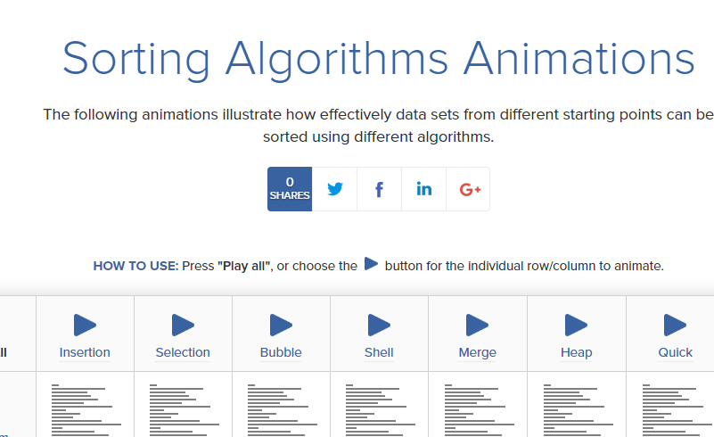

## 网站&博客

### SQL 刷题网站

#### SQLZOO

https://sqlzoo.net/

这是一个免费的 SQL 学习网站，支持语言：English・日本語・中文（繁体）

`SQLZOO` 包括了 SQL 学习的教程和参考资料，支持多国语言，每一个语法配套一个教程、一份数据和一个测验，非常适合初学者使用，因为可以一边通过教程学习语法知识，再通过测验巩固。

`SQLZOO` 的教程框架由浅入深，非常推荐给初学者，如果有简体中文的翻译更好了。

#### XUESQL

http://xuesql.cn/

如果你因为上面介绍的 `SQLZOO` 可以因为语言问题而劝退，那就推荐你一下中文的网站吧：`XUESQL`。

网站页面的上部分是教程手册，下部分是在线练习。写完 SQL 直接回车就是提交，如果正确会自动进入下一题。

另外还有一个加分项，它有自己配套的 B 站视频（同样免费）。

上面介绍了两个边学习边练习测试的网站，下面再介绍专门刷题的网站吧！

#### LeetCode

https://leetcode-cn.com/problemset/database/

一般大家看到 LeetCode 第一印象是刷算法题的，其实 LeetCode 上也有关于 SQL 的题目

我们可以在这里在线刷题，既能让你很直观的看到自己所写的 SQL 的运行速度等，也可以去借鉴别人优化好的 SQL，与自己的对比，将好的用法学会，这样的提升是很快的。

#### 其他

用来刷题网站的题目统计大部分为了统计而统计，缺少业务场景。建议大家合理利用上面推荐的网站来学习，如果想更好的了解业务题目，可以找一些面试题用来练习。

另外，还有一些 SQL 在线刷题网站，大家也可以尝试一下：

https://www.w3resource.com/sql-exercises/

https://sqlbolt.com/

### cmd 相关

#### :small_blue_diamond:教程

- 扫盲：https://lellansin.wordpress.com/2012/12/15/cmd%E5%BA%94%E7%94%A8%E5%9F%BA%E7%A1%80-%E6%89%AB%E7%9B%B2%E6%95%99%E7%A8%8B/
- 常用 cmd：https://blog.csdn.net/hanzheng260561728/article/details/51558990

#### :small_blue_diamond:微软开放命令行文档

> cmd 文档/doc 文档/command line

[link](http://download.microsoft.com/download/5/8/9/58911986-D4AD-4695-BF63-F734CD4DF8F2/ws-commands.pdf)

### Spring 生命周期详解好文

https://blog.csdn.net/lisongjia123/article/details/52091013?utm_source=blogxgwz0
https://blog.csdn.net/fuzhongmin05/article/details/73389779
https://blog.csdn.net/qq_23473123/article/details/76610052

### Database Client

[15 个 windows 上好用的 client](https://www.slant.co/topics/53/~best-mysql-client-applications-for-windows)

### 排序算法图解博客

看到的讲得还阔以的: https://www.cnblogs.com/chengxiao/category/880910.html

### linux 换行符

https://blog.csdn.net/mulangren1988/article/details/54316783

### 正则表达式 密码强度

https://www.cnblogs.com/cexm/p/7737538.html

### 数据结构/算法可视化网站

https://www.toptal.com/developers/sorting-algorithms

https://www.cs.usfca.edu/~galles/visualization/Algorithms.html

https://visualgo.net/zh

### 100 多个实用的 Javascript 代码片段

https://1loc.dev/

### 一个素材网站 devianart

https://www.deviantart.com/

### chrome 插件开发

https://www.cnblogs.com/liuxianan/p/chrome-plugin-develop.html#%E6%89%93%E5%8C%85%E4%B8%8E%E5%8F%91%E5%B8%83
