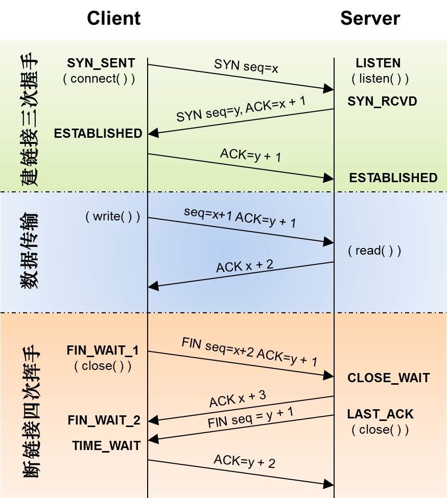
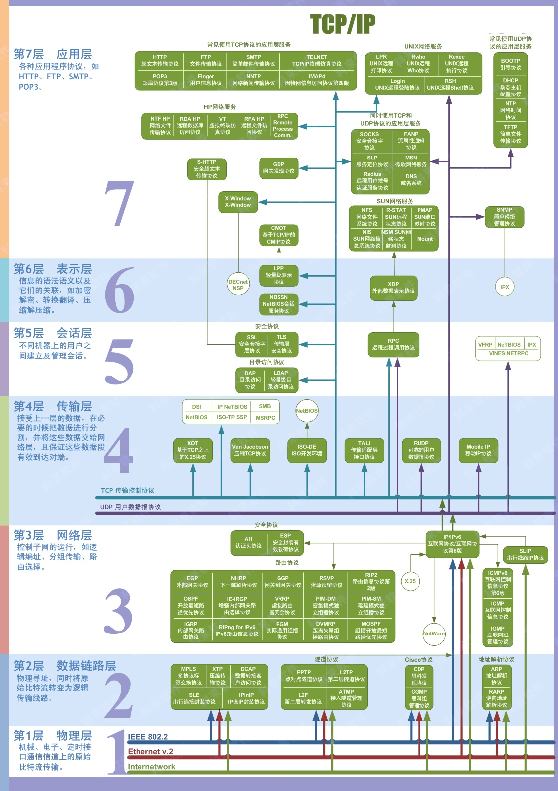
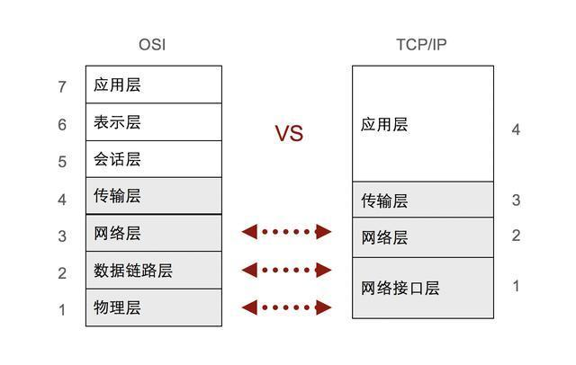
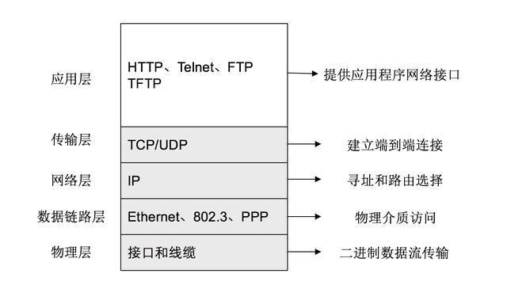

## 网络

### TCP/UDP

#### UDP特点

> - UDP是**无连接**的
> - UDP使用尽最大努力交付，但是**不保证可靠交付**
> - UDP是**面向报文**的
> - UDP没有拥塞控制
> - UDP支持**一对一，一对多，多对一，多对多**的交互通讯
> - UDP首部的开销小

#### TCP特点

> - TCP是**面向连接**的
> - 每一条TCP连接只能由两个端点，**每一条TCP连接只能是点对点的**
> - TCP提供**可靠**交付的服务
> - TCP提供**全双工通信**
> - 面向字节流

### TCP可靠传输保证机制

**停止等待协议：** 每发完一个分组就停止发送，直到收到上一个分组的确认信息。若超过规定时间没有接收到确认信息，边认为是分组丢失，开始重传。

**连续ARQ协议：**  发送方采用滑动窗口的形式，处于滑动窗口的分组可以直接发送出去；接收方一般采用累积确认的方式，也就是说接受方不必对接收到的每一个分组都进行确认，而是对按序到达的最后一个分组进行确认，而发送方每接收到一个确认，窗口就向前滑动一定距离。

**流量控制：**协调发送方和接收方的收发速率，利用滑动窗口来协调，使用探测报文来探测当前应该发送的速率，采用[Nagle算法](http://baike.sogou.com/v10500918.htm?fromTitle=Nagle算法)

**拥塞控制：**
 当网络中某一资源的需求超出了该资源所能提供的可用部分，这时网络的性能就要开始变坏，这种情况就叫做拥塞。而拥塞控制就是为了减少或者避免拥塞对网络性能的影响而做出的一种控制手段。

**拥塞控制思路：**发送方维持一个叫做**拥塞窗口**的状态变量，拥塞窗口的大小取决于网络的拥塞程度，并且在动态的变化。发送方让自己的发送窗口等于拥塞窗口，如果在考虑接收方的接收能力，一般发送窗口还要小于拥塞窗口。

**慢开始：**当主机开始发送数据的时候，由小到大的增大发送窗口，也就是由小到大的增大拥塞窗口。接收方接收到一个报文之后就回传一个确认报文，发送方每接收到一个确认报文，就将拥塞窗口加1，这样每经过一个传输轮次之后，拥塞窗口就增大一倍。

**拥塞避免：**思路是让拥塞窗口缓慢的增大，即每经过一个往返时间RTT就把发送方的拥塞窗口加1，而不是加倍，这样拥塞窗口就是线性缓慢增加，比慢开始的增长速率缓慢的多。

**慢开始门限：**为了防止拥塞窗口增长过大引起网络拥塞，还需要设置一个慢开始门限

- 拥塞窗口<慢开始门限时，使用慢开始算法
- 拥塞窗口>慢开始门限时，使用拥塞避免算法
- 拥塞窗口=慢开始门限时，两种算法都可以

**快重传：**要求收到方每收到一个时序的报文段之后就立即发出重复确认，而不要等到自己发送数据时才进行捎带确认。而发送方只要一连收到三个重复确认就应当立即重传对方尚未接受到的报文，而不必等待为报文设置的重传计时器到期。

**快回复：**与快重传配合使用，当发送方连续收到三个重复确认的时候，就执行“乘法减小”算法，将慢开始门限减半。将拥塞窗口设置为慢开始门限减半之后的值，并开始指向拥塞避免算法。

### TCP/IP握手

#### 建立连接

1. **客户端**请求建立连接：SYN=1，seq=x；

2. **服务器**对**客户端**的请求进行响应：SYN=1，ACK=1，seq=y，ack=x+1；
3. **客户端**对**服务器端**的响应信息进行回应：ACK=1，seq=x+1，ack=y+1；

#### 断开连接

1. **客户端**请求断开连接： FIN=1，seq = u；
2. **服务端**对**客户端**的请求应答：ACK=1，seq=v，ack=u+1；
3. **服务端**请求断开连接：FIN=1，ACK=1，seq=w，ack=u+1；
4. **客户端**对**服务端**的请求应答：ACK=1，seq=u+1，ack=w+1；

### 对于游戏来说 怎么选择TCP和UDP?

- 如果是由客户端间歇性的发起无状态的查询，并且偶尔发生延迟是可以容忍，那么使用HTTP/HTTPS吧。

- 如果客户端和服务器都可以独立发包，但是偶尔发生延迟可以容忍（比如：在线的纸牌游戏，许多MMO类的游戏），那么使用TCP长连接吧。

- 如果客户端和服务器都可以独立发包，而且无法忍受延迟（比如：大多数的多人动作类游戏，一些MMO类游戏），那么使用UDP吧。

转自: http://blog.jobbole.com/64638/

### OSI七层网络模型

### TCP/IP四层模型

### ARP与RARP

#### ARP：拿IP地址问MAC地址

1. 首先，每个主机都会在自己的ARP缓冲区中**建立一个ARP列表**，以表示IP地址和MAC地址之间的对应关系；
2. 当**源主机要发送数据**时，首先检查ARP列表中是否有对应IP地址的目的主机的MAC地址：
   1. 如果有，则直接发送数据；
   2. 如果没有，就向本网段的所有主机发送ARP数据包，该数据包中有：源主机IP地址、源主机MAC地址、目的主机IP地址；
3. 当**本网络的所有主机**收到该ARP数据包时，首先**检查数据包中的IP地址是否是自己的IP地址**，如果不是，则忽略该数据包，如果是，则首先从数据包中取出源主机的IP和MAC地址写入到ARP列表中，如果已经存在，则覆盖，然后将自己的MAC地址写入ARP响应包中，告诉源主机自己是它想要找的MAC地址；
4. 源主机收到ARP响应包后，**将目的主机的IP和MAC写入ARP列表**，并利用此信息发送数据。如果源主机一直都没有收到ARP响应数据包，表示ARP查询失败；

#### RARP：拿MAC地址问IP地址

作用是完成**硬件地址到IP地址的映射**。

在网络中配置一台RARP服务器，里面保存着IP地址和MAC地址的映射关系，当无盘工作站启动后：

1. 首先，封装一个RARP数据包，里面有其MAC地址；
2. 其次，广播到网络中去；
3. 最后，当服务器收到请求包后，就查找对应的MAC地址的IP地址装入响应报文中发回给请求者。因为需要广播请求报文，因此RARP只能用于具有广播能力的网络；

### DNS

DNS( Domain Name System)是“域名系统”的英文缩写，是一种组织成域层次结构的计算机和网络服务命名系统，它用于TCP/IP网络，它所提供的服务是用来将主机名和域名转换为IP地址的工作。

关于DNS的获取流程：
DNS是应用层协议，事实上他是为其他应用层协议工作的，包括不限于HTTP和SMTP以及FTP，用于将用户提供的主机名解析为ip地址。
具体过程如下：

1. 用户主机上运行着DNS的客户端，就是我们的PC机或者手机客户端运行着DNS客户端了
2. 浏览器将接收到的url中抽取出域名字段，就是访问的主机名，比如并将这个主机名传送给DNS应用的客户端
3. DNS客户机端向DNS服务器端发送一份查询报文，报文中包含着要访问的主机名字段（中间包括一些列缓存查询以及分布式DNS集群的工作）
4. 该DNS客户机最终会收到一份回答报文，其中包含有该主机名对应的IP地址
5. 一旦该浏览器收到来自DNS的IP地址，就可以向该IP地址定位的HTTP服务器发起TCP连接；